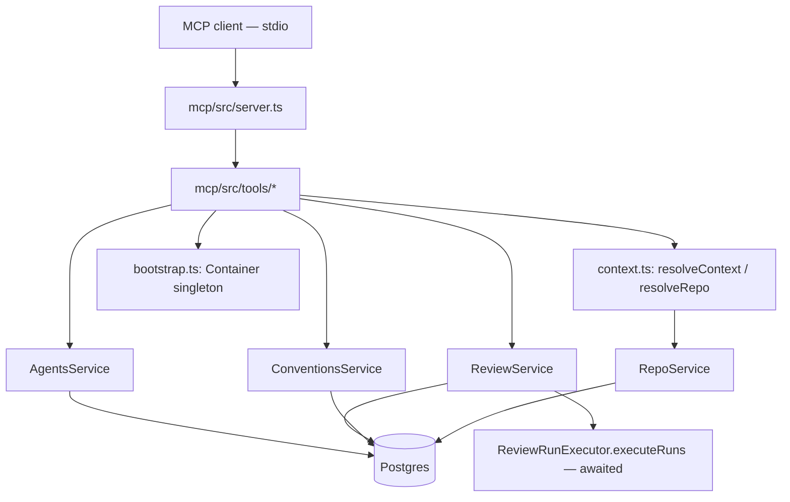

# Development Plan: `@devdigest/mcp` — Local MCP Server

**Status:** Implemented (lesson L04, branch `lab04/mcp`).

## Context

L04 of the DevDigest course (`README.md`: "`devdigest-mcp` server · Blast Radius (reads
repo-intel)") calls for a **local** MCP server exposing 5 tools over the existing review
pipeline: `list_agents`, `run_agent_on_pr`, `get_findings`, `get_conventions`, and
`get_blast_radius` (a deliberate stub — "doробите в домашці", left for a later lesson).

The design follows 4 tool-design principles supplied for this lesson — **result, not
operation**; **flat arguments**; **concise structured response**; **error leads
forward** — plus a set of naming/token-economy rules (namespace, pagination, `file:line`
signal over UUIDs, "when to choose" language) and general MCP token-economy practice
(server-level `instructions` instead of duplicating context per tool, no `outputSchema`,
correct `readOnlyHint`/`destructiveHint` annotations).

## Decisions

- **Package, not a server module.** `mcp/` is a new top-level package (`@devdigest/mcp`),
  sibling to `server/`/`client/`/`reviewer-core/`/`e2e/`, following the `reviewer-core`
  precedent: raw-TS consumption via `tsx` + `tsconfig.json` path aliases, no build step,
  no pnpm workspace. It boots its **own** lightweight `Container` (`loadConfig()` +
  `createDb()` + `new Container()`, mirroring `server/src/app.ts` minus Fastify) — the
  REST API does not need to be running for the MCP server to work.
- **Stdio transport only** — spawned as a subprocess by the MCP client (Claude Code /
  Claude Desktop), no HTTP port.
- **`agent` is an id only**, sourced from `list_agents` — no name-based resolution.
- **Single flat `agent: string` field**, where the literal `"all"` means "every enabled
  agent" (not a separate `agentId?`/`all?` pair).
- **`run_agent_on_pr` blocks until completion**, no artificial timeout — it performs
  `create → wait → fetch findings` as one action, matching "result, not operation."
- **`@modelcontextprotocol/sdk` v1.29.0** (the current stable release — not the
  unreleased v2 beta, which uses a different package name).

## Architecture

**Onion-architecture correction applied during design review:** the first draft proposed
a new `Container.reposRepo` getter that MCP tools would call directly
(`container.reposRepo.findByFullName(...)`). Running the codebase's own
`onion-architecture` skill against that draft caught it as a violation — the documented
`dependency-rule.md` forbids a presentation-layer caller (which is what an MCP tool
architecturally is, same role as a Fastify route) from reaching into `repository.ts`
directly. Fixed by adding **no new `Container` property** and instead exposing two new
public service methods (`RepoService.getByFullName`, `ReviewService.findPrByNumber`) —
every MCP tool calls only `new XService(container)`, never a repository or
`container.xxxRepo`, exactly like Fastify routes.

## Server-side changes (additive only, `server/`)

No existing behavior changed, no DB migration:

| File | Addition |
|---|---|
| `server/src/modules/repos/service.ts` | `RepoService.getByFullName(workspaceId, fullName)` |
| `server/src/modules/reviews/repository/pull.repo.ts` | `getPullByRepoAndNumber(db, repoId, number)` |
| `server/src/modules/reviews/repository/run.repo.ts` | `getAgentRun(db, workspaceId, runId)` |
| `server/src/modules/reviews/repository/review.repo.ts` | `reviewByRunId(db, runId)` |
| `server/src/modules/reviews/repository.ts` | Delegators for the three methods above |
| `server/src/modules/reviews/service.ts` | `createRunsForTargets` (extracted, behavior-preserving refactor of `runReview`'s job-creation loop), `findPrByNumber`, `runReviewAndWait` (awaits `ReviewRunExecutor.executeRuns` instead of firing-and-forgetting), `findingsForRun` (`running`/`failed`/`cancelled`/`done`) |

`ReviewService.runReview` (used by the HTTP API + SSE UI) is untouched — `runReviewAndWait`
is a new sibling method for the MCP use case, sharing only the extracted job-creation helper.

## The 5 tools

All names are namespaced `devdigest_*`. No tool declares `outputSchema` (keeps `tools/list`
minimal). Shared context (id formats, workspace auto-resolution, the run→findings
relationship) lives once in the server's `instructions` field, not per tool.

| Tool | Args (flat) | Behavior | annotations |
|---|---|---|---|
| `devdigest_list_agents` | — | Trimmed agent list (no `system_prompt`/`output_schema`) | `readOnlyHint:true` |
| `devdigest_run_agent_on_pr` | `repo`, `pr`, `agent` | Resolves repo/PR/agent, blocks on `runReviewAndWait`, returns a concise per-run summary (`file:line` findings live behind `get_findings`) | `readOnlyHint:false, openWorldHint:true` |
| `devdigest_get_findings` | `run_id`, `limit?`, `offset?` | `findingsForRun`, paginated | `readOnlyHint:true` |
| `devdigest_get_conventions` | `repo`, `limit?`, `offset?` | `ConventionsService.list`, paginated | `readOnlyHint:true` |
| `devdigest_get_blast_radius` | `repo`, `pr` | Pure stub — zero DB/service calls, `{implemented:false, ...}` | `readOnlyHint:true` |

Runtime errors are actionable, per "error leads forward": unknown agent → *"do not guess an
id, call devdigest_list_agents first"*; unknown repo → *"repo must be 'owner/name' ..., not
an internal id"*; unknown run_id → *"not an internal id you should guess; run_id only comes
from devdigest_run_agent_on_pr"*; the blast-radius stub → *"note this and continue your
review without it."*

## Verification performed

- `cd server && pnpm typecheck` and `pnpm exec vitest run --exclude '**/*.it.test.ts'` —
  green, no regression to `runReview`'s existing fire-and-forget behavior.
- `cd mcp && pnpm typecheck` — green, including the reused `server/src/**` sources under
  this package's own path aliases (the main integration risk for a non-workspace,
  cross-package setup).
- Full end-to-end run against a real MCP `Client` over `StdioClientTransport`, driving
  the actual server process against seeded local Postgres: `tools/list` returns exactly
  5 `devdigest_*` tools with the `instructions` field present once and no `outputSchema`;
  `devdigest_list_agents` returns real seeded agents, trimmed; `devdigest_get_blast_radius`
  returns its fixed stub with zero DB calls; every error path
  (unknown run_id / repo / agent id / PR number) returns the exact actionable text
  specified above.

## Out of scope (deliberately)

- Anthropic's `defer_loading`/Tool Search Tool mechanism — a client-harness feature for
  10+ tools across multiple MCP servers, not needed for 5 tools in one server.
- Real `get_blast_radius` logic — homework for a later lesson; `container.repoIntel.getBlastRadius()`
  already exists as the future data source (`server/src/modules/repo-intel/service.ts`).
