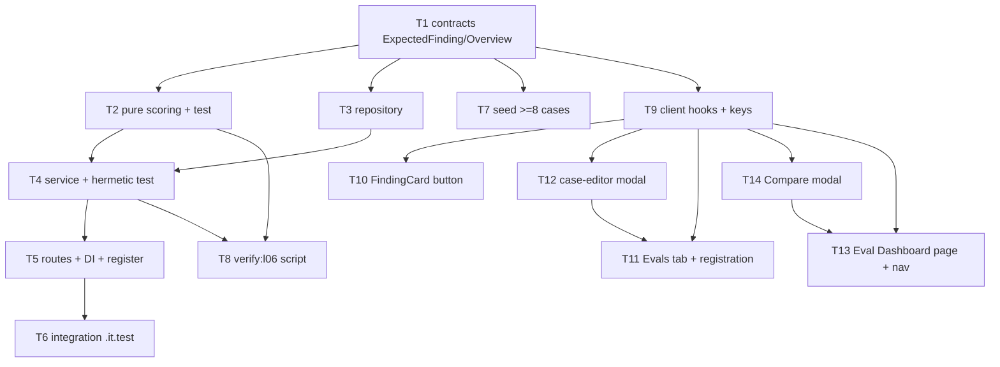

# Implementation Plan: Eval Pipeline (L06)

## Overview
Build a per-agent regression eval pipeline: eval cases are born from real accept/dismiss decisions
(one-click "Turn into eval case") and from a seeded fixed set (≥8), stored in the existing
`eval_cases` table. Running a case makes **one real** `reviewPullRequest` LLM call per case (agent's
own provider + linked skills), then scores it with **pure, zero-LLM code** (recall / precision /
citation_accuracy / pass, micro-averaged at run level). Each run persists a config snapshot
(`system_prompt` + `model`) into the existing jsonb columns (no migration) to power the Compare
prompt-diff. New client surfaces: an Evals tab on the agent page (+ case-editor modal), an Eval
Dashboard page with a Compare modal, and a FindingCard button. Gated by a new green `pnpm verify:l06`.

## Execution mode
**Recommended: Multi-agent (parallel implementers) — to be confirmed by the user.**
The work splits into a contracts-first + pure-scoring foundation (Phase 1), a self-contained backend
`eval` module chain (Phase 2), a seed/verify pair (Phase 3), and a client fan-out (Phases 4–6) that
only needs the shared contracts to start. Once T1 lands, the backend chain and the entire client
fan-out run concurrently on disjoint owned paths. The backend critical path is fairly linear
(T1→T2/T3→T4→T5→T6), so the parallelism win comes mainly from running the client fan-out alongside the
backend. If the user prefers fewer moving parts, a **single-agent sequential** pass is viable and
relaxes the owned-path-overlap constraint to phase ordering only — but multi-agent is the default
because the file boundaries are clean and non-overlapping. **This is a recommendation; the user
confirms the mode before implementers run.**

## Requirements
Traceability is to the spec's own AC-numbers (`specs/SPEC-03-eval-pipeline.md`). Requirements are
reproduced as given / as settled with the user — not authored here.

- R1 (AC-1..AC-3): One-click create from a finding resolves finding→review→pull (workspace-scoped),
  takes the **file/hunk slice** of that finding via `sliceDiff` as `input_diff`, creates an
  `owner_kind='agent'` case; accepted finding → `expected_output = [skeleton]`, dismissed → `[]`;
  a finding with neither `acceptedAt` nor `dismissedAt` is rejected with an explicit error.
- R2 (AC-4, AC-5): Generic create accepts `EvalCaseInput` with `expected_output` = `ExpectedFinding[]`;
  list returns all `owner_kind='agent'` cases of that agent within the caller's workspace.
- R3 (AC-6..AC-11): Pure scoring, **zero LLM**, no grounding re-run: match = same `file` AND line-range
  overlap (`aStart<=bEnd && bStart<=aEnd`, `end` defaults to `start`); recall = matched_expected/total
  (empty→1); precision = matched_produced/total (any unmatched produced = FP, incl. any produced when
  expected is empty; empty produced→1); citation_accuracy = grounding kept/(kept+dropped) from the run
  outcome (empty→1); pass = all expected matched AND zero FP.
- R4 (AC-12): Run-level metrics are **micro-averaged** (pooled counts, not per-case averages).
- R5 (AC-13, AC-14, AC-19): Batch run parses each `input_diff` → `UnifiedDiff`, calls
  `reviewPullRequest` with `container.llm(agent.provider)` + linked skills, scores, persists an
  `eval_runs` row incl. a config snapshot (`system_prompt`, `model`) in existing jsonb; one failing
  case is fail-soft (marked fail/error, rest still run).
- R6 (AC-15, AC-16, AC-20): Batch-run returns aggregated `EvalRun` (per_trace per case); single-case
  run returns `EvalRunResult`; per-case history returns `EvalRunRecord[]` chronologically.
- R7 (AC-17): Two runs with prompts that change finding behaviour produce different recall/precision
  (proven hermetically with two stub LLMs).
- R8 (AC-18): Batch-run endpoint is rate-limited with the same pattern as the existing reviews/LLM-run
  route (10/min), not an arbitrary limit.
- R9 (AC-21, AC-22, AC-23): Agent eval-dashboard endpoint returns `EvalDashboard`
  (current/delta/trend/recent_runs/alert); Compare shows metric deltas + prompt-diff from snapshots
  (prompt-diff omitted fail-soft if a snapshot is absent); the Compare "Promote" button re-runs the
  set against the agent's **current** prompt via the same batch-run path — no version promotion.
- R10 (AC-24, AC-25): Workspace overview endpoint returns `EvalOverview` (one `EvalAgentSummary` per
  review agent + recent_runs across agents); an agent with no runs shows a neutral/empty state.
- R11 (AC-26): `db:seed` idempotently seeds ≥8 agent cases covering **both** `expected_output` forms
  (non-empty skeleton array and empty `[]`).
- R12 (AC-27): `pnpm verify:l06` runs hermetic eval coverage (pure scoring test + service test with a
  stub LLM) + typecheck and exits 0; `eval/*.it.test.ts` excluded.
- R13 (AC-28..AC-30): Eval-case editor modal — required Name; Input tabs Diff/Files/PR meta mapped to
  `input_diff`/`input_files`/`input_meta`; Expected output JSON editor for `ExpectedFinding[]` with a
  live "valid JSON" indicator + "+ Finding skeleton"; footer Run on save / Cancel / Save / Run case;
  Run case → `POST /eval-cases/:id/run` → status line "Last run passed/failed · expected N finding,
  got M · <duration> · <cost>".
- R14 (Security / Untrusted / a11y / i18n): eval endpoints workspace-scoped via `getContext`;
  one-click verifies finding→review→pull belongs to caller's workspace (IDOR); the untrusted-diff
  barrier stays inside `reviewPullRequest` (not bypassed); metrics/status conveyed as number+label and
  text/icon (not colour alone); all strings via the existing `eval.json` i18n namespace.

## Recommendations
Surfaced during spec review — the user confirms or overrides before implementers run:

- **Severity enum mismatch (needs a decision).** The spec's Contracts section says
  `ExpectedFinding.severity` reuses `Severity (high|medium|low)`, but the actual shared enum is
  `Severity = ['CRITICAL','WARNING','SUGGESTION']` (`server/src/vendor/shared/contracts/findings.ts:11`),
  and produced findings use those values. **Recommendation / default:** `ExpectedFinding.severity`
  reuses the real `Severity` enum (`CRITICAL|WARNING|SUGGESTION`) so skeletons compare like-for-like
  with produced findings; the "(high|medium|low)" in the spec text is treated as a stale carry-over.
  `FindingCategory` (`bug|security|perf|style|test`) matches the spec and is reused as-is. Confirm the
  default; changing it would only alter the enum values in T1 and the seed/editor, not the plan shape.
- **`sliceDiff` is file/path-level, not hunk-level.** `sliceDiff(diff, path)` returns the whole-file
  diff for that path (`reviewer-core/src/review/reduce.ts:58`). One-click slicing is therefore
  per-file (the finding's file), which still satisfies AC-1's "slice around the finding, not the whole
  PR diff". The plan does **not** ask for a new hunk-level slicer.
- **Possible new Container getter for finding lookup.** One-click must resolve finding→review→pull
  workspace-scoped. If no public `container.*` getter already exposes a finding-by-id lookup, the
  implementer adds one to `Container` first (per the cross-module rule — a service never imports
  another module's repository) rather than reaching into the reviews repo directly. Flagged so it
  isn't a mid-task surprise.
- **No migration.** Everything new (config snapshot, expectations) rides existing jsonb columns
  (`eval_cases.expected_output/input_files/input_meta`, `eval_runs.actual_output`). No `db:generate`,
  no `db:migrate` — which also side-steps the known missing-`0010_snapshot.json` drizzle-kit trap
  (server INSIGHTS).

## Affected modules & contracts
- **server / new `modules/eval/`** — `scoring.ts` (pure, 0 LLM), `repository.ts` (Drizzle over
  `eval_cases`/`eval_runs`), `service.ts` (one-click build, batch/single run via `reviewPullRequest`,
  dashboard/overview aggregation), `routes.ts` (7 endpoints, workspace-scoped, batch-run rate-limited).
  Registered in `modules/index.ts`; service constructed in `platform/container.ts`.
- **server / `db/seed.ts`** — seed ≥8 idempotent agent cases (both `expected_output` forms).
- **server / `package.json`** — new `verify:l06` script.
- **reviewer-core (read-only, unchanged)** — `reviewPullRequest` (`review/run.ts`), `sliceDiff`
  (`review/reduce.ts`), grounding outcome (`ReviewOutcome.review.findings` = kept, `.dropped[]` =
  dropped). Server parses `input_diff` with `parseUnifiedDiff` (`server/src/adapters/git/diff-parser.ts`).
- **client** — hooks (`lib/hooks/eval.ts`), FindingCard button, Evals tab + case-editor modal on the
  agent page, Eval Dashboard page + Compare modal, nav entry.
- **Contracts (additive, in the existing `contracts/eval-ci.ts`, both vendor copies):**
  new `ExpectedFinding`, `EvalOverview`, `EvalAgentSummary`; `EvalCaseInput.expected_output` tightened
  from `z.unknown()` to `ExpectedFinding[]` (see callout below). `EvalRun`, `EvalPerTrace`,
  `EvalRunRecord`, `EvalRunResult`, `EvalDashboard`, `EvalTrendPoint`, `EvalCase`, `EvalOwnerKind`
  are **reused unchanged**.

> **Explicit shared-contract callout.** `EvalCaseInput.expected_output` changes from `z.unknown()` to
> `ExpectedFinding[]` (`server/src/vendor/shared/contracts/eval-ci.ts`). This is a deliberate,
> spec-authorised tightening of an existing contract's semantics (spec Contracts + AC-4), not a casual
> edit. It is additive in intent (no prior code relied on `expected_output` being any specific shape)
> but it **does** narrow an existing field — called out here per the plan's own red-flags rule.

> **Shared dual-copy trap (applies to every contract task).** `@devdigest/shared` resolves to **two
> independent files**: `server/src/vendor/shared/` and `client/src/vendor/shared/` (client
> `tsconfig.json` points at its own copy — client INSIGHTS confirm the `gotchas.md` "resolves to
> server copy" note is wrong). Any contract change MUST be mirrored into **both** `eval-ci.ts` copies.
> The client barrel and client contract cross-imports must **not** use `.js` extensions (Next/webpack
> cannot resolve them); the server copy follows the ESM `.js` convention. Keep contract edits ASCII to
> avoid the Edit-tool curly-quote corruption trap (server INSIGHTS).

## Architecture changes
- **Domain (contracts):** additive exports in both `contracts/eval-ci.ts` copies; pure Zod, zero
  framework imports; reuse `Severity`/`FindingCategory` from `./findings`.
- **Application/pure (scoring):** `server/src/modules/eval/scoring.ts` — pure deterministic functions
  over (produced `Finding[]`, `ExpectedFinding[]`, grounding kept/dropped counts). No I/O, no LLM.
- **Application (service):** `server/src/modules/eval/service.ts` — orchestration only (no SQL, no
  adapter instantiation); resolves inputs via `container.*` getters, calls `reviewPullRequest`, scores
  via `scoring.ts`, persists via `repository.ts`.
- **Infrastructure (repository):** `server/src/modules/eval/repository.ts` — Drizzle over
  `eval_cases`/`eval_runs`; `$inferSelect`/`$inferInsert` never leave this file; toDomain/toDb mappers.
- **Presentation:** `server/src/modules/eval/routes.ts` — thin handlers (`getContext` → one service
  call → reply), `fastify-type-provider-zod` schemas, batch-run `config.rateLimit` mirroring reviews.
- **Client (RSC boundary):** Evals tab, case-editor modal, Dashboard drill-in, Compare modal, and the
  FindingCard button are all `"use client"` (interactivity + TanStack Query). The Dashboard page shell
  may stay a Server Component that renders the client widgets.

## Phased tasks

### Phase 1 — Contracts & pure scoring (foundation)

- **T1 — Additive eval contracts (both `eval-ci.ts` copies)**
  - **Action:** In `server/src/vendor/shared/contracts/eval-ci.ts` add `ExpectedFinding = z.object({
    severity: Severity, category: FindingCategory, title: z.string(), file: z.string(), start_line:
    z.number().int(), end_line: z.number().int().nullish() })` (import `Severity`/`FindingCategory`
    from `./findings.js`); change `EvalCaseInput.expected_output` from `z.unknown()` to
    `z.array(ExpectedFinding).default([])`; add `EvalAgentSummary = { agent_id, name, recall,
    precision, citation_accuracy, traces_passed, traces_total, trend: EvalTrendPoint[] }` and
    `EvalOverview = { agents: EvalAgentSummary[], recent_runs: EvalRunRecord[] }`. Export schema +
    inferred type for each. **Mirror the exact same edits** into
    `client/src/vendor/shared/contracts/eval-ci.ts` (no `.js` on client imports/exports). Confirm both
    barrels re-export eval-ci via `export *` (no barrel edit expected — verify).
  - **Module:** shared (server + client vendor copies)
  - **Type:** core
  - **Skills to use:** `zod`, `typescript-expert`, `onion-architecture` (domain layer)
  - **Owned paths:** `server/src/vendor/shared/contracts/eval-ci.ts`,
    `client/src/vendor/shared/contracts/eval-ci.ts`, `server/src/vendor/shared/index.ts`,
    `client/src/vendor/shared/index.ts`
  - **Depends-on:** none
  - **Risk:** medium
  - **Known gotchas:** Dual-copy trap (both copies; client without `.js`). Zod `.default([])` relaxes
    only the *input* type — any hand-built object literal typed as `EvalCaseInput`/`EvalOverview` must
    still list the field (server INSIGHTS on `.default()` output types). Reuse the real `Severity`
    enum (CRITICAL/WARNING/SUGGESTION) per the Recommendations decision, not high/medium/low. Keep the
    file ASCII (Edit-tool curly-quote trap).
  - **Acceptance:** `cd server && pnpm typecheck` and `cd client && pnpm typecheck` show no errors
    attributable to `eval-ci` (grep the output for `eval-ci`; a fully green tree isn't required while
    sibling phase-1 work is in flight); `import { ExpectedFinding, EvalOverview, EvalAgentSummary }
    from '@devdigest/shared'` resolves in both packages.

- **T2 — Pure scoring module + hermetic test**
  - **Action:** Create `server/src/modules/eval/scoring.ts`: `matches(produced: Finding, expected:
    ExpectedFinding): boolean` (same `file` AND `aStart<=bEnd && bStart<=aEnd`, each `end` defaulting
    to its `start`); `scoreCase({ produced, expected, kept, dropped }) → { recall, precision,
    citation_accuracy, pass }` per AC-8..AC-11 (empty-expected→recall 1; empty-produced→precision 1;
    any unmatched produced = FP incl. all produced when expected is empty; kept+dropped=0 →
    citation_accuracy 1; pass = all expected matched AND zero FP); `aggregate(cases[]) → run-level`
    micro-averaged pooled counts (AC-12) yielding recall/precision/citation_accuracy/traces_passed/
    traces_total. Add `scoring.test.ts` with fixtures → exact metrics covering every AC-11 mockup case
    (expected 1 got 1 → pass; expected 1 got 0 → fail; expected 0 got 0 → pass; produced on empty →
    FP/fail; grounding all-dropped → citation 0; micro-average ≠ per-case average).
  - **Module:** server
  - **Type:** core
  - **Skills to use:** `typescript-expert`, `zod`, `react-testing-library` (vitest idioms for the pure
    test), `onion-architecture` (pure helper placement)
  - **Owned paths:** `server/src/modules/eval/scoring.ts`, `server/src/modules/eval/scoring.test.ts`
  - **Depends-on:** T1
  - **Risk:** low
  - **Known gotchas:** citation_accuracy comes from run-outcome counts, NOT re-running grounding
    (`ReviewOutcome.review.findings` = kept, `.dropped[]` = dropped;
    `reviewer-core/src/review/run.ts:100`). `end_line` is `nullish` on `ExpectedFinding` — default to
    `start_line` inside `matches`. Overlap must be inclusive on both ends. Keep the module free of any
    Container/LLM import so AC-6 (zero LLM) is structurally guaranteed.
  - **Acceptance:** `cd server && pnpm exec vitest run modules/eval/scoring.test.ts` green; the suite
    asserts exact numeric metrics for each fixture and that aggregate uses pooled counts.

### Phase 2 — Backend `eval` module (depends on Phase 1)

- **T3 — Eval repository (`repository.ts`)**
  - **Action:** Drizzle over `eval_cases`/`eval_runs` (`server/src/db/schema/eval.ts`): `createCase`,
    `listCasesForAgent(workspaceId, agentId)` (filter `owner_kind='agent'` + `owner_id` +
    `workspace_id`), `getCase`, `insertRun` (writes recall/precision/citation_accuracy/pass/
    duration_ms/cost_usd + `actual_output` jsonb carrying `{ per_trace…, prompt_snapshot: {
    system_prompt, model } }` — the config snapshot rides here, no migration), `listRunsForCase`
    chronological, and dashboard reads (latest + previous run per agent, trend series, recent_runs).
    Provide toDomain/toDb mappers to the shared DTOs (`EvalCase`, `EvalRunRecord`, `EvalTrendPoint`);
    keep `$inferSelect`/`$inferInsert` inside this file.
  - **Module:** server
  - **Type:** backend
  - **Skills to use:** `drizzle-orm-patterns`, `onion-architecture` (infrastructure), `zod`
    (`parse-never-trust-json` on jsonb reads)
  - **Owned paths:** `server/src/modules/eval/repository.ts`
  - **Depends-on:** T1
  - **Risk:** medium
  - **Known gotchas:** jsonb columns are untyped at the DB layer — validate `expected_output` as
    `ExpectedFinding[]` and `actual_output`/snapshot on read. No migration — the snapshot lives in the
    existing `eval_runs.actual_output` jsonb. Workspace scoping is enforced in queries (join through
    `eval_cases.workspace_id`). For unit-testing sequential Drizzle chains, mock `db.select()` with a
    call counter (server INSIGHTS pattern) — but DB-backed assertions belong in T6's `.it.test`.
  - **Acceptance:** `cd server && pnpm typecheck` clean for the file; round-trip (insert run → read
    history, list cases by agent) is exercised by T6 against real Postgres.

- **T4 — Eval service + hermetic service test (`service.ts`)**
  - **Action:** `EvalService(container)` with: `createFromFinding(workspaceId, findingId)` — resolve
    finding→review→pull workspace-scoped (add a `Container` getter if none exists; do NOT import the
    reviews repo directly), reject with an explicit error if the finding has neither `acceptedAt` nor
    `dismissedAt` (AC-3), load the PR diff, `sliceDiff(diff, finding.file)` → `input_diff`, build the
    case with `expected_output = [skeleton]` (accepted) or `[]` (dismissed), persist via T3.
    `createCase(input)` — generic `EvalCaseInput`. `runSet(workspaceId, agentId)` — for each case:
    `parseUnifiedDiff(input_diff)`, `reviewPullRequest({ systemPrompt: agent.systemPrompt, model:
    agent.model, diff, llm: container.llm(agent.provider), strategy: agent.strategy, skills })`
    (mirror `reviews/run-executor.ts runOneAgent` for provider + `agentsRepo.linkedSkills` loading),
    score via `scoring.ts` using `outcome.review.findings` (kept) + `outcome.dropped`, persist an
    `eval_runs` row with the config snapshot; **fail-soft** per case (one throw/timeout → mark that
    case fail/error, continue the rest, AC-19). Aggregate to `EvalRun` (per_trace per case).
    `runCase(caseId)` → `EvalRunResult`. `dashboard(agentId)` → `EvalDashboard`;
    `overview(workspaceId)` → `EvalOverview` (one summary per review agent; agent with no runs → empty
    state, AC-25). Add `service.test.ts` (hermetic, stub LLM via `ContainerOverrides.llm` from
    `src/adapters/mocks.ts`): running one case yields the expected metrics; **AC-17** — two stub LLMs
    returning different findings yield different recall/precision; **AC-6/AC-19** — a throwing stub for
    one case leaves the others scored.
  - **Module:** server
  - **Type:** backend
  - **Skills to use:** `onion-architecture` (application/orchestration, cross-module via `container.*`),
    `typescript-expert`, `security` (workspace-scoped resolution / IDOR; untrusted diff stays inside
    `reviewPullRequest`), `react-testing-library` (vitest idioms), `zod`
  - **Owned paths:** `server/src/modules/eval/service.ts`, `server/src/modules/eval/service.test.ts`
  - **Depends-on:** T2, T3
  - **Risk:** high
  - **Known gotchas:** Reuse the `run-executor.ts runOneAgent` recipe for `container.llm(agent.provider
    as Provider)` and `agentsRepo.linkedSkills(agent.id)` (enabled → bodies, delimiter-wrapped). Import
    the minimal `Logger` type from `../reviews/run-executor.js` (server INSIGHTS — it isn't in shared).
    Do NOT wrap the diff yourself — `reviewPullRequest`'s `assemblePrompt` already `wrapUntrusted`s it;
    the eval path must not become a second LLM call site. Scoring receives kept/dropped counts from the
    outcome — never re-run grounding. `cost_usd`/`duration_ms` come from the outcome + timing.
  - **Acceptance:** `cd server && pnpm exec vitest run modules/eval/service.test.ts` green (one-case
    metrics, two-prompt divergence, per-case fail-soft, and that the scoring path issues zero provider
    calls beyond the one `reviewPullRequest` per case); `pnpm typecheck` clean for the file.

- **T5 — Routes + DI + registration (`routes.ts`)**
  - **Action:** Fastify plugin exposing, all via `getContext(app.container, req)` and
    `app.withTypeProvider<ZodTypeProvider>()`: `POST /findings/:id/eval-case` (one-click),
    `POST /agents/:id/eval-cases` + `GET /agents/:id/eval-cases`, `POST /agents/:id/eval-runs`
    (batch — `config: { rateLimit: { max: 10, timeWindow: '1 minute' } }`, mirroring
    `reviews/routes.ts:29`), `POST /eval-cases/:id/run` (single), `GET /eval-cases/:id/runs` (history),
    `GET /agents/:id/eval-dashboard`, `GET /eval/dashboard` (workspace overview). `IdParams` from
    `_shared/schemas.ts`; response schemas from `@devdigest/shared`; thin handlers (validate → one
    service call → reply); `NotFoundError`/`AppError` from `platform/errors`. Register `eval` in
    `server/src/modules/index.ts` (one import + one entry); construct `EvalService` in
    `platform/container.ts` (lazy getter mirroring existing services).
  - **Module:** server
  - **Type:** backend
  - **Skills to use:** `fastify-best-practices` (routes, rate-limit config, serialization),
    `onion-architecture` (presentation + DI container), `zod`, `security` (A01 IDOR — every route
    workspace-scoped)
  - **Owned paths:** `server/src/modules/eval/routes.ts`, `server/src/modules/index.ts`,
    `server/src/platform/container.ts`
  - **Depends-on:** T4
  - **Risk:** medium
  - **Known gotchas:** Rate-limit config is under route `config`, not `schema`. `getContext` is
    mandatory as the first call in every handler (server INSIGHTS) — never read `workspaceId` from
    headers. Editing `platform/container.ts`/`modules/index.ts` — keep edits ASCII (Edit-tool
    curly-quote trap). `/eval/dashboard` (workspace) and `/agents/:id/eval-dashboard` (one agent) are
    distinct routes — don't let one shadow the other.
  - **Acceptance:** `cd server && pnpm typecheck` clean; `cd server && pnpm exec vitest run
    --exclude '**/*.it.test.ts'` green; a hermetic route test via Fastify `inject` asserts the
    batch-run route carries the 10/min rate-limit config and that a cross-workspace finding id is
    rejected (IDOR).

- **T6 — Backend integration tests (`eval.it.test.ts`, excluded from verify)**
  - **Action:** `.it.test.ts` (real Postgres via testcontainers, mock LLM from `src/adapters/mocks.ts`)
    covering: one-click accepted → `[skeleton]` + sliced `input_diff`; one-click dismissed → `[]`;
    one-click on a no-decision finding → explicit error, no case (AC-3); list returns only this
    agent's this-workspace cases (AC-5); batch run of N cases → N `eval_runs` rows with metrics + a
    persisted `system_prompt`+`model` snapshot (AC-13/AC-14); single-case run → `EvalRunResult`;
    history chronological (AC-20); one failing case fail-soft (AC-19); agent dashboard + workspace
    overview shapes incl. an agent with zero runs (AC-21/AC-24/AC-25). Cross-workspace one-click
    rejected (IDOR).
  - **Module:** server
  - **Type:** backend (tests)
  - **Skills to use:** `react-testing-library` (vitest idioms), `fastify-best-practices` (`inject`),
    `security` (IDOR assertions), `drizzle-orm-patterns`
  - **Owned paths:** `server/src/modules/eval/eval.it.test.ts`
  - **Depends-on:** T5
  - **Risk:** medium
  - **Known gotchas:** `*.it.test.ts` = integration; **excluded** from `verify:l06`, run via
    `vitest run .it.test`. If any sibling service (e.g. via provider defaults) would fire an unmocked
    LLM call, pre-seed the needed rows / override the right provider (see the brief `.it.test` INSIGHT
    on provider-default mismatches). Assert provider call **count** for the batch path.
  - **Acceptance:** `cd server && pnpm exec vitest run .it.test` includes and passes the new file.

### Phase 3 — Seed & verify gate (depends on Phase 1/2)

- **T7 — Seed ≥8 regression cases (`seed.ts`)**
  - **Action:** In `server/src/db/seed.ts`, idempotently insert ≥8 `eval_cases` bound to a seeded
    review agent, covering **both** `expected_output` forms — several with a non-empty
    `ExpectedFinding[]` (accepted-provenance) and several with `[]` (dismissed-provenance). Each case
    carries a realistic `input_diff` (a small unified diff slice) so a run can parse and review it.
    Idempotency by a stable natural key (e.g. `(owner_id, name)`) — re-running `db:seed` must not
    duplicate.
  - **Module:** server
  - **Type:** backend
  - **Skills to use:** `drizzle-orm-patterns` (idempotent upsert/`onConflictDoNothing`),
    `postgresql-table-design`, `onion-architecture` (infra), `zod` (build valid `ExpectedFinding[]`)
  - **Owned paths:** `server/src/db/seed.ts`
  - **Depends-on:** T1
  - **Risk:** low
  - **Known gotchas:** Reuse `Severity` (CRITICAL/WARNING/SUGGESTION) + `FindingCategory` values in
    skeletons so seeded expectations match what the engine can produce. Seed writes must be
    idempotent (existing seed convention). Do NOT run `db:seed` as part of acceptance (planner
    constraint) — the deliverable is the code + a dry `pnpm typecheck`.
  - **Acceptance:** `cd server && pnpm typecheck` clean; code review confirms ≥8 cases with both
    `expected_output` forms and a conflict-guarded insert (no duplication on re-seed).

- **T8 — `verify:l06` script**
  - **Action:** Add to `server/package.json` scripts:
    `"verify:l06": "vitest run eval contracts --exclude '**/*.it.test.ts' && pnpm typecheck"`
    (mirrors `verify:l03`). This picks up `modules/eval/scoring.test.ts` + `modules/eval/service.test.ts`
    (via the `eval` filter) and contract tests (via `contracts`), excludes `eval.it.test.ts`, then
    typechecks.
  - **Module:** server
  - **Type:** backend
  - **Skills to use:** `typescript-expert` (script wiring)
  - **Owned paths:** `server/package.json`
  - **Depends-on:** T2, T4
  - **Risk:** low
  - **Known gotchas:** The `eval` positional filter matches any test path containing `eval` — confirm
    it doesn't accidentally pull in unrelated suites; if it does, narrow to `modules/eval`. The
    `.it.test` exclusion must stay so DB tests don't run in the hermetic gate.
  - **Acceptance:** `cd server && pnpm verify:l06` exits 0 with T2's and T4's suites + contracts green
    and typecheck clean; `eval.it.test.ts` is not executed by it.

### Phase 4 — Client data layer & FindingCard (depends on T1)

- **T9 — Eval hooks + query keys (`hooks/eval.ts`)**
  - **Action:** Add `client/src/lib/hooks/eval.ts` mirroring `agents.ts`/`reviews.ts`: query hooks for
    agent cases, case run-history, agent dashboard, workspace dashboard; mutation hooks for one-click
    create (`POST /findings/:id/eval-case`), create/update case, run set (`POST /agents/:id/eval-runs`),
    run single case (`POST /eval-cases/:id/run`) — each invalidating the right keys. Use the `api`
    helper (`client/src/lib/api.ts`) and register stable query keys alongside existing hooks; export
    from `client/src/lib/hooks/index.ts`. Confirm the `eval` i18n namespace (`client/messages/en/eval.json`,
    already complete) is registered where `next-intl` assembles messages (mirror an existing namespace).
  - **Module:** client
  - **Type:** ui
  - **Skills to use:** `react-best-practices` (data fetching in hooks), `frontend-architecture` (hook
    placement), `next-best-practices`
  - **Owned paths:** `client/src/lib/hooks/eval.ts`, `client/src/lib/hooks/index.ts`
  - **Depends-on:** T1
  - **Risk:** low
  - **Known gotchas:** Client resolves `@devdigest/shared` to its OWN vendor copy — T1 owns the client
    `eval-ci.ts`; this task just imports the types. Use the `@/` alias for 3+ level imports (client
    INSIGHTS). Query keys must be unique.
  - **Acceptance:** `cd client && pnpm typecheck` clean; hooks compile; the `eval` namespace loads
    (no missing-message warning when a component reads `eval.*`).

- **T10 — FindingCard "Turn into eval case" button**
  - **Action:** Add the button to
    `client/src/app/repos/[repoId]/pulls/[number]/_components/FindingCard/FindingCard.tsx` and wire it
    in the sibling `FindingsPanel/FindingsPanel.tsx` to the one-click create mutation (T9). Disable /
    hide it for a finding with no accept/dismiss decision (AC-3 is enforced server-side, but reflect it
    in the UI). Show success/error feedback. Strings via `eval.json`.
  - **Module:** client
  - **Type:** ui
  - **Skills to use:** `react-best-practices` (a11y icon-button label, conditional render),
    `frontend-architecture`, `next-best-practices`, `react-testing-library`
  - **Owned paths:**
    `client/src/app/repos/[repoId]/pulls/[number]/_components/FindingCard/FindingCard.tsx`,
    `client/src/app/repos/[repoId]/pulls/[number]/_components/FindingsPanel/FindingsPanel.tsx`
  - **Depends-on:** T9
  - **Risk:** low
  - **Known gotchas:** New client interaction tests must use `fireEvent` (NOT `userEvent` — not
    installed, client INSIGHTS). Quote bracketed dynamic-route paths when `git add`ing (zsh glob trap).
  - **Acceptance:** `cd client && pnpm typecheck` clean; `cd client && pnpm test` covers: button
    present on a decided finding, click fires the create mutation, feedback shown.

### Phase 5 — Evals tab & case-editor modal (depends on T9)

- **T11 — Evals tab + tab registration**
  - **Action:** Add an `evals` tab to the AgentEditor: register it in
    `client/src/app/agents/[id]/_components/AgentEditor/{AgentEditor.tsx,constants.ts}` (`TABS`) and in
    the page `VALID_TABS` (`client/src/app/agents/[id]/page.tsx`); create
    `_components/EvalsTab/EvalsTab.tsx` (clone the `SkillsTab` structure) rendering metric cards
    (recall/precision/citation as **number + label**, not colour alone), the case list with per-case
    pass/fail (text/icon), and "Run all evals" + "New eval case" buttons wired to T9 hooks. Opens the
    case-editor modal (T12) for new/edit. Strings via `eval.json` (`evalsTab`, `page`).
  - **Module:** client
  - **Type:** ui
  - **Skills to use:** `react-best-practices` (container/presentational split, key props, a11y),
    `frontend-architecture` (colocated `_components/`), `next-best-practices`, `react-testing-library`
  - **Owned paths:**
    `client/src/app/agents/[id]/_components/AgentEditor/AgentEditor.tsx`,
    `client/src/app/agents/[id]/_components/AgentEditor/constants.ts`,
    `client/src/app/agents/[id]/page.tsx`,
    `client/src/app/agents/[id]/_components/EvalsTab/` (new folder + test)
  - **Depends-on:** T9, T12
  - **Risk:** medium
  - **Known gotchas:** Depends on T12 so the modal import resolves at typecheck. Page-component tests
    that render `<AppShell>` must `vi.mock` the app-shell module (client INSIGHTS). `fireEvent` for
    interactions. Metrics must convey meaning without colour (WCAG AA).
  - **Acceptance:** `cd client && pnpm typecheck` clean; `cd client && pnpm test` covers: tab renders
    the case list + metric cards, "New eval case" opens the editor, "Run all evals" fires the run-set
    mutation.

- **T12 — Eval-case editor modal**
  - **Action:** New `client/src/app/agents/[id]/_components/EvalCaseEditor/` modal: header "Eval case ·
    <name>" + subtitle "<Agent> · simulate a PR and assert the expected output"; required **Name**;
    **Input** section with three tabs **Diff** (`input_diff`), **Files** (`input_files`), **PR meta**
    (`input_meta`); **Expected output** JSON editor for `ExpectedFinding[]` with a live "valid JSON"
    indicator and a "+ Finding skeleton" button that inserts an empty skeleton template; footer with a
    "Run on save" toggle + **Cancel** / **Save** / **Run case** buttons. **Run case** →
    `POST /eval-cases/:id/run` (T9) → status line "Last run passed/failed · expected N finding, got M ·
    <duration> · <cost>". Strings via `eval.json` (`caseEditor`).
  - **Module:** client
  - **Type:** ui
  - **Skills to use:** `react-best-practices` (derive-don't-store for JSON validity, conditional
    render, a11y modal focus-trap), `frontend-architecture`, `next-best-practices`,
    `react-testing-library`, `zod` (client-side `ExpectedFinding[]` validation for the indicator)
  - **Owned paths:** `client/src/app/agents/[id]/_components/EvalCaseEditor/` (new folder + test)
  - **Depends-on:** T9
  - **Risk:** medium
  - **Known gotchas:** JSON validity is **derived during render** from the textarea value — do not
    store it in `useState` + effect (react-best-practices). `fireEvent` for interactions. The status
    line reads expected N from `expected_output.length` and got M from the run's produced count. Modal
    must be keyboard-operable (Escape + visible Close).
  - **Acceptance:** `cd client && pnpm typecheck` clean; `cd client && pnpm test` covers: invalid JSON
    → indicator shows invalid + Save/Run guarded; "+ Finding skeleton" inserts a template; Run case
    fires the single-run mutation and renders the status line.

### Phase 6 — Eval Dashboard page & Compare (depends on T9)

- **T13 — Eval Dashboard page + nav entry**
  - **Action:** Create `client/src/app/eval/page.tsx` (model on `agents/[id]/page.tsx` skeleton +
    `OverviewTab` card-grid) listing all review agents with RECALL / PRECISION / CITE + a recharts
    sparkline (recharts is already a dep), plus a recent-runs table (from `GET /eval/dashboard`, T9);
    drill-in renders large metric cards + a trend chart and opens the Compare modal (T14). Add the nav
    entry in `client/src/vendor/ui/nav.ts` under the **SKILLS LAB** group: `{ key: "eval", href:
    "/eval", icon: <existing icon>, gKey: "e" }` (`activeKeyFor()` already maps `/eval`; the `nav.eval`
    label already exists in `shell.json`). Strings via `eval.json` (`dashboard`, `page`).
  - **Module:** client
  - **Type:** ui
  - **Skills to use:** `react-best-practices` (container/presentational, a11y, key props),
    `frontend-architecture` (route segment + colocated `_components/`), `next-best-practices` (RSC
    boundary — page shell can be a Server Component rendering client widgets), `react-testing-library`
  - **Owned paths:** `client/src/app/eval/` (new route: `page.tsx` + `_components/`),
    `client/src/vendor/ui/nav.ts`
  - **Depends-on:** T9, T14
  - **Risk:** medium
  - **Known gotchas:** `gKey: "e"` is free under SKILLS LAB (s/a/v/c are taken). Depends on T14 so the
    Compare import resolves. Sparklines/metrics need number+label, not colour alone (WCAG AA).
    `vi.mock` app-shell in page tests (client INSIGHTS).
  - **Acceptance:** `cd client && pnpm typecheck` clean; `cd client && pnpm test` covers: dashboard
    lists agents with metrics + sparkline, an agent with no runs shows an empty state (AC-25), drill-in
    opens Compare; nav shows the Eval entry active on `/eval`.

- **T14 — Compare modal (two runs + prompt-diff + re-run)**
  - **Action:** New `client/src/app/eval/_components/CompareRuns/` modal showing two runs side by side
    with metric deltas (recall / precision / citation_accuracy) as number + delta, and a diff of their
    persisted `system_prompt` snapshots; if a run lacks a snapshot, **omit the prompt-diff fail-soft**
    but still show metric deltas (AC-22). A "Promote" button re-runs the set against the agent's
    current prompt via the **same batch-run** hook (`POST /agents/:id/eval-runs`, T9) — producing a new
    run to compare — with a note that this is a re-run, not a version promotion (AC-23). Strings via
    `eval.json` (`dashboard`).
  - **Module:** client
  - **Type:** ui
  - **Skills to use:** `react-best-practices` (conditional render for missing snapshot, a11y modal),
    `frontend-architecture`, `next-best-practices`, `react-testing-library`
  - **Owned paths:** `client/src/app/eval/_components/CompareRuns/` (new folder + test)
  - **Depends-on:** T9
  - **Risk:** medium
  - **Known gotchas:** Prompt snapshots come from `eval_runs.actual_output` (persisted by T4) — a run
    predating snapshots simply has none → hide the diff, keep deltas. "Promote" reuses the batch-run
    mutation; it must not call any "activate version" endpoint (none exists — non-goal). `fireEvent`
    for interactions; keyboard-operable modal.
  - **Acceptance:** `cd client && pnpm typecheck` clean; `cd client && pnpm test` covers: two runs →
    deltas + prompt-diff; a run without a snapshot → deltas shown, prompt-diff omitted; Promote fires
    the batch-run mutation.

## Testing strategy
- **Server hermetic (in `verify:l06`):** `cd server && pnpm exec vitest run eval contracts --exclude
  '**/*.it.test.ts'` — `scoring.test.ts` (T2, fixtures → exact metrics), `service.test.ts` (T4, stub
  LLM: one-case metrics, two-prompt divergence, per-case fail-soft), route wiring (T5), contract tests.
- **Server integration (real Postgres, separate):** `cd server && pnpm exec vitest run .it.test` —
  `eval.it.test.ts` (T6): one-click provenance + IDOR, N-case batch + snapshot, history, fail-soft,
  dashboard/overview incl. empty state. Uses the mock LLM from `src/adapters/mocks.ts`.
- **Client (jsdom):** `cd client && pnpm test` — FindingCard button (T10), EvalsTab (T11), case-editor
  modal (T12), Dashboard page (T13), Compare modal (T14); `fireEvent` (not `userEvent`); `vi.mock`
  app-shell for page tests; mock hooks/`api` at the boundary.
- **Typecheck gates:** `cd server && pnpm typecheck`, `cd client && pnpm typecheck`.
- **Gate:** `cd server && pnpm verify:l06` (T8) must exit 0.
- Do NOT run `db:migrate`, `db:seed`, or a dev server as part of task acceptance (planner constraint).

## Task dependency DAG

Concurrency: after **T1**, the backend chain (T2/T3 → T4 → T5 → T6) and the client fan-out
(T9 → {T10, T12→T11, T14→T13}) run in parallel on disjoint owned paths. T7 (seed) and T8 (verify) join
once their deps land. No task shares an owned file with a concurrently-runnable task.

## Risks & mitigations
- **Severity enum mismatch** (spec text says high/medium/low; real enum is CRITICAL/WARNING/SUGGESTION)
  → default to the real `Severity` enum (Recommendations); user confirms. Localised to T1 + seed +
  editor if overridden.
- **Shared dual-copy drift** (client typecheck fails because only the server `eval-ci.ts` was edited)
  → T1 explicitly owns both copies + both barrels; no `.js` on client imports; ASCII-only edits.
- **Tightening `EvalCaseInput.expected_output`** narrows an existing contract → explicit callout above;
  spec-authorised; `.default([])` keeps input backward-tolerant.
- **Finding→PR resolution not exposed on `Container`** → T4 adds a `Container` getter first (per the
  cross-module rule), rather than importing the reviews repository directly.
- **Eval path becoming a second LLM call site** (bypassing `wrapUntrusted`) → T4 calls only
  `reviewPullRequest`; scoring is import-isolated from any provider so AC-6 is structural.
- **`verify:l06` filter over-matching** (the `eval` positional catching unrelated suites) → T8 narrows
  to `modules/eval` if needed; `.it.test` stays excluded.
- **`userEvent` not installed / `AppShell` router invariant in tests** → all client tasks use
  `fireEvent` and `vi.mock` the app-shell in page tests (client INSIGHTS).
- **Out-of-scope discovery:** skill-owned eval cases (`owner_kind='skill'`), routing/dispatch, and
  scripting the weaken/strengthen experiment are explicit non-goals — flagged here, not silently added.

## Red-flags check
- [x] Every requirement maps to a task (R1→T4/T5/T6; R2→T1/T4/T5; R3→T2; R4→T2; R5→T4/T6; R6→T4/T5;
      R7→T4; R8→T5; R9→T4/T13/T14; R10→T4/T13; R11→T7; R12→T2/T4/T8; R13→T12; R14→T1/T5/T9/T10-T14).
- [x] Dependencies form a DAG (no cycles) — see diagram.
- [x] Execution mode is stated (recommended multi-agent, user confirms); concurrent tasks have
      non-overlapping Owned paths (backend chain owns distinct module files; T5 solely owns
      `index.ts`/`container.ts`; client tasks own disjoint folders; T11 sequenced after T12 to resolve
      the modal import).
- [x] Every Acceptance is measurable (named test files, `vitest`/`typecheck`/`verify:l06` commands,
      rate-limit/IDOR/call-count assertions, observable UI states).
- [x] No edits to existing shared contracts without an explicit callout — the
      `EvalCaseInput.expected_output` tightening is explicitly flagged; all other eval contracts reused
      unchanged.
- [x] No specification content was authored — requirements are reproduced from SPEC-03 with AC refs;
      only recommendations and the plan are new.
```
