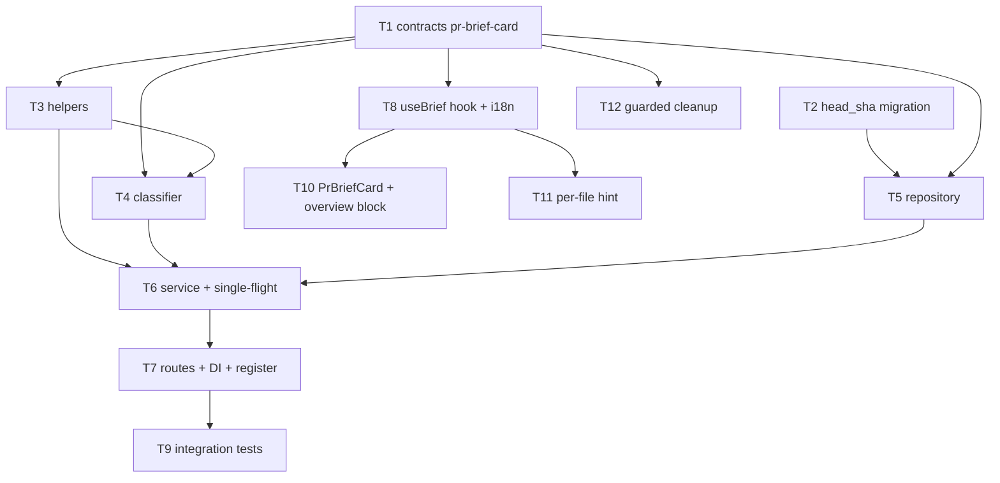

# Implementation Plan: Why+Risk Brief

## Overview
Add a PR-level "Why+Risk Brief" card that condenses already-computed signals (intent, blast-radius
summary, smart-diff stats-by-group, linked issue, relevant Context Folder specs) into a structured
`{ what, why, risk_level, risks[], review_focus[] }` via **one** structured LLM call, plus **one**
batched LLM call that fills `SmartDiffFile.pseudocode_summary` for `role: 'core'` files only. Both
results share a single cache keyed by (PR id, head commit SHA); generation is triggered only by an
explicit Generate/Regenerate button (never automatically). The PR overview also renders, read-only,
the latest completed review-run's verdict/score/findings-counts/cost from the existing
`review-api.ts` source (zero new LLM calls, zero new backend compute).

## Execution mode
**Multi-agent (parallel implementers).** The work splits cleanly into a contracts-first foundation,
a backend `brief` module, and a client slice (card + per-file hint + overview block), which can run
in parallel once contracts land. Owned paths below are non-overlapping within each phase; where two
tasks would touch the same file they are ordered via `Depends-on` instead. This is confirmed as the
default; nothing in scope forces a single-agent pass.

## Requirements
Traceability is to the spec's own AC-numbers (`specs/SPEC-02-why-risk-brief.md`). Requirements are
reproduced as given — not authored here.

- R1 (AC-1, AC-19): Synchronous endpoint builds a `Brief` from already-computed inputs via exactly
  one structured LLM call; returns `{ what, why, risk_level, risks[], review_focus[] }`. No SSE.
- R2 (AC-2): LLM input is stats/summaries only — never file bodies or diff bodies.
- R3 (AC-3): `risk_level ∈ {high, medium, low}` (same enum as `RiskSeverity`).
- R4 (AC-4): Each `risks[]` element reuses the existing `Risk` shape (`kind, title, explanation,
  severity, file_refs`); each `file_ref` carries a line locator `file:line` or
  `file:startLine-endLine`.
- R5 (AC-5): Each `review_focus[]` element = `{ label, file_ref, reason }`, `reason` mandatory,
  `file_ref` a line locator.
- R6 (AC-6, AC-7, AC-8): Post-hoc validation drops any `file_ref` whose **file part** is absent from
  the PR changed-file set; a risk left with zero valid refs is dropped entirely; every drop is
  logged/traced (not silent). Line-number out-of-range does NOT cause a drop (AC-6 edge case).
- R7 (AC-9, AC-10, AC-11, AC-16): One cache entry per (PR id, head SHA) holds both Brief and per-file
  summaries. Cache hit = zero LLM calls. New head SHA = miss. Regenerate forces rebuild of both and
  replaces the entry.
- R8 (AC-12): First open with no cache = empty state + explicit Generate CTA; no auto-generation.
- R9 (AC-13, AC-14, AC-15, AC-17): Exactly one batched per-file LLM call, input = core-file smart-diff
  stats only (no bodies), fills `pseudocode_summary` for core files only; hint renders only for core
  files; per-file failure is fail-soft (Brief still built, files shown without hint).
- R10 (AC-18): Structured Brief-call failure/timeout/invalid-schema → explicit error state with
  Retry, no partial brief returned, no partial/invalid write to cache.
- R11 (AC-20, AC-21, AC-22): `PrBriefCard` renders what/why/risk_level (color **plus** text label)
  and review_focus; focus items and risk `file_refs` are clickable and navigate to the specific
  line (or first line of a range).
- R12 (AC-23, AC-24, AC-25, AC-26): Overview renders the **latest completed** review-run's verdict,
  score, findings/blockers counts (derived from `findings` by severity), and **cost sum only** —
  read-only from `review-api.ts`, no new LLM call/compute; omitted (neutral state) when no completed
  run exists; Brief remains available regardless.
- R13 (Security / Untrusted inputs): PR body/intent, linked issue, and specs are untrusted — wrapped
  via `wrapUntrusted` before any LLM call; never interpreted as instructions. Generate/Regenerate is
  rate-limited 10/min (matching reviews/intent). AI output labelled as AI-generated on the UI.
- R14 (i18n / a11y): All new user strings go through `next-intl`; risk_level and score/verdict carry
  text + color (not color alone); focus/file links keyboard-operable; error+Retry keyboard-reachable.
- R15 (Non-goal cleanup — assigned to this plan): guarded removal of the dead `PrBrief` /
  `PrHistory` / `PrHistoryItem` exports and the client `PrBrief` re-export (see T12).

## Recommendations
Surfaced during spec review and **accepted by the user** (all four grouped decisions "all defaults
ok"):

- Reuse the existing empty `pr_brief` table + add a `head_sha` migration, rather than a new table.
- New shared contract file `contracts/pr-brief-card.ts`; **reuse** the existing `Risk` /
  `RiskSeverity` / `SmartDiffRole` schemas (they live in `contracts/brief.ts` and are actively
  consumed — only `PrBrief` composed + `PrHistory*` are dead scaffolding).
- Per-file core summaries ride in `PrBriefResponse.core_summaries`; the `smart-diff` module is left
  untouched (its contract does not change).
- Overview verdict/score/findings/cost reads from the **existing** `GET /pulls/:id/reviews` endpoint
  (confirmed to return persisted `ReviewRecord[]` + findings) — **no new backend read route needed**;
  the client derives the latest-completed run + counts + cost sum.
- Concurrent Regenerate coalesces via an in-process `Map<prId+headSha, Promise>` single-flight
  (the API is single-instance; DB advisory lock noted only as the multi-instance alternative — not
  built).
- Reuse the single existing `risk_brief` feature-model slot for **both** LLM calls (no new slot).
- Guarded cleanup of dead scaffolding (T12), contingent on a zero-consumer grep; `brief.json` i18n
  and the `pr_brief` table's live shape are left alone (table repurposed via head_sha).

## Affected modules & contracts
- **server / new `modules/brief/`** — gathers already-computed signals from `intent`, `blast`,
  `smart-diff`, `project-context`, `pulls`/`reviews` (all read-only), wraps untrusted text, makes the
  two LLM calls, validates+drops hallucinated refs, caches by head SHA, serves synchronously.
- **server / `db/schema/reviews.ts`** — add `head_sha` column to `pr_brief` (+ generated migration).
- **server / `platform/container.ts`, `modules/index.ts`** — DI + route registration for `brief`.
- **client** — new `PrBriefCard` + overview review-run block (reuses reviews hook) + per-file hint in
  the file/diff view + `useBrief` hook + i18n namespace.
- **Contracts (new file, both vendor copies):** `contracts/pr-brief-card.ts` exporting `Brief`,
  `ReviewFocusItem`, `PrBriefResponse`. Reuses existing `Risk`/`RiskSeverity`/`SmartDiffRole`.
- **Contracts unchanged:** `review-api.ts` (`ReviewRecord`), `brief.ts` live schemas
  (`Risk`, `SmartDiffFile`, `Intent`, `BlastRadius`) — read-only sources. `SmartDiffFile` shape does
  not change; `pseudocode_summary` merely transitions from "always null" to "may carry a summary for
  core files".

> **Shared dual-copy trap (applies to every contract task).** `@devdigest/shared` resolves to
> **two independent files**: `server/src/vendor/shared/` and `client/src/vendor/shared/` (client
> `tsconfig.json` points at its own copy). Any new/edited contract MUST be mirrored **byte-for-byte**
> into both copies and re-exported from **both** barrels (`index.ts`). Client barrel/re-exports must
> **not** use `.js` extensions (Next/webpack cannot resolve them); the server copy follows the ESM
> `.js` convention. See `client/insights/INSIGHTS.md` (dual-copy entries).

## Architecture changes
- **Domain (contracts):** add `server/src/vendor/shared/contracts/pr-brief-card.ts` and mirror
  `client/src/vendor/shared/contracts/pr-brief-card.ts`; wire both `index.ts` barrels. Pure Zod, zero
  framework imports.
- **Infrastructure (schema/migration):** `server/src/db/schema/reviews.ts` — `head_sha text` on
  `pr_brief`; `pnpm db:generate` emits the migration SQL under `server/drizzle/`.
- **Infrastructure (repository):** `server/src/modules/brief/repository.ts` — read/write the
  `pr_brief` row (prId PK), compare `head_sha` for hit/miss. Drizzle stays in this file.
- **Application (service + helpers + classifier):** `server/src/modules/brief/service.ts`
  (orchestration + single-flight), `helpers.ts` (pure ref-validation/drop/dedupe), `classifier.ts`
  (prompt build + two LLM calls + `wrapUntrusted`). No SQL, no adapter instantiation.
- **Presentation:** `server/src/modules/brief/routes.ts` — thin `GET`/`POST /pulls/:id/brief`;
  registered in `server/src/modules/index.ts`; service constructed in `platform/container.ts`.
- **Client (RSC boundary):** `PrBriefCard` and the file-view hint are `"use client"` (interactive:
  buttons, navigation, TanStack Query). The overview server block reuses the existing reviews hook.

## Phased tasks

### Phase 1 — Contracts & schema (foundation)

- **T1 — New shared contract `pr-brief-card.ts` (both copies)**
  - **Action:** Add `Brief = { what: string; why: string; risk_level: RiskSeverity; risks: Risk[];
    review_focus: ReviewFocusItem[] }`, `ReviewFocusItem = { label: string; file_ref: string;
    reason: string }` (all required), and the endpoint envelope
    `PrBriefResponse = { brief: Brief; core_summaries: Record<string,string>; head_sha: string;
    generated: boolean }`. Import and reuse `Risk`, `RiskSeverity` from `./brief` and `SmartDiffRole`
    where needed. Create the file in `server/src/vendor/shared/contracts/` **and** mirror it exactly
    into `client/src/vendor/shared/contracts/`; re-export from both `index.ts` barrels (server: `.js`
    ext; client: no ext). Export both schema and inferred type per convention.
  - **Module:** shared (server + client vendor copies)
  - **Type:** core
  - **Skills to use:** `zod`, `typescript-expert`, `onion-architecture` (domain layer)
  - **Owned paths:** `server/src/vendor/shared/contracts/pr-brief-card.ts`,
    `server/src/vendor/shared/index.ts`, `client/src/vendor/shared/contracts/pr-brief-card.ts`,
    `client/src/vendor/shared/index.ts`
  - **Depends-on:** none
  - **Risk:** medium
  - **Known gotchas:** Dual-copy trap (both copies + both barrels, client barrel without `.js`).
    Use `nullish()` (not `optional`/`nullable`) if any field is later made optional — but here
    `reason` and all `Brief` fields are **required** per AC-4/AC-5. `core_summaries` is a keyed
    record, not an array.
  - **Acceptance:** `cd server && pnpm typecheck` and `cd client && pnpm typecheck` both pass for the
    new file (grep the typecheck output for `pr-brief-card` — a fully-green tree isn't required while
    sibling phase-1 tasks are in flight); `import { Brief, ReviewFocusItem, PrBriefResponse } from
    '@devdigest/shared'` resolves in both packages.

- **T2 — `head_sha` migration on `pr_brief`**
  - **Action:** Add `headSha: text('head_sha')` (nullable — existing rows predate it) to the
    `prBrief` table in `server/src/db/schema/reviews.ts`. Run `cd server && pnpm db:generate` to emit
    the migration SQL; commit the generated file under `server/drizzle/`. Do NOT run `db:migrate` as
    part of acceptance in CI-less mode — generation + review is the deliverable.
  - **Module:** server
  - **Type:** backend
  - **Skills to use:** `drizzle-orm-patterns`, `postgresql-table-design`, `onion-architecture` (infra)
  - **Owned paths:** `server/src/db/schema/reviews.ts`, `server/drizzle/**` (new generated migration)
  - **Depends-on:** none
  - **Risk:** low
  - **Known gotchas:** Migrations never auto-run on boot (CLAUDE.md); explicit `db:generate` then
    `db:migrate`. Nullable column avoids a table rewrite on existing rows. `pr_brief` PK stays `prId`
    — one brief per PR, replaced on new SHA/Regenerate.
  - **Acceptance:** `pnpm db:generate` produces exactly one new migration adding `head_sha`;
    `pnpm typecheck` passes; schema diff shows only the added column.

### Phase 2 — Backend `brief` module (depends on Phase 1)

- **T3 — Pure ref-validation helpers (`helpers.ts`)**
  - **Action:** Implement pure functions: parse a `file:line` / `file:startLine-endLine` locator into
    `{ file, startLine, endLine? }`; validate the **file part** against the PR changed-file set;
    drop invalid `file_refs`; dedupe refs per risk deterministically (by path+range); drop any risk
    left with zero valid refs (AC-7); same validation for `review_focus[]` items (a focus item whose
    ref is invalid is dropped). Return a small `{ kept, dropped }` result so the service can log
    drops (AC-8). Line-number range is NOT validated against file length (AC-6 edge case). Add a
    hermetic unit test.
  - **Module:** server
  - **Type:** core
  - **Skills to use:** `typescript-expert`, `zod`, `react-testing-library` (vitest patterns for the
    pure test)
  - **Owned paths:** `server/src/modules/brief/helpers.ts`, `server/src/modules/brief/helpers.test.ts`
  - **Depends-on:** T1
  - **Risk:** low
  - **Known gotchas:** Validation is on file part only; a valid file with an out-of-range line stays.
    Empty changed-file set (empty diff) → all refs dropped → risks with only such refs dropped.
  - **Acceptance:** `cd server && pnpm exec vitest run modules/brief/helpers.test.ts` green; covers
    drop-invalid, keep-valid-file-bad-line, drop-risk-with-zero-refs, dedupe determinism, empty set.

- **T4 — Prompt builders + two LLM calls (`classifier.ts`)**
  - **Action:** Build the structured Brief prompt from stats/summaries only (intent, blast summary,
    smart-diff groups/stats, linked issue, relevant specs) — **no file/diff bodies** (AC-2); wrap
    every externally-authored fragment (PR body/intent, issue, specs) with `wrapUntrusted` from
    `platform/prompt.ts` (AC / R13). Call `llm.completeStructured({ schema: Brief, ... })` once.
    Separately build the batched per-file prompt from **core-file** smart-diff stats only (path,
    role, additions, deletions) and call `completeStructured` once returning
    `{ [path]: summary }` for core files (AC-13/AC-14). Resolve the model via
    `resolveFeatureModel(container, workspaceId, 'risk_brief')` for both calls. Return typed results;
    surface failures as typed errors so the service can fail-soft (per-file) / error-state (Brief).
  - **Module:** server
  - **Type:** core
  - **Skills to use:** `typescript-expert`, `zod`, `security` (A05 injection / ASI01 goal-hijacking —
    untrusted wrapping), `onion-architecture` (application helper)
  - **Owned paths:** `server/src/modules/brief/classifier.ts`
  - **Depends-on:** T1, T3
  - **Risk:** medium
  - **Known gotchas:** Mirror `intent/classifier.ts` structure (inputs injected; no DB/GitHub/fetch
    here). `completeStructured<T>` signature is in `vendor/shared/adapters.ts`. Prompt must never
    include change bodies — build from headers/stats like `intent/classifier.ts` does.
  - **Acceptance:** `cd server && pnpm typecheck` clean for the file; a hermetic unit test (may live
    in T3's suite or a sibling `classifier.test.ts` owned here) asserts the assembled prompt contains
    stats/summaries and contains **no** diff/file body text, and that exactly one structured call is
    issued per builder.

- **T5 — Cache repository (`repository.ts`)**
  - **Action:** Read/write the `pr_brief` row by `prId`. `get(prId)` returns the stored
    `{ json, headSha }` or null; `upsert(prId, headSha, response)` writes the full `PrBriefResponse`
    JSON + `head_sha`. Provide `toDomain`/`toDb` mappers; keep Drizzle `$inferSelect`/`$inferInsert`
    inside this file. A hit is decided by the **service** comparing stored `headSha` to the PR's
    current head SHA — repository just stores/returns.
  - **Module:** server
  - **Type:** backend
  - **Skills to use:** `drizzle-orm-patterns`, `onion-architecture` (infrastructure layer)
  - **Owned paths:** `server/src/modules/brief/repository.ts`
  - **Depends-on:** T1, T2
  - **Risk:** low
  - **Known gotchas:** JSON column is untyped at the DB layer — parse/validate with `PrBriefResponse`
    on read (`parse-never-trust-json`). Never leak `$inferSelect` out of this file.
  - **Acceptance:** `cd server && pnpm typecheck` clean; an integration test in T9 exercises
    upsert-then-get round-trip against real Postgres.

- **T6 — Orchestration service + single-flight (`service.ts`)**
  - **Action:** `getCached(workspaceId, prId)` → resolve PR + current head SHA (via
    `ReviewRepository`/`pulls`), read cache; if `headSha` matches return `{ ...response, generated:
    false }` with **zero** LLM calls (AC-9). `generate(workspaceId, prId, { regenerate })` →
    single-flight on key `prId+headSha` using an in-process `Map<string, Promise<PrBriefResponse>>`
    (coalesce concurrent Regenerate, AC race edge case); gather already-computed inputs from the
    read-only source services/repos (intent, blast, smart-diff, project-context, linked issue), build
    changed-file set, call `classifier` (Brief), then per-file (core only). Validate+drop refs via
    `helpers` and **log each drop** (AC-8). On Brief-call failure/invalid schema: throw a typed error
    and do **not** write cache (AC-18). On per-file failure: keep Brief, `core_summaries = {}`
    (AC-17). Persist via repository and return.
  - **Module:** server
  - **Type:** backend
  - **Skills to use:** `onion-architecture` (application/orchestration + fire-and-forget rules),
    `typescript-expert`, `security` (fail-closed error handling, logging without leaking bodies)
  - **Owned paths:** `server/src/modules/brief/service.ts`
  - **Depends-on:** T4, T5, T3
  - **Risk:** high
  - **Known gotchas:** Single-flight map must key on `prId+headSha` (not prId alone) and delete the
    entry in a `finally` so a failed build doesn't wedge future attempts. Linked issue absent → build
    without it, not an error (AC-2 edge). Empty diff → empty changed-file set → all refs drop. Reuse
    existing services read-only; do not mutate their state or contracts.
  - **Acceptance:** covered by T9 integration tests — cache-hit does zero provider calls; miss does ≤2
    calls; Regenerate replaces cache; per-file failure leaves Brief intact; Brief failure writes no
    cache row. `pnpm typecheck` clean.

- **T7 — Routes + DI + registration**
  - **Action:** `GET /pulls/:id/brief` → `service.getCached`; returns the cached `PrBriefResponse` or
    an empty-state marker (e.g. `204` or `{ generated: false, brief: null }` — pick one and declare
    the Zod response schema) and **never** generates (AC-12). `POST /pulls/:id/brief` (body
    `{ regenerate?: boolean }`) → `service.generate`; `config: { rateLimit: { max: 10, timeWindow:
    '1 minute' } }` (matching `intent/reviews`). Thin handlers only (validate → one service call →
    reply) with `fastify-type-provider-zod` param/body/response schemas. Register `brief` in
    `server/src/modules/index.ts`; construct `BriefService` in `platform/container.ts` (lazy getter,
    mirroring existing services).
  - **Module:** server
  - **Type:** backend
  - **Skills to use:** `fastify-best-practices` (routes, rate-limit config, serialization),
    `onion-architecture` (presentation + DI container), `zod`
  - **Owned paths:** `server/src/modules/brief/routes.ts`, `server/src/modules/index.ts`,
    `server/src/platform/container.ts`
  - **Depends-on:** T6
  - **Risk:** medium
  - **Known gotchas:** `modules/index.ts` currently registers `intent, smartDiff, blast,
    projectContext, ...` — append `brief` there (one import + one entry). Rate-limit config is under
    route `config`, not schema. Editing `platform/container.ts` — beware the Edit-tool Unicode-quote
    substitution trap (server INSIGHTS) if the block contains non-ASCII; keep edits ASCII.
  - **Acceptance:** `cd server && pnpm typecheck` clean; `pnpm exec vitest run --exclude
    '**/*.it.test.ts'` green; a hermetic route test (via Fastify `inject`) asserts `GET` on a
    no-cache PR returns the empty-state (no provider call) and `POST` is registered with the 10/min
    rate-limit config.

### Phase 3 — Client (depends on T1; parallelizable with Phase 2)

- **T8 — Brief API hook + i18n namespace**
  - **Action:** Add `useBrief(prId)` (TanStack Query, `GET /pulls/:id/brief`) and
    `useGenerateBrief(prId)` mutation (`POST`, invalidates the brief query) in a new hook file, with
    stable query keys registered alongside the existing hooks. Add a **new** i18n namespace file
    `client/messages/en/brief-card.json` for all new strings (what/why labels, risk-level labels,
    review-focus, empty/loading/error/Retry, AI-generated label) — do **not** reuse the stale
    `brief.json`. Use `useTranslations('briefCard')` in components (T10/T11).
  - **Module:** client
  - **Type:** ui
  - **Skills to use:** `react-best-practices` (data fetching in hooks), `frontend-architecture`
    (hook/constant placement), `next-best-practices`
  - **Owned paths:** `client/src/lib/hooks/brief.ts`, `client/src/lib/hooks/index.ts`,
    `client/messages/en/brief-card.json`
  - **Depends-on:** T1
  - **Risk:** low
  - **Known gotchas:** Follow the existing `client/src/lib/hooks/intent.ts` / `smart-diff.ts` pattern
    and the `api` helper in `client/src/lib/api.ts`. Register the new namespace wherever
    `next-intl` messages are assembled (mirror an existing namespace like `prReview`/`projectContext`).
  - **Acceptance:** `cd client && pnpm typecheck` clean; hook compiles and query keys are unique;
    the new namespace loads (no missing-message warning when a component reads `briefCard.*`).

- **T9 — Backend integration tests for the brief endpoint** *(server; grouped in Phase 3 to run
  after the backend lands, but owned separately)*
  - **Action:** `.it.test.ts` (real Postgres via testcontainers) covering: miss → ≤2 provider calls
    and full 5-field brief; hit → zero provider calls, same brief; new head SHA → miss; Regenerate →
    forces rebuild + cache replace; hallucinated `file_ref` dropped + logged; risk with only invalid
    refs dropped (AC-7); per-file failure → Brief intact, no hint; Brief failure → error, no cache
    write (AC-18). Use the mock LLM provider (`src/adapters/mocks.ts`).
  - **Module:** server
  - **Type:** backend (tests)
  - **Skills to use:** `react-testing-library` (vitest idioms), `security` (assert bodies never enter
    prompt), `fastify-best-practices` (`inject`)
  - **Owned paths:** `server/src/modules/brief/service.it.test.ts`
  - **Depends-on:** T7
  - **Risk:** medium
  - **Known gotchas:** `*.it.test.ts` = integration (real Postgres). Assert provider call **count**
    for hit/miss/regenerate. Mock provider returns fixed structured payloads incl. one hallucinated
    ref to prove the drop+log path.
  - **Acceptance:** `cd server && pnpm exec vitest run .it.test` includes and passes the new file.

- **T10 — `PrBriefCard` + overview review-run block**
  - **Action:** `"use client"` `PrBriefCard` rendering what/why, `risk_level` as **color + text
    label** (AC-20), and `review_focus[]` each clickable → navigate to the ref line (AC-21). Render
    risk `file_refs` as clickable links whose visible text includes the `file:line` locator (AC-22).
    Handle empty (Generate CTA, AC-12), loading, and error+Retry (AC-18/AC-7 US-7) states. Mark
    AI-generated content visibly (R13/ASI09). Add a sibling **overview block** that reads the latest
    **completed** run from the existing reviews hook (`client/src/lib/hooks/reviews.ts` →
    `GET /pulls/:id/reviews`), derives verdict/score, findings/blockers counts by severity, and
    **cost sum only** (no token telemetry); omit the block (neutral) when no completed run exists
    (AC-23..AC-26). Compose both in the PR overview page. Add a component test.
  - **Module:** client
  - **Type:** ui
  - **Skills to use:** `react-best-practices` (presentational/container split, conditional-render,
    a11y, key props), `frontend-architecture` (colocated `_components/`), `next-best-practices`
    (client boundary), `react-testing-library`, `security` (validate ref before use as link)
  - **Owned paths:**
    `client/src/app/repos/[repoId]/pulls/[number]/_components/PrBriefCard/PrBriefCard.tsx`,
    `client/src/app/repos/[repoId]/pulls/[number]/_components/PrBriefCard/PrBriefCard.test.tsx`,
    `client/src/app/repos/[repoId]/pulls/[number]/_components/ReviewRunOverview/ReviewRunOverview.tsx`,
    `client/src/app/repos/[repoId]/pulls/[number]/page.tsx`
  - **Depends-on:** T8
  - **Risk:** medium
  - **Known gotchas:** Existing PR-detail components live under
    `[number]/_components/` (e.g. `RunHistory/`) — colocate there. Reuse `SeverityChip` for
    findings/blockers counts if suitable (see client INSIGHTS re: `SeverityChip` 12-slot model).
    `risk_level`/`score` must convey meaning without color (WCAG AA). Focus/link navigation targets a
    specific line — reuse whatever line-anchor mechanism the file/diff view exposes (coordinate with
    T11 on the anchor format).
  - **Acceptance:** `cd client && pnpm typecheck` clean; `cd client && pnpm test` passes a
    `PrBriefCard.test.tsx` walking: empty→Generate CTA (no auto-fetch of generation), loaded→risk
    level shown as text+color, focus click issues navigation to `file:line`, error→Retry visible;
    review-run block hidden when no completed run.

- **T11 — Per-file `pseudocode_summary` hint in the file/diff view**
  - **Action:** In the changed-file / diff view, overlay the core-file hint from
    `PrBriefResponse.core_summaries[path]` (from `useBrief`). Render the hint block **only** for files
    the smart-diff groups as `role: 'core'` **and** that have a summary; render nothing for
    wiring/boilerplate or when absent (AC-15/AC-17). Label it AI-generated. Expose/consume the
    line-anchor target used by T10's focus/ref navigation so click-through lands on `file:line`.
  - **Module:** client
  - **Type:** ui
  - **Skills to use:** `react-best-practices` (conditional render, no derived-state-in-effect),
    `frontend-architecture`, `next-best-practices`, `react-testing-library`
  - **Owned paths:** the smart-diff/file-view component + its test under
    `client/src/app/repos/[repoId]/pulls/[number]/_components/` (implementer locates the existing
    file-view component that consumes `useSmartDiff`; if none is colocated there, the component under
    `client/src/components/` that renders the smart-diff file list — grep for `useSmartDiff` /
    `smart-diff.ts` consumers). Owns only that component file + its test; must NOT overlap T10's
    owned files.
  - **Depends-on:** T8
  - **Risk:** medium
  - **Known gotchas:** `smart-diff` module is untouched server-side; summaries come from the brief
    response, not the smart-diff response (whose `pseudocode_summary` stays null on the wire). Do not
    fetch smart-diff twice. Role is known from the smart-diff group the file belongs to.
  - **Acceptance:** `cd client && pnpm typecheck` clean; `cd client && pnpm test` covers: core file
    with summary → hint shown; wiring/boilerplate → no hint; core file without summary → no hint.

### Phase 4 — Cleanup (guarded; after contracts settle)

- **T12 — Guarded removal of dead `PrBrief` scaffolding**
  - **Action:** First run a zero-consumer grep for `PrBrief`, `PrHistory`, `PrHistoryItem` across
    `server/src`, `client/src`, `reviewer-core/src`, `e2e/src` (excluding the definition files and
    barrel comments). **Only if** the sole references are the definitions + the client type re-export,
    remove the `PrBrief` / `PrHistory` / `PrHistoryItem` Zod schemas + inferred types from **both**
    `contracts/brief.ts` copies, drop them from both `index.ts` barrel comments, and remove the
    `PrBrief` re-export in `client/src/lib/types.ts`. Leave `Risk`/`SmartDiffFile`/`Intent`/
    `BlastRadius` (live), the `pr_brief` table (repurposed), and `brief.json` (ambiguous — may back
    git-why's `why` sub-block) untouched. If grep finds a real consumer, **skip the removal** and note
    it in the task result instead.
  - **Module:** shared (server + client vendor copies) + client
  - **Type:** core
  - **Skills to use:** `typescript-expert`, `zod`, `onion-architecture` (domain layer)
  - **Owned paths:** `server/src/vendor/shared/contracts/brief.ts`,
    `client/src/vendor/shared/contracts/brief.ts`, `client/src/lib/types.ts`,
    `server/src/vendor/shared/index.ts`, `client/src/vendor/shared/index.ts`
  - **Depends-on:** T1 (barrels are edited by T1 first; sequencing avoids an index.ts conflict)
  - **Risk:** medium
  - **Known gotchas:** This edits the **consumed** shared `brief.ts` — **explicit callout**: this is
    a deliberate, grep-guarded change to shared contracts, not a casual edit. Dual-copy trap applies
    (both copies + both barrels). Removal is contingent on the grep — do not delete on assumption.
  - **Acceptance:** `cd server && pnpm typecheck` and `cd client && pnpm typecheck` both fully green
    after removal; `cd reviewer-core && npm run typecheck` green; grep shows no remaining references
    to the removed symbols outside their (now-deleted) definitions.

## Testing strategy
- **Server unit (hermetic):** `cd server && pnpm exec vitest run --exclude '**/*.it.test.ts'` —
  covers `helpers.test.ts` (T3) and `classifier` prompt assertions (T4), route wiring (T7).
- **Server integration (real Postgres):** `cd server && pnpm exec vitest run .it.test` — covers the
  full endpoint behavior incl. call-count and cache semantics (T9), using the mock LLM provider.
- **Client (jsdom):** `cd client && pnpm test` — `PrBriefCard.test.tsx` (T10) and the file-view hint
  test (T11); MSW/mocked `useBrief` at the boundary.
- **Typecheck gates:** `cd server && pnpm typecheck`, `cd client && pnpm typecheck`,
  `cd reviewer-core && npm run typecheck` (T12 final gate).
- Do not run `db:migrate`, seeds, or a dev server as part of task acceptance (planner constraint).

## Task dependency DAG

Concurrency: {T1, T2} in Phase 1 (disjoint paths). Phase 2 backend {T3, T5} start together after
T1/T2; T4 after T3; T6 after T4/T5; T7 after T6. Phase 3 client {T8 then T10, T11} runs in parallel
with Phase 2 once T1 lands (disjoint client paths from backend). T9 after T7. T12 last, after T1.

## Risks & mitigations
- **Shared dual-copy drift** (client typecheck fails because only the server copy was edited) →
  T1 and T12 explicitly own both copies + both barrels; every contract acceptance greps its own file
  in both packages.
- **Single-flight wedge** (a failed build leaves a rejected promise cached in the map) → delete the
  map entry in `finally`; T9 covers a failure-then-retry path.
- **Hallucinated refs / prompt-injection** via untrusted issue/spec/PR text → `wrapUntrusted` on
  every externally-authored fragment (T4); post-hoc file-set validation + drop + log (T3/T6);
  AI-generated labelling on the UI (T10/T11).
- **Accidentally breaking a live `brief.ts` consumer during cleanup** → T12 is grep-guarded and
  skips removal if any real consumer exists; only the dead `PrBrief`/`PrHistory*` symbols are in
  scope.
- **File-view component location uncertainty** (T11) → implementer locates it by grepping
  `useSmartDiff` consumers; T11 owns only that one component + its test and must not overlap T10.
- **Line-anchor coordination** between T10 (focus/ref click) and T11 (hint view) → both depend on T8
  and share the file/diff view's existing line-anchor mechanism; the anchor format is agreed via the
  smart-diff/file-view component, not re-invented.
- **Out-of-scope discovery:** the stale `brief.json` `why` sub-block may belong to git-why — left
  untouched deliberately; flagged here rather than silently cleaned.

## Red-flags check
- [x] Every requirement maps to a task (R1-R11 → T3/T4/T6/T7/T9/T10/T11; R12 → T10; R13 → T4/T6/T7/
      T10/T11; R14 → T8/T10/T11; R15 → T12).
- [x] Dependencies form a DAG (no cycles) — see diagram.
- [x] Execution mode is stated (multi-agent); concurrent tasks have non-overlapping Owned paths
      (Phase-1 T1/T2 disjoint; backend chain sequential on shared module files; client T8→{T10,T11}
      own disjoint files; T12 sequenced after T1 to avoid the barrel `index.ts` conflict).
- [x] Every Acceptance is measurable (named test files, `vitest`/`typecheck` commands, provider
      call-count assertions, observable UI states).
- [x] No edits to existing shared contracts without an explicit callout — T12 edits the consumed
      `brief.ts` and is explicitly flagged and grep-guarded; `review-api.ts` and live `brief.ts`
      schemas are read-only.
- [x] No specification content was authored — requirements are reproduced from SPEC-02 with AC refs;
      only recommendations and the plan are new.
