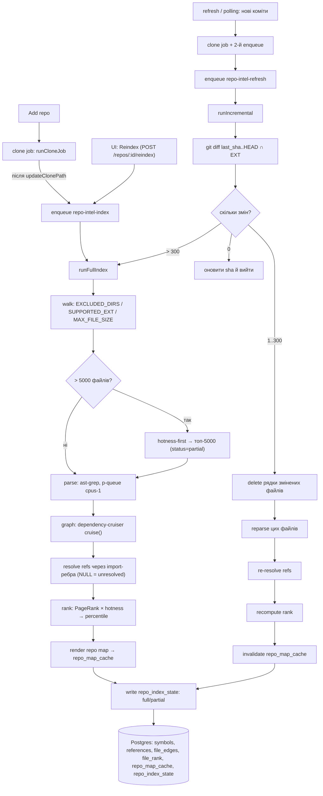
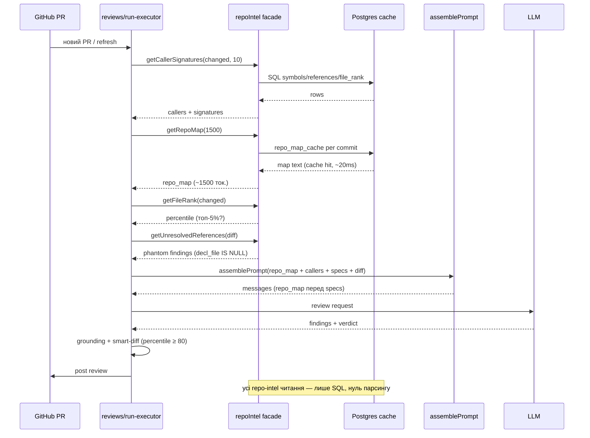
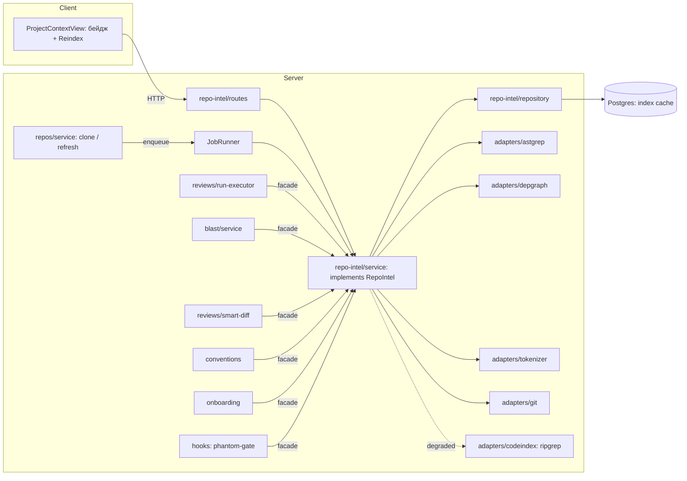
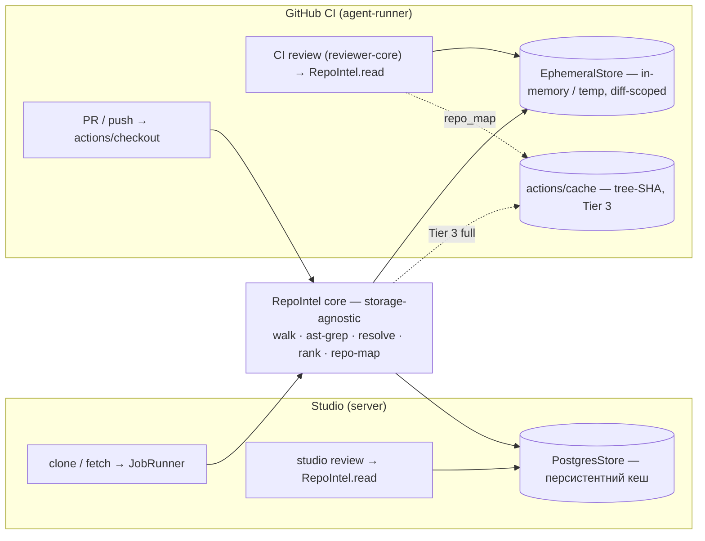

# Repo Intelligence Layer (repo-intel) — план і специфікація (DevDigest)

> **Статус:** план до затвердження · **Дата:** 2026-06-10
> **Джерело:** адаптовано з узагальненої `spec-repo-intel.md` до реального коду DevDigest
> **Пов'язано:** `specs/ai-pr-reviewer.md`, `specs/eval-harness.md`, `docs/refactor-plan.md`

`repo-intel` — спільний кешований шар «розуміння репозиторію», який живить усі фічі застосунку
(рев'ю, Blast Radius, Onboarding, Conventions, Phantom-gate, smart-diff). Принцип:
**індексуємо на clone/fetch — читаємо на рев'ю.** Факти збирає код один раз; у prompt ідуть стислі
вижимки з кешу.

Цей документ — **план + специфікація імплементації**, а не лише опис фічі. Він свідомо відрізняється
від `spec-repo-intel.md`: та спека узагальнена (`repo_id INT`, raw SQL, «наявний токенайзер»), а тут
усе зведено до фактичного коду (`repos.id` = `uuid`, Drizzle ORM, JobRunner, наявні `symbols`/`references`).
Імплементація — окремий крок після затвердження.

## Зміст
1. Контекст і принцип
2. Вплив на кожну фічу (простими словами)
3. Наскільки це піднімає якість (чесна оцінка)
4. Фази впровадження (за ROI/ризиком)
5. Адаптації до реального репо
6. Зміни в даних (Drizzle)
7. Залежності
8. Модуль-фасад, адаптери, container
9. Пайплайн індексації
10. Рендер repo map
11. Точки інтеграції (файл → зміна)
12. Degraded mode
13. Acceptance Criteria
14. Ризики та мітигації
15. Відкриті питання
16. Процеси і потоки (Mermaid)
17. repo-intel у CI vs Studio (рішення)

---

## 1. Контекст і принцип

### Проблема
Сьогодні застосунок «розуміє» код **на гарячому шляху**, щоразу під час рев'ю чи відкриття PR:

- **Рев'ю сліпе до структури.** `assemblePrompt` (`reviewer-core/src/prompt.ts`) дає моделі лише
  `system → task → skills → memory → specs → diff`. Модель не знає, хто викликає змінену функцію і
  наскільки важливий змінений файл.
- **Дубльований on-the-fly аналіз.** `blast` (`server/src/modules/blast/service.ts`) на кожен запит
  сканує весь клон через `codeIndex.symbols()`/`references()` + читає файли для endpoints. Onboarding і
  conventions роблять свої проходи. Те саме рахується багато разів.
- **Неточність.** `codeindex` (`server/src/adapters/codeindex/extract.ts`) — це регексп по рядках, не
  AST: пропускає реекспорти, плутає декларації, матчить референси лише за іменем.

### Принцип
**Порахувати один раз на clone/fetch, скласти в Postgres, читати з кешу.** Уся складність
(`@ast-grep/napi`, `dependency-cruiser`, `graphology`, токенайзер) ховається за єдиним фасадом
`repoIntel.*`; фічі імпортують фасад, а не бібліотеки. На гарячому шляху рев'ю — лише SQL **у studio**
(персистентний Postgres-кеш). У CI індекс будується ефемерно в раннері на кожен запуск — свідомий
компроміс «self-contained + завжди свіжий PR head» замість «нуль парсингу» (деталі — §17).

### Чесний реврейм (навіщо це насправді)
Це **навчальний template**, не продакшн-продукт, тому цінність рахується двома лінзами:

- **Педагогічна** (домінує): repo-intel — флагманський матеріал курсу (precompute-and-cache;
  три рівні аналізу regex → AST → компіляторна семантика; repo map à la Aider; PageRank по графу імпортів).
- **Якість рев'ю:** піднімає **стелю** (новий клас крос-файлових інсайтів) і **довіру**
  (порахований onboarding/conventions замість вгаданого) більше, ніж середній коментар — детально у §3.

Це **платформенна ставка** з великою площею змін і нетривіальним ризиком (поганий індекс шкодить —
§3, §14). Тому впроваджуємо **фазами з вимірюванням** (§4), а не одним заходом.

---

## 2. Вплив на кожну фічу (простими словами)

**Рев'ю PR** (`server/src/modules/reviews/run-executor.ts` + `reviewer-core/src/prompt.ts`). Зараз: у `assemblePrompt` модель отримує лише `system → task → skills → memory → specs → diff`; структури репо немає, важливість файлу зчитується тільки з шляху. Стане: перед блоком `## Project context` додається `## Repo skeleton` (карта top-N важливих символів, токен-бюджет ≤ 1500) + до кожного зміненого файлу — короткий блок «хто викликає змінені символи» (до 10 викликачів), а в task-рядок підшивається «N із M змінених файлів — топ-5% важливих». На практиці: модель ловить breaking changes для гарячих залежностей, пріоритезує core-файли, менше галюцинує про структуру.

**Blast Radius** (`server/src/modules/blast/service.ts`). Зараз: при кожному запиті виконуються on-the-fly `codeIndex.symbols()` + `references()` по всьому клону + читання файлів для `extractEndpoints`/`extractCrons` — повільно і неточно (регексп-індекс пропускає реекспорти й опосередковані виклики). Стане: вся механіка ховається за `repoIntel.getBlastRadius(repoId, changedFiles)`: < 200 мс з кешу, BFS ≤ 2 по графу імпортів: змінені символи → викликачі → endpoints/cron. На практиці: бейджу «що зачепить цей PR» можна довіряти, і він не гальмує сторінку PR.

**Smart Diff** (`server/src/modules/reviews/smart-diff.ts`). Зараз: `classifyFile(path)` ділить файли на `core/wiring/boilerplate` тільки за регулярками шляху — `service.ts` у фікстурі та реальний core коштують однаково. Стане: позначка `core` підтверджується важливістю — `getFileRank(repoId, path).percentile ≥ 80`; решта евристики залишається. На практиці: чесніший розподіл за пріоритетом, без втрати простоти й детермінізму.

**Onboarding** (`server/src/modules/onboarding/analyzer.ts` → `facts.ts:collectKeyFiles`). Зараз: «що читати спершу» = `keyFiles` із grep + ручні правила для маркер-файлів. Стане: reading path = топ-7 за `getFileRank` (виключаючи тести/конфіги/міграції) + перетин з critical paths з графа залежностей. На практиці: послідовність онбордингу порахована з реальних викликів, а не вгадана за іменами.

**Conventions** (`server/src/modules/conventions/extract-pipeline.ts` → `sampleFiles`). Зараз: семпли беруться як перші N символів із `codeIndex.symbols()` + grep по розширеннях — у вибірку легко потрапляє щось випадкове. Стане: `repoIntel.getConventionSamples(repoId, 12)` повертає топ-12 за важливістю + конфіги репо. На практиці: правила вчаться з файлів, що задають тон проєкту, а не з випадкових утиліт.

**Phantom-API gate** (`server/src/modules/hooks/detectors.ts`). Зараз: детектор працює лише за регексп-маркерами (TODO/стаби/підозрілі імпорти) — реальні «фантомні» виклики не ловить. Стане: ~20 рядків поверх `repoIntel.getUnresolvedReferences(repoId, diff)` — будь-який символ із доданих рядків, що не резолвиться по індексу, → finding `phantom`. На практиці: майже безкоштовно ловимо виклики неіснуючих/перейменованих/неправильно імпортованих API.

**Run trace / вартість** (`server/src/vendor/shared/contracts/trace.ts`). Зараз: у `PromptAssembly` зберігаються тільки `{system, skills, memory, specs, user}`; токени видно одним числом. Стане: додається опційне поле `repo_map` + подія `repo_intel_read` із вимірюваним токен-каунтом і `cache_hit:boolean`. На практиці: видно вартість шару окремо; завдяки prompt-caching карта кешується per-commit і коштує копійки.

**Інтерфейс** (`client/src/app/repos/[repoId]/context/` + `client/src/lib/hooks/context.ts`). Зараз: показується тільки статус індексації project-context (`useIndexStatus` + `useReindex`). Стане: поряд — бейдж стану repo-intel індексу (`full | partial | degraded | indexed N/M файлів`) + кнопка `Reindex`. На практиці: користувач бачить, чи готовий «розумний» шар, і чесний `partial` на гігантських репо без сюрпризів.

**Наскрізна гарантія — degraded mode.** Якщо feature-флаг `repoIntelEnabled=false`, індекс впав, або репо завелике для повного аналізу — кожен метод фасаду повертає `{ degraded: true, … }` із best-effort даними (символи через ripgrep-фолбек, порожні rank/map). Жодна з восьми фіч вище не падає: вони рендерять чесний стан `partial index`/`degraded` і працюють на старій логіці (ripgrep-blast, path-only smart-diff, key-files-onboarding тощо). Інакше кажучи: repo-intel — це шар прискорення й точності, а не залежність на критичному шляху.

---

## 3. Наскільки це піднімає якість (чесна оцінка)

repo-intel — це **не «ще один промпт-тюнінг», а зсув стелі**, але цей зсув нерівномірний по класах знахідок. Чесна декомпозиція:

- **Великий приріст — на крос-файлових інсайтах.** Breaking changes (зміна сигнатури/семантики shared-функції, видалений експорт, поламаний контракт endpoint'а) — це клас, де модель уперше отримує інформацію, якої **немає у дифі**: викликачі змінених символів, ребра імпортів, percentile важливості. Плюс **Phantom-API gate** на `getUnresolvedReferences` — детермінований чек з високою точністю (символ викликається, ніде не декларований і не імпортований → знахідка з мінімумом false positives). Це новий клас рев'ю-знахідок, якого ripgrep-режим у принципі не вміє.
- **Помірний приріст — на пріоритезації + довірі.** Onboarding/conventions/smart-diff перестають «вгадувати» і починають **рахувати** (reading path = top-N за PageRank×hotness, conventions sample = ті ж top-N, smart-diff core ↔ `percentile ≥ 80`). Це не нові знахідки — це **обґрунтовані** знахідки. Для навчального template це педагогічна цінність окремо («найшвидший аналіз — той, що вже порахований»).
- **~Нуль — на локальній логіці, стилі, безпеці в межах файлу.** Тут якість залежить від моделі і самого дифа, а не від структури навколо. Repo-intel сюди нічого не доносить.
- **Ризик у зворотний бік.** Поганий індекс шкодить більше, ніж його відсутність: модель отримує **впевнено-неправильний** контекст (однойменні символи з різних модулів, re-export через barrel, DI/декоратори, динамічні require, monkey-patching — усе це джерела хибних ребер). Чесний `NULL` для нерезолвнутого + резолв тільки через import-ребра + Phantom-gate як *окремий* детектор (а не «шепіт у промпті») пом'якшують це, але не знімають повністю.
- **Висновок.** Стеля підіймається там, де її не дістати без структурного контексту; довіра — там, де раніше було «ми так вирішили». На локальних багах — близько нуля. Тому міряємо не середній скор рев'ю, а **recall по класах**: специфічно — крос-файлові дефекти та phantom-виклики ДО/ПІСЛЯ (див. `specs/eval-harness.md`). Якщо приріст на цих класах не вийде значущим — це сигнал зупинитися на Tier 1, а не йти далі.

---

## 4. Фази впровадження (за ROI/ризиком)

Фази свідомо нерівні за обсягом: чим далі — тим більше інженерії і тим спекулятивніший ROI. Між фазами — **gate на `specs/eval-harness.md`**.

- **Tier 1 — «Callers + Phantom» поверх наявного.** Висока користь, низький ризик, мала зміна. Що робимо:
  - Підняти наявні `symbols`/`references` (`server/src/db/schema/context.ts`) з ripgrep-евристики до AST-екстракції в межах файлів дифа (а не всього репо) — це вже дає named-imports + call-expressions з прийнятною точністю.
  - У промпт рев'ю — блок **«Callers of changed symbols»** (top-N сигнатур; правило відбору фіксоване).
  - **Phantom-API gate** як окремий детектор (не текст у промпті), що виконується ДО моделі. На T1 резолв **ефемерний, diff-scoped** — перевіряємо резолв символів у межах розпарсених файлів дифа, **без** персистентної колонки `decl_file` й графа (вони приходять на T2/T3). Тобто T1-phantom не залежить від схеми T2.
  - **Обов'язково eval-first:** прогнати `specs/eval-harness.md` ДО і ПІСЛЯ цього блоку. Якщо recall по крос-файлових/фантомах не зростає вимірювано — далі не йдемо, рефакторимо промпт замість будувати індекс.
- **Tier 2 — повноцінний індекс.** Будуємо тільки якщо Tier 1 виміряно дав приріст. Що робимо:
  - `@ast-grep/napi` як єдиний парсер (повна заміна regex у `extract.ts`).
  - Інкрементальність по `content_hash`; нові таблиці `repoIndexState`, `fileEdges` (плюс розширення `symbols`/`references` до повної схеми зі специфікації).
  - Резолв референсів через import-ребра; `NULL` для нерезолвнутого зберігаємо явно (живить Phantom-gate).
  - Acceptance цього tier'у — повний індекс DevDigest < 30 с, інкремент 5 файлів < 3 с, blast < 200 мс.
- **Tier 3 — graph + repo map + onboarding/conventions на rank.** ROI **для рев'ю** тут спекулятивний, **для педагогіки** — високий (це і є кульмінація L04/L05). Що робимо:
  - `dependency-cruiser` граф → `graphology` PageRank → `rank = pagerank × (1 + hotness)`.
  - `repoMapCache` per `commit_sha`, рендер з бінарним пошуком по бюджету (Aider-патерн), новий слот `repo_map` у промпт-збірці.
  - smart-diff core ↔ `percentile ≥ 80` (поле у відповіді, бейдж у клієнті); conventions/onboarding — на rank; клієнтський бейдж стану індексу.
  - Acceptance — repo_map ≤ 1500 ток., повтор < 20 мс; додано input у промпт ≤ 2500 ток.
- **Полагодити НЕЗАЛЕЖНО від фаз (це передумова, не tier):**
  - **(a) depth ↔ hotness.** `CLONE_DEPTH = 1` (`server/src/modules/repos/constants.ts`) робить вікно `HOTNESS_WINDOW = 180` днів вродженно вирожденим. Варіанти: або поглибити клон (`--shallow-since`/deepen), або **викинути hotness із v1** і лишити `rank = pagerank` до окремого рішення. Триматись обох — це brewing inconsistency.
  - **(b) Eval-first дисципліна.** Кожен tier має gate на `specs/eval-harness.md`; без виміряного приросту наступний tier не починаємо.
  - **(c) Degraded як справжній план Б.** `@ast-grep/napi` — нативний deps; для Windows-студентів потрібен `prebuilt` + перевірка в CI. Якщо prebuilt падає або фіче-флаг `repoIntelEnabled=false` — увесь шар чесно стає ripgrep-фолбеком, без напівдеградованих станів.

---

## 5. Адаптації до реального репо

Ключові розбіжності між узагальненою `spec-repo-intel.md` і фактичним кодом, та як ми їх знімаємо:

- **Тип `repo_id` — `uuid`** (не `INT`, як у спеці §4). Усі нові посилання — `uuid('repo_id').notNull().references(() => repos.id, { onDelete: 'cascade' })`, як це вже зроблено в `symbols`, `references`, `onboarding`, `codeChunks`.
- **Міграції — лише Drizzle**: пишемо pgTable у `server/src/db/schema/*.ts`, генеруємо через `pnpm db:generate` (drizzle-kit) і прикладаємо через `pnpm db:migrate` (`server/src/db/migrate.ts`). **Raw SQL не пишемо** — drizzle-kit сам зробить файли в `server/src/db/migrations/` за схемою імен `NNNN_<slug>.sql` (як наявні `0001_add_agent_run_error.sql`, `0002_warm_moonstone.sql`).
- **Розширюємо, а не дублюємо**: наявні `symbols` / `references` у `server/src/db/schema/context.ts` уже несуть `repoId`, `path`, `name`, `kind`, `line` — додаємо до них поля з §4 спеки (`content_hash`, `exported`, `signature`, `end_line`, `decl_file`) замість того, щоб плодити `ri_symbols`/`ri_references`. **Префікс `ri_` не використовуємо** ніде в коді й таблицях; усі нові таблиці називаються семантично (`repo_index_state`, `file_edges`, `file_rank`, `repo_map_cache`, `file_facts`).
- **Токенайзера в репо немає** — `adapters/tokenizer/` стає окремим адаптером на `js-tiktoken` (pure-JS, без natives; див. §7), а не вбудовується у схему. Поки токенайзер не під'єднано — фолбек `ceil(chars/4)` живе в адаптері.
- **Feature-flag `repoIntelEnabled`.** Загальної feature-flag системи в репо нема — є лише `embeddingsEnabled` у `server/src/platform/config.ts` (Zod `EnvSchema`). Додаємо `repoIntelEnabled` (env `REPO_INTEL_ENABLED`) тим самим патерном і протягуємо через Container у фасад. За вимкненим флагом увесь шар стає ripgrep-фолбеком (§12).
- **Barrel-експорт** (`server/src/db/schema.ts`) треба руками доповнити новими таблицями і додати їх у об'єкт `schema` (інакше клієнтський тип неповний); drizzle-kit самі pgTable-и підхоплює через `schema: './src/db/schema.ts'` у `drizzle.config.ts`.

---

## 6. Зміни в даних (Drizzle)

Усі дифи — у `server/src/db/schema/context.ts` (розширення наявних таблиць) або у новому файлі `server/src/db/schema/repo-intel.ts` (нові таблиці). Кожен пункт позначено фазою.

### 6.1 Розширення `symbols` [T2] — `server/src/db/schema/context.ts`

```ts
import {
  pgTable, uuid, text, integer, boolean, jsonb, timestamp, vector, index, uniqueIndex,
} from 'drizzle-orm/pg-core';

export const symbols = pgTable(
  'symbols',
  {
    id: uuid('id').primaryKey().defaultRandom(),
    repoId: uuid('repo_id')
      .notNull()
      .references(() => repos.id, { onDelete: 'cascade' }),
    path: text('path').notNull(),
    name: text('name').notNull(),
    kind: text('kind').notNull(),
    line: integer('line'),                                   // = start_line, лишається
    endLine: integer('end_line'),                            // NEW
    exported: boolean('exported').notNull().default(false),  // NEW
    signature: text('signature'),                            // NEW
    contentHash: text('content_hash'),                       // NEW (nullable: бекфіл порожній)
  },
  (t) => ({
    lookupIdx: index('symbols_repo_path_idx').on(t.repoId, t.path),
    nameIdx: index('symbols_repo_name_idx').on(t.repoId, t.name),
    uq: uniqueIndex('symbols_repo_path_name_kind_line_uq')
      .on(t.repoId, t.path, t.name, t.kind, t.line),
  }),
);
```

Зауваги: `contentHash` тримаємо nullable, бо існуючі рядки на момент першої міграції не матимуть значення (індексатор перепише при наступному `refreshIndex`); UNIQUE — за `(repoId, path, name, kind, line)`, де `line` несе семантику start_line зі спеки §4.

### 6.2 Розширення `references` [T2] — `server/src/db/schema/context.ts`

```ts
export const references = pgTable(
  'references',
  {
    id: uuid('id').primaryKey().defaultRandom(),
    repoId: uuid('repo_id')
      .notNull()
      .references(() => repos.id, { onDelete: 'cascade' }),
    fromPath: text('from_path').notNull(),                  // = ref_file у спеці
    toSymbol: text('to_symbol').notNull(),                  // = symbol_name
    line: integer('line').notNull(),                         // = ref_line
    declFile: text('decl_file'),                             // NEW: NULL = unresolved → Phantom-gate
    contentHash: text('content_hash'),                       // NEW
  },
  (t) => ({
    byDecl: index('references_repo_decl_symbol_idx').on(t.repoId, t.declFile, t.toSymbol),
    byFile: index('references_repo_from_idx').on(t.repoId, t.fromPath),
  }),
);
```

### 6.3 Нові таблиці [T2/T3] — `server/src/db/schema/repo-intel.ts`

```ts
import {
  pgTable, uuid, text, integer, smallint, doublePrecision,
  jsonb, timestamp, primaryKey, index,
} from 'drizzle-orm/pg-core';
import { repos } from './repos';

// ------------------------- T2 -------------------------

/** Стан індексу per repo. PK = repoId (1:1). */
export const repoIndexState = pgTable('repo_index_state', {
  repoId: uuid('repo_id')
    .primaryKey()
    .references(() => repos.id, { onDelete: 'cascade' }),
  lastIndexedSha: text('last_indexed_sha').notNull(),
  indexerVersion: integer('indexer_version').notNull(),
  status: text('status', {
    enum: ['full', 'partial', 'degraded', 'failed'],
  }).notNull(),
  filesIndexed: integer('files_indexed').notNull().default(0),
  filesSkipped: integer('files_skipped').notNull().default(0),
  stats: jsonb('stats').notNull().default({}),
  updatedAt: timestamp('updated_at', { withTimezone: true }).defaultNow().notNull(),
});

/** Ребра графа імпортів. Складений PK + індекс reverse-lookup. */
export const fileEdges = pgTable(
  'file_edges',
  {
    repoId: uuid('repo_id')
      .notNull()
      .references(() => repos.id, { onDelete: 'cascade' }),
    fromFile: text('from_file').notNull(),
    toFile: text('to_file').notNull(),
  },
  (t) => ({
    pk: primaryKey({ columns: [t.repoId, t.fromFile, t.toFile] }),
    toIdx: index('file_edges_repo_to_idx').on(t.repoId, t.toFile),
  }),
);

/** Precomputed facts з blast (endpoints/crons на файл) — щоб blast не парсив. [T2/T3] */
export const fileFacts = pgTable(
  'file_facts',
  {
    repoId: uuid('repo_id')
      .notNull()
      .references(() => repos.id, { onDelete: 'cascade' }),
    filePath: text('file_path').notNull(),
    endpoints: jsonb('endpoints').notNull().default([]),
    crons: jsonb('crons').notNull().default([]),
  },
  (t) => ({
    pk: primaryKey({ columns: [t.repoId, t.filePath] }),
  }),
);

// ------------------------- T3 -------------------------

/** Ранг файлу (PageRank × hotness). */
export const fileRank = pgTable(
  'file_rank',
  {
    repoId: uuid('repo_id')
      .notNull()
      .references(() => repos.id, { onDelete: 'cascade' }),
    filePath: text('file_path').notNull(),
    pagerank: doublePrecision('pagerank').notNull(),
    hotness: doublePrecision('hotness').notNull(),
    rank: doublePrecision('rank').notNull(),
    percentile: smallint('percentile').notNull(),
  },
  (t) => ({
    pk: primaryKey({ columns: [t.repoId, t.filePath] }),
  }),
);

/** Кеш відрендереної мапи per (repo, commit, budget). */
export const repoMapCache = pgTable(
  'repo_map_cache',
  {
    repoId: uuid('repo_id')
      .notNull()
      .references(() => repos.id, { onDelete: 'cascade' }),
    commitSha: text('commit_sha').notNull(),
    tokenBudget: integer('token_budget').notNull(),
    mapText: text('map_text').notNull(),
    tokenCount: integer('token_count').notNull(),
    createdAt: timestamp('created_at', { withTimezone: true }).defaultNow().notNull(),
  },
  (t) => ({
    pk: primaryKey({ columns: [t.repoId, t.commitSha, t.tokenBudget] }),
  }),
);
```

### 6.4 Експорти у barrel — `server/src/db/schema.ts`

```ts
export * from './schema/repo-intel'; // NEW

// ... у constant `schema` додати:
import {
  repoIndexState, fileEdges, fileFacts, fileRank, repoMapCache,
} from './schema/repo-intel';

export const schema = {
  // ... існуючі
  repoIndexState, fileEdges, fileFacts, fileRank, repoMapCache,
};
```

### 6.5 Послідовність застосування

```bash
pnpm --filter @devdigest/api db:generate   # drizzle-kit згенерує наступний NNNN_<slug>.sql
pnpm --filter @devdigest/api db:migrate    # tsx src/db/migrate.ts (idempotent, ставить pgvector)
```

drizzle-kit пронумерує файли наступними вільними номерами (точний номер залежить від наявних міграцій). Логічно розбити на дві групи: **T2** (symbols/references-розширення, `repo_index_state`, `file_edges`, `file_facts`) і **T3** (`file_rank`, `repo_map_cache`).

---

## 7. Залежності

| Пакет | Роль | Примітка | Фаза |
|---|---|---|---|
| `@ast-grep/napi` | AST-парс (tree-sitter), екстракція символів і референсів | in-process napi-біндинг; prebuilt-бінарники під darwin-arm64/x64, linux-x64, **win-x64** — Windows-машини студентів покриті; у CI прогнати `windows-latest` job, щоб не зловити сюрприз | T2 |
| `dependency-cruiser` | Граф імпортів файлів | Використовуємо **програмний API `cruise()`**, НЕ CLI; резолв TS aliases через tsconfig репо, якщо є; помилка ⇒ try/catch і `partial` без edges (див. §12 degraded) | T3 |
| `graphology` + `graphology-metrics` | Граф у пам'яті + PageRank | Чистий JS, без natives; на ≤ 5 000 вузлів PageRank — мс | T3 |
| `js-tiktoken` | Підрахунок токенів для бінарного пошуку у `getRepoMap` | Pure-JS (`cl100k_base`), без natives; під'єднується як `adapters/tokenizer/`; до моменту інтеграції — евристичний fallback `ceil(chars / 4)` | T2 → точніше у T3 |

**Що вже є — переюзаємо:**

- `p-queue@^8` (`server/package.json`) — пул воркерів індексатора (`concurrency = cpus - 1`), нової деп-и під worker pool не потрібно.
- `simple-git@^3.27` — уже в проєкті; **адаптер `git/simple-git.ts` треба доповнити** методами `log`/`commitCounts` (hotness, 180 днів) і name-only diff (`git diff --name-only`, інкремент). Апгрейд самого пакета не потрібен — він уже вміє це під капотом.
- `postgres@^3` + `drizzle-orm@^0.38` — без апгрейдів.

**Правила розташування:**

- Усі нові залежності додаються у **`apps/server`** і використовуються виключно з модуля `server/src/modules/repo-intel/` (фасад) та `server/src/adapters/{astgrep,depgraph,tokenizer}/`. Фічі (`reviews`, `blast`, `onboarding`, `conventions`, `hooks`) НЕ імпортують ці бібліотеки прямо — лише фасад `repoIntel.*`.
- `@ast-grep/napi` — єдина napi-залежність у проєкті: додати CI-перевірку `windows-latest` (job `server-build-windows`), щоб упевнитися, що prebuilt інсталяція проходить без node-gyp.

---

## 8. Модуль-фасад, адаптери, container

Уся бібліотечна складність (`@ast-grep/napi`, `dependency-cruiser`, `graphology`, tokenizer) ховається за єдиним фасадом `RepoIntel`. Фічі (reviewer prompt-збірка, blast, onboarding, conventions, Phantom-gate, smart-diff) імпортують ТІЛЬКИ цей інтерфейс — без прямих залежностей від парсерів і графових бібліотек. Це робить degraded-режим (ripgrep-фолбек) і майбутній перехід на scip-typescript локальною заміною адаптера.

**Інтерфейс** (адаптовано під реальні типи коду — `repos.id` = uuid → `string`):

```ts
// server/src/modules/repo-intel/types.ts
export interface IndexResult {
  status: 'full' | 'partial' | 'degraded' | 'failed';
  filesIndexed: number;
  filesSkipped: number;
  durationMs: number;
  reason?: string;
}

export interface IndexState extends IndexResult {
  repoId: string;
  lastIndexedSha: string;
  indexerVersion: number;
  updatedAt: Date;
  degraded?: boolean;
}

export interface BlastResult {
  changedSymbols: Array<{ file: string; name: string; kind: string }>;
  callers: Array<{ file: string; symbol: string; viaSymbol: string; rank: number }>;
  impactedEndpoints: string[]; // "METHOD /path" (через extractEndpoints/file_facts)
  degraded?: boolean;
}

export interface SymbolRow {
  file: string;
  name: string;
  kind: string;
  exported: boolean;
  startLine: number;
  endLine: number;
  signature: string | null;
}

export interface SignatureRow {
  file: string;
  symbol: string;
  signature: string;
  rank: number; // file_rank.rank викликача
}

export interface RefRow {
  refFile: string;
  refLine: number;
  symbolName: string;
  declFile: string | null; // NULL = unresolved (= кандидат для Phantom-gate)
}

export interface RepoIntel {
  // Індексація (studio: через JobRunner-хендлери, не блокуючий API; CI: inline у раннері — §17)
  indexRepo(repoId: string): Promise<IndexResult>;          // повний
  refreshIndex(repoId: string): Promise<IndexResult>;       // інкрементальний
  getIndexState(repoId: string): Promise<IndexState>;       // {status, sha, version, stats}

  // Читання. Studio T2+: лише SQL з персистентного кешу. T1 / CI: можливий diff-scoped парс (§17)
  getBlastRadius(repoId: string, changedFiles: string[]): Promise<BlastResult>;
  getRepoMap(repoId: string, tokenBudget?: number): Promise<{ text: string; tokens: number; cached: boolean }>;
  getFileRank(repoId: string, paths: string[]): Promise<Array<{ path: string; percentile: number }>>;
  getSymbolsInFiles(repoId: string, paths: string[]): Promise<SymbolRow[]>;
  getCallerSignatures(repoId: string, changedFiles: string[], limit?: number): Promise<SignatureRow[]>;
  getUnresolvedReferences(repoId: string, files: string[]): Promise<RefRow[]>; // T1: diff-scoped ефемерно (без decl_file); T2/T3: persistent decl_file IS NULL
  getConventionSamples(repoId: string, n: number): Promise<string[]>; // топ-N file_path за rank, фільтр тестів/конфігів

  // T3 — для onboarding reading-path і critical paths (граф уже побудований)
  getTopFilesByRank(repoId: string, n: number, opts?: { exclude?: string[] }): Promise<string[]>;
  getCriticalPaths(repoId: string): Promise<string[][]>;
}
```

**Degraded-контракт.** Якщо `repoIndexState.status` ∈ {`degraded`,`failed`} або відповідних рядків індексу нема — метод повертає поле `degraded: true` і best-effort відповідь поверх наявного `container.codeIndex` (`RipgrepCodeIndex.symbols`/`references`); для rank/map — порожньо. Фічі рендерять чесний бейдж «partial index».

**Структура модуля** (патерн репо: routes → service → repository → helpers/constants):

```
server/src/modules/repo-intel/
  ├── routes.ts        // HTTP: GET /repos/:id/index-state, POST /repos/:id/reindex,
  │                    //       GET /repos/:id/repo-map?budget=
  ├── service.ts       // implements RepoIntel; реєстрація job-хендлерів; degraded-фасад
  ├── repository.ts    // Drizzle-запити по symbols / references / file_edges /
  │                    //   file_rank / repo_map_cache / repo_index_state / file_facts
  ├── pipeline/
  │    ├── full.ts          // фаза walk → parse → graph → resolve → rank → map → save
  │    ├── incremental.ts   // diff-only флоу (§9.3)
  │    ├── walk.ts          // EXCLUDED_DIRS, SUPPORTED_EXT, MAX_FILE_SIZE
  │    ├── resolve.ts       // symbol→decl_file через ребра імпортів
  │    ├── rank.ts          // graphology PageRank × hotness
  │    └── repo-map.ts      // бінарний пошук по бюджету токенів
  ├── helpers.ts       // pure transforms (signature trim, percentile, file kinds)
  └── constants.ts     // INDEX_JOB_KIND, REFRESH_JOB_KIND, MAX_* (див. §9)
```

**Нові адаптери** (`server/src/adapters/`), in-process, без сабпроцесів:

- `adapters/astgrep/` — обгортка над `@ast-grep/napi`. Експортує `parseSymbols(file, source) → ExtractedSymbol[]` (з полем `exported`, `signature`) і `parseReferences(file, source) → ExtractedReference[]`. Збігається типами з `codeindex/extract.ts`, щоб degraded-шлях лишався однаковим.
- `adapters/depgraph/` — обгортка над `dependency-cruiser` programmatic API (`cruise(paths, { tsConfig, exclude })`); резолвить TS aliases якщо `tsconfig.json` є; повертає `Array<{from: string; to: string}>`.
- `adapters/tokenizer/` — інтерфейс `Tokenizer { count(text: string): number }`. Дефолтна реалізація — `js-tiktoken` (`cl100k_base`); підмінна у тестах (мок-лічильник).

Усі три адаптери — **тільки** під `modules/repo-intel/*`. Жодна інша фіча їх не імпортує.

**Wiring у Container** (`server/src/platform/container.ts`). Додається lazy-getter `repoIntel` за тим самим патерном, що `git`/`codeIndex`:

```ts
import type { RepoIntel } from '../modules/repo-intel/types.js';
import { RepoIntelService } from '../modules/repo-intel/service.js';
import { AstGrepParser } from '../adapters/astgrep/index.js';
import { DepCruiseGraph } from '../adapters/depgraph/index.js';
import { TiktokenTokenizer } from '../adapters/tokenizer/tiktoken.js';

// у ContainerOverrides додати:
//   repoIntel?: RepoIntel;
//   astgrep?: AstGrepParser; depgraph?: DepCruiseGraph; tokenizer?: Tokenizer;

private _repoIntel?: RepoIntel;

get repoIntel(): RepoIntel {
  if (this.overrides.repoIntel) return this.overrides.repoIntel;
  this._repoIntel ??= new RepoIntelService(this, {
    astgrep:   this.overrides.astgrep   ?? new AstGrepParser(),
    depgraph:  this.overrides.depgraph  ?? new DepCruiseGraph(),
    tokenizer: this.overrides.tokenizer ?? new TiktokenTokenizer(),
    fallback:  this.codeIndex, // degraded path
    git:       this.git,
  });
  return this._repoIntel;
}
```

`RepoIntelService` у конструкторі викликає `registerIndexJobHandlers()` (по аналогії з `RepoService.registerCloneJobHandler()`) — реєструє два хендлери в `container.jobs`.

**Фазовість.**
- **T1 (каркас):** інтерфейс, скелет `service/repository/routes/constants`, реєстрація `container.repoIntel`, ВСІ методи повертають `{ degraded: true }` через `container.codeIndex`. Жодних нових npm-залежностей. Фічі вже можуть мігрувати на фасад — поведінка ідентична поточному ripgrep-шляху.
- **T2:** `adapters/astgrep` + `adapters/tokenizer`, повний+інкрементальний пайплайн до етапу резолву (БЕЗ графа); rank = тільки hotness; `repo_map` працює; status `partial` за замовчуванням, бо ребер ще нема.
- **T3:** `adapters/depgraph` (`dependency-cruiser`), резолв референсів через імпорт-ребра, PageRank, status `full`; підключення `repoMapCache` і методів `getTopFilesByRank`/`getCriticalPaths`.

---

## 9. Пайплайн індексації

### 9.1 Тригери і job-handlers

Два нові kind-и в `JobRunner` (`server/src/platform/jobs.ts`), реєстровані `RepoIntelService.registerIndexJobHandlers()` за тим самим патерном, що `RepoService.registerCloneJobHandler`:

```ts
// server/src/modules/repo-intel/constants.ts
export const INDEX_JOB_KIND   = 'repo-intel-index';
export const REFRESH_JOB_KIND = 'repo-intel-refresh';
```

```ts
registerIndexJobHandlers(): void {
  this.container.jobs.register(INDEX_JOB_KIND,   async (p) => this.runFullIndex(p as IndexPayload));
  this.container.jobs.register(REFRESH_JOB_KIND, async (p) => this.runIncremental(p as IndexPayload));
}
```

**Точки enqueue в наявному коді** (`server/src/modules/repos/service.ts`):

1. **`runCloneJob`** (повний індекс): ПІСЛЯ `await this.repo.updateClonePath(repoId, path)` — додається
   `await this.container.jobs.enqueue(workspaceId, INDEX_JOB_KIND, { repoId, owner, name })`.
   ВАЖЛИВО: enqueue, а не виклик `indexRepo` напряму — інакше `clone`-джоба не закриється, доки не дочекається індексу, і вилетить по `INDEX_JOB_TIMEOUT=120s` (нижче).
2. **`refresh`** (інкрементальний): ПІСЛЯ enqueue `CLONE_JOB_KIND` додається другий enqueue `REFRESH_JOB_KIND` (порядок у черзі між kind-ами не гарантовано FIFO через `p-queue`, тому refresh-хендлер, якщо `currentHead === last_indexed_sha`, виходить без роботи).
3. **HTTP `POST /repos/:id/reindex`** — нова ручка в `repo-intel/routes.ts`, enqueue `INDEX_JOB_KIND` для ручного приму з UI.

### 9.2 Повний індекс (§5.1 спеки), один прохід

Усе виконує `RepoIntelService.runFullIndex({ repoId })`. **Важливо про таймаути:** `JobRunner` обгортає хендлер у `withTimeout(handler, 120 s)`, який на спрацюванні **reject-ить → джоба `failed` і ретраїться (`retries: 2`)** — хендлер не може зловити власний зовнішній таймаут. Тому індексатор **сам стежить за м'яким бюджетом `INDEX_SOFT_BUDGET ≈ 110 s` (< 120 s)** і, не встигаючи, добровільно фіксує `status='partial'` (опрацьовані файли вже записані) та повертається **штатно** — ДО зовнішнього hard-таймауту. Індекс ідемпотентний (DELETE+rewrite), тож ретрай безпечний, але дорогий — самозавершення в `partial` кращe за reject (а для індекс-джоб варто розглянути `retries: 0`).

**Крок 1 — walk + фільтр** (`pipeline/walk.ts`):
- старт від `git.clonePathFor({owner, name})` = `<cloneDir>/owner/name`;
- виключити `EXCLUDED_DIRS = { node_modules, dist, build, coverage, .next, out, vendor, .git }` + усі шляхи з `.gitignore` (через `ignore` пакет);
- залишити лише `SUPPORTED_EXT = { .ts, .tsx, .js, .jsx, .mjs, .cjs }`;
- викинути файли з `stat().size > MAX_FILE_SIZE = 400 KB` → лічильник у `stats.skippedTooLarge`.

**Крок 2 — bounding до MAX_INDEXED_FILES**: якщо `files.length > MAX_INDEXED_FILES = 5000` — спершу порахувати hotness (див. крок 6), відсортувати DESC, лишити перші 5000; `status='partial'`, `stats.bounded = totalFiles - 5000`.

**Крок 3 — парс-фаза** (`pipeline/parse.ts`), паралельно через **наявний** `p-queue` (НЕ створюємо своїх воркер-пулів):

```ts
const parseQ = new PQueue({ concurrency: Math.max(1, os.cpus().length - 1) });
await Promise.all(files.map((f) => parseQ.add(async () => {
  const src = await readFile(join(root, f), 'utf8');
  const contentHash = sha1(src);
  // per-file watchdog на MAX_PARSE_MS_PER_FILE = 2000 ms
  const parsed = await withTimeout(astgrep.parse(f, src), MAX_PARSE_MS_PER_FILE)
    .catch((e) => { stats.parseDegraded.push({ file: f, reason: e.message }); return null; });
  if (!parsed) return;
  symbolsBuf.push(...parsed.symbols.map(s => ({...s, file: f, contentHash})));
  refsBuf.push(...parsed.references.map(r => ({...r, refFile: f, contentHash})));
})));
```

Запис у `symbols`/`references` — батчево, після завершення черги (`onIdle`). Унікальність забезпечена `symbols_repo_path_name_kind_line_uq`.

**Крок 4 — граф-фаза** (`pipeline/graph.ts`): `depgraph.cruise(files, { tsConfig: detectTsConfig(root) })` → `file_edges`. Уся фаза в `try/catch`: якщо `cruise()` падає на чужому конфізі — `stats.graphFailed = err.message`, `status='partial'`, `rank` рахуємо лише з hotness, степені-залежності пропускаємо.

**Крок 5 — резолв референсів** (`pipeline/resolve.ts`): для кожного `(repo_id, to_symbol, from_path)` шукаємо `decl_file` через імпорт-ребра from_path → потенційні `to_file`, серед яких є `symbols.name = to_symbol AND exported=true`. Якщо знайдено рівно одного кандидата — `UPDATE references SET decl_file = $1`. Якщо нуль або >1 (неоднозначно) — `decl_file = NULL` (це й живить Phantom-gate, §7.8 спеки).

**Крок 6 — ранг** (`pipeline/rank.ts`):
- `hotness`: `git.log({ since: '180 days ago' })` згрупований по `file_path` → `log(1 + commits)`;
- `pagerank`: `graphology` граф з `file_edges`, директивна вага 1.0, ітерації стандартні (graphology-metrics дефолти; на ≤5 000 вузлів — мс);
- `rank = pagerank * (1 + hotness)`;
- `percentile`: `ntile(100)` поверх `rank` → `file_rank.percentile`.

**Крок 7 — repo map**: `pipeline/repo-map.ts` (див. §10) — рендериться для `tokenBudget = 1500` за замовчуванням і пишеться у `repo_map_cache (repo_id, commit_sha, 1500)`.

**Крок 8 — фінал**: один `INSERT ... ON CONFLICT UPDATE` у `repo_index_state` (sha = `git.currentHead`, `indexer_version = INDEXER_VERSION`, `status`, `files_indexed`, `files_skipped`, `stats`).

### 9.3 Інкрементальний апдейт (§5.2 спеки)

`runIncremental({ repoId })`:
1. `state = await getIndexState(repoId)`; якщо `state.indexerVersion !== INDEXER_VERSION` → делегуємо `runFullIndex` (хедер коду змінився, інкремент не сумісний).
2. `currentSha = await git.currentHead({owner,name})`. Якщо `currentSha === state.lastIndexedSha` — нічого не міняти, тільки `updated_at`.
3. `changed = git diff --name-only <state.lastIndexedSha>..<currentSha>` ∩ `SUPPORTED_EXT`. Якщо `changed.length === 0` → `UPDATE repo_index_state SET last_indexed_sha=$1` і вихід.
4. Якщо `changed.length > 300` → `runFullIndex` (інкремент стає дорожчим за повний).
5. Інакше у транзакції: `DELETE FROM symbols/references/file_edges WHERE repo_id=$1 AND file_path/ref_file/from_file = ANY($2)` → перепарс цих файлів (як у §9.2 крок 3) → перерезолв тих `references`, чий `decl_file IS NULL` АБО `decl_file = ANY(changed)` → повний перерахунок `file_rank` (дешевий) → `DELETE FROM repo_map_cache WHERE repo_id=$1` (бо commit_sha змінився; кеш per-commit).
6. `UPDATE repo_index_state` з новим sha.

### 9.4 Таблиця лімітів і констант

| Константа | Значення | Де живе | Точка перевірки |
|---|---|---|---|
| `MAX_INDEXED_FILES` | 5 000 | `repo-intel/constants.ts` | walk-фаза, обрізає до 5 000 за hotness DESC |
| `MAX_FILE_SIZE` | 400 KB | `repo-intel/constants.ts` | `stat().size`, лог у `stats.skippedTooLarge` |
| `SUPPORTED_EXT` | `.ts .tsx .js .jsx .mjs .cjs` | `repo-intel/constants.ts` | walk + diff-перетин в інкременті |
| `EXCLUDED_DIRS` | `node_modules dist build coverage .next out vendor .git` + `.gitignore` | `repo-intel/constants.ts` + `pipeline/walk.ts` | walk |
| `MAX_PARSE_MS_PER_FILE` | 2 000 ms | `repo-intel/constants.ts` | `withTimeout` на `astgrep.parse` per-file |
| `INDEX_JOB_TIMEOUT` | 120 s (hard) | `JobRunner.timeoutMs` дефолт | `jobs.ts:withTimeout` reject-ить → `failed`+retry; НЕ перевизначаємо |
| `INDEX_SOFT_BUDGET` | ≈ 110 s | `repo-intel/constants.ts` | self-watch у `runFullIndex` → `partial` ДО hard-таймауту |
| `BFS_DEPTH` | 2 | `repo-intel/constants.ts` | `getBlastRadius` (читання, не пайплайн) |
| `MAX_CALLERS_PER_SYMBOL` | 20 | `repo-intel/constants.ts` | `getBlastRadius` ORDER BY `file_rank.rank` DESC LIMIT 20 |
| `HOTNESS_WINDOW` | 180 днів | `repo-intel/constants.ts` | `git.log({ since: '180 days ago' })` |
| `INDEXER_VERSION` | 1 (стартова) | `repo-intel/constants.ts` | початок `runIncremental` — mismatch → full |

### 9.5 ЗАСТЕРЕЖЕННЯ — shallow clone vs hotness

`SimpleGitClient.clone()` викликається з `depth: CLONE_DEPTH = 1` (`server/src/modules/repos/constants.ts`) — у клоні фізично немає історії, на якій можна порахувати hotness за 180 днів. Це блокуюча розбіжність зі спекою §3.

> **РІШЕННЯ (2026-06-11): Опція B.** `rank = pagerank`, hotness викинуто з v1.
> Деталі й обґрунтування — `docs/repo-intel-t3-spec.md` §0. Мітка «рекомендована
> для v1» на Опції A нижче — застаріла; clone-шлях НЕ поглиблюємо.

Рішення на T2/T3 фазах (див. також §4 «Полагодити незалежно від фаз»):
1. **Опція A (рекомендована для v1):** ввести `CLONE_DEPTH_FOR_INDEX` і викликати `git.fetch(['--shallow-since=180.days'])`/`--deepen` ВСЕРЕДИНІ `runFullIndex` перед `git log` (deepen дешевший за повний `--depth`). Тоді поточний clone-шлях не сповільнюється, hotness отримує осмислене вікно.
2. **Опція B (швидко, але приховує дані):** лишити hotness як `0` у v1, `rank = pagerank` — фіча працює, але деградує сенс ранжування при відсутньому графі (status `partial`); repo map чесно називає це «top-ranked by import graph only».

У будь-якому разі `pipeline/rank.ts` має guard `if (commits === 0) hotness = 0` — алгоритм не падає, але `stats.hotnessAvailable=false` пишеться в `repo_index_state.stats`, і UI рендерить це як підказку.

---

## 10. Рендер repo map

**Спрощений патерн Aider** (`pipeline/repo-map.ts`), запускається наприкінці повного індексу та при кожному успішному інкременті. [T3]

**Алгоритм:**

1. **Кандидати:** один SQL-запит
   ```sql
   SELECT s.path, s.name, s.exported, s.signature, r.rank
   FROM symbols s
   JOIN file_rank r ON r.repo_id = s.repo_id AND r.file_path = s.path
   WHERE s.repo_id = $1 AND s.signature IS NOT NULL
   ORDER BY r.rank DESC, s.exported DESC, s.line ASC;
   ```
   → топові файли йдуть першими; усередині файлу `exported=true` перед локальними; стабільний порядок за `line`.

2. **Групування у рядки:** редюсимо в `Map<file, signatures[]>`, зберігаючи порядок входження файлів (Map тримає insertion order). Формат виводу — точно зі спеки §5.3:
   ```
   # Repo skeleton (top-ranked symbols, partial view)
   src/modules/reviews/run-executor.ts:
     executeReview(agentId, prId): Promise<Review>
     assembleContext(...)
   src/platform/prompt.ts:
     wrapUntrusted(text, kind)
   ```
   Перший коментар-рядок — обов'язковий: модель не вважає мапу вичерпною.

3. **Бінарний пошук по бюджету** через `adapters/tokenizer`:
   ```ts
   const total = candidates.length;
   let lo = 0, hi = total, best = '', bestTokens = 0;
   while (lo <= hi) {
     const mid = (lo + hi) >> 1;          // включаємо перші mid кандидатів
     const text = render(candidates.slice(0, mid));
     const tokens = tokenizer.count(text);
     if (tokens <= tokenBudget) { best = text; bestTokens = tokens; lo = mid + 1; }
     else hi = mid - 1;
   }
   return { text: best, tokens: bestTokens };
   ```
   На ~5 000 символів це ≤ 13 ітерацій по `count` — суб-100 ms.

4. **Кеш у `repo_map_cache`** ключем `(repo_id, commit_sha, token_budget)`:
   - запис ПІСЛЯ обчислення на новому HEAD;
   - `getRepoMap(repoId, budget)` спершу робить SELECT по cache → якщо hit ↔ `{ text, tokens, cached: true }` (< 20 ms — лише SQL по PK);
   - інвалідація — у `runIncremental` крок 5 (`DELETE WHERE repo_id=$1` коли sha рухнувся), плюс каскад при видаленні репо;
   - підтримуємо до 3 різних `token_budget` на репо (1 500, 2 000, 3 000); LRU не потрібен — таблиця по PK і так мала.

5. **Стабільність для prompt-cache.** Текст мапи детермінований per `(commit_sha, token_budget)`: однаковий порядок ORDER BY, однакові signatures (з `symbols.signature`, обрізані до 120 символів у парс-фазі). Це робить слот `repo_map` стабільним префіксом для Anthropic prompt-caching між прогонами рев'ю на тому ж HEAD. Будь-яка зміна (`INDEXER_VERSION`, новий PageRank через інкремент, новий бюджет) — новий ключ кешу, ніяких часткових апдейтів.

> **Фаза.** Пункт повністю в T3: repo map має сенс лише коли є PageRank, інакше «top-ranked» вироджується у «top-hotness», що візуально схоже на сирий tree-listing. У T2 фасад відповідає `{ text: '', tokens: 0, cached: false, degraded: true }`, і reviewer prompt-збірка пропускає `repo_map`.

---

## 11. Точки інтеграції (файл → зміна)

| Зона | Файл | Зміна | Фаза |
|---|---|---|---|
| Prompt-слот | `reviewer-core/src/prompt.ts` | `PromptParts.repoMap?: string`; нова секція `## Repo skeleton` у `assemblePrompt`, вставляється у `userSections` **перед** `## Project context` | T3 |
| Trace-контракт | `server/src/vendor/shared/contracts/trace.ts` | `PromptAssembly.repo_map: z.string().nullish()`; нова подія `repo_intel_read` із `data: { tokens, cache_hit }` | T1 (callers у логах) / T3 (repo_map+event) |
| Reviewer-ctx | `server/src/modules/reviews/run-executor.ts` | після завантаження `specs`: інжект `getCallerSignatures(repoId, changed, 10)` у task-блок (T1); виклик `getRepoMap(repoId, 1500)` + `getFileRank(repoId, changed)` для рядка «N із M змінених — топ-5%» (T3) | T1 / T3 |
| Blast | `server/src/modules/blast/service.ts` | `forPull()` повністю переходить на `repoIntel.getBlastRadius(repoId, changedFiles)`; чинна ripgrep-логіка (`codeIndex.symbols()`/`references()` + `extractEndpoints`/`extractCrons`) лишається лише як degraded-фолбек | T2 (фасад над поточним кодом) → T3 (повний AST-граф) |
| Smart-diff | `server/src/modules/reviews/smart-diff.ts` | у циклі по `files` після `classifyFile(f.path)`: якщо `role==='core'` — підтвердити `getFileRank(repoId, f.path).percentile ≥ 80`, інакше понизити до `wiring` | T3 |
| Conventions | `server/src/modules/conventions/extract-pipeline.ts` | `sampleFiles(...)` замінити викликом `getConventionSamples(repoId, 12)`; чинний шлях (`codeIndex.symbols`+`grep`) — degraded-фолбек | T3 |
| Onboarding | `server/src/modules/onboarding/facts.ts` (`collectKeyFiles`) | reading path = `getTopFilesByRank(repoId, 7, {exclude:['tests','config']})` ∪ `getCriticalPaths(repoId)`; чинний grep-набір — degraded-фолбек | T3 |
| Hooks | `server/src/modules/hooks/detectors.ts` | новий детектор `detectPhantomReferences(diff, repoId)`: викликає `getUnresolvedReferences(repoId, diff)` → emit findings `kind:'phantom'`; підмішується у наявний раннер детекторів | T1 |
| Client | `client/src/lib/hooks/repo-intel.ts` (new), `client/src/app/repos/[repoId]/context/_components/ProjectContextView/` | `useRepoIntelStatus(repoId)` + `useReindexRepoIntel(repoId)` (по аналогії з `useIndexStatus`/`useReindex` у `lib/hooks/context.ts`); у `ProjectContextView` — бейдж `full/partial/degraded/indexed` + кнопка Reindex | T3 |
| Git-адаптер | `server/src/adapters/git/simple-git.ts` | + name-only diff helper (`git diff --name-only`, для інкременту); + `log`/`commitCounts` (hotness 180 днів) | T2 / T3 |
| Container/DI | `server/src/platform/container.ts` | lazy-getter `container.repoIntel` із методами фасаду §8 (`getBlastRadius/getRepoMap/getFileRank/getCallerSignatures/getConventionSamples/getTopFilesByRank/getCriticalPaths/getUnresolvedReferences/getIndexState`) | T1 (skeleton) → T3 (повний) |

---

## 12. Degraded mode

**Контракт фасаду.** Кожен метод `repoIntel.*` повертає об'єкт із полем `degraded: boolean` і, опційно, `reason: 'flag_off' | 'index_failed' | 'index_partial' | 'repo_too_large' | 'no_data'`. Тригери degraded:

- feature-флаг `repoIntelEnabled=false` у конфізі;
- запис у `repo_index_state` має `status ∈ {'degraded','failed'}`;
- ключові таблиці порожні (`symbols`/`references`/`file_rank` для `repoId` = 0 рядків) — трактується як `no_data`;
- розмір репо перевищує `MAX_INDEXED_FILES`/`MAX_FILE_SIZE` — `repo_too_large` + `status='partial'`.

**Поведінка методів у degraded:**

- `getBlastRadius` → best-effort через існуючий `codeIndex.symbols()`/`references()` + ripgrep (поточний шлях `blast/service.ts`), повертає `{degraded:true, ...}`;
- `getRepoMap`, `getFileRank`, `getCallerSignatures`, `getCriticalPaths`, `getUnresolvedReferences`, `getTopFilesByRank` → `{degraded:true, data:null|[]}`;
- `getConventionSamples` → `{degraded:true, samples: <heuristic sampleFiles output>}`;
- `getIndexState` → завжди працює, повертає `{status, filesIndexed, ... , reason?}`.

**Поведінка фіч.** Жоден споживач не кидає виключення на degraded:

- `run-executor` пропускає секцію `## Repo skeleton` і не додає рядок «топ-5%» — review йде як раніше;
- `blast/service.ts` повертає клієнту той самий `{changed_symbols, callers, endpoints, crons}`, плюс `partial:true`;
- `smart-diff` залишає `classifyFile`-вердикт без підвищення/пониження;
- `onboarding`/`conventions` падають на чинні евристики (`collectKeyFiles`, `sampleFiles`);
- `detectPhantomReferences` повертає `[]` (нічого не додає до regex-детекторів);
- Client рендерить бейдж `degraded`/`partial index` із текстом причини; кнопка Reindex доступна.

Це й є наскрізна гарантія: repo-intel прискорює і уточнює, але ніколи не блокує review-флоу.

---

## 13. Acceptance Criteria

Критерії перенесені з §8 специфікації та адаптовані до реалій (`uuid` для `repos.id`, Drizzle ORM, vitest + testcontainers, події у run trace). Кожен критерій позначений фазою, де він стає актуальним (T1/T2/T3).

1. **[T2]** Повний індекс DevDigest (~сотні файлів) виконується **< 30 с**; `repoIndexState.status = 'full'`; запис є у БД (перевірка через `db.select().from(repoIndexState).where(eq(repoIndexState.repoId, ...))` у testcontainers-тесті).
2. **[T2]** Інкремент: зміна 5 файлів + `refreshIndex` → **< 3 с**; рядки `symbols`/`references` для незмінених файлів **не перезаписані** (перевірити через стабільність `content_hash` і `id` тих рядків).
3. **[T2, studio]** `getBlastRadius` на demo-PR зі зміною shared-хелпера повертає **≥ 2 викликачі + ≥ 1 endpoint** за **< 200 мс**, читаючи лише з персистентного кешу — у run trace **відсутні** події `parse_file`/`ast_grep_parse` (тільки SQL+BFS). **[T1 / CI]** той самий запит — diff-scoped: парс присутній, ціль латентності м'якша (best-effort), «нуль парсингу» тут не вимагається.
4. **[T3]** `getRepoMap(repoId, 1500)` повертає текст з `tokenCount ≤ 1500`; повторний виклик на тому ж `commit_sha` обслуговується з `repo_map_cache` за **< 20 мс** (перевірити подією `repo_map_cache_hit` у trace).
5. **[T3]** Прогін рев'ю на demo-PR: у run trace видно блоки `repo_map` і `callers` з токен-каунтами; **сумарний доданий вхід ≤ 2500 токенів**.
6. **[T2]** Синтетичне репо з 20 000 файлів → `status = 'partial'`, рівно `MAX_INDEXED_FILES` найгарячіших файлів проіндексовано; UI показує partial-бейдж; рев'ю не падає.
7. **[T2]** Файл із синтаксичною помилкою не валить індекс: причина зафіксована у `repoIndexState.stats`; решта файлів проіндексована.
8. **[T2]** Зміна `INDEXER_VERSION` (наприклад, з `1` на `2`) у коді → наступний `refreshIndex` робить повний реіндекс автоматично (перевірка через `repoIndexState.indexerVersion` ДО/ПІСЛЯ).
9. **[T2/T3]** `DELETE FROM repos WHERE id = ?` каскадно чистить `repo_index_state`, `symbols`, `references`, `file_edges`, `file_facts`, `file_rank`, `repo_map_cache` (`ON DELETE CASCADE` від `repos.id`).
10. **[T1+]** `repoIntelEnabled = false` → рев'ю/blast працюють на ripgrep-фолбеку без помилок; UI показує «degraded mode»; жодних звернень до `symbols`/`file_edges` через фасад на гарячому шляху.

### Як це валідувати
- Схема: `pnpm --filter @devdigest/api db:generate && pnpm --filter @devdigest/api db:migrate`.
- Типи: `pnpm --filter @devdigest/api typecheck`.
- Тести: `pnpm --filter @devdigest/api test` (`vitest`; інтеграційні з `describe.skip` без Docker, через `server/test/helpers/pg.ts`, у стилі `server/test/blast-brief.test.ts` / `reviews.test.ts`). Дані сидяться через `db.insert(...).values(...)`, репо створюється з валідним `uuid`.
- Приріст якості: прогін `specs/eval-harness.md` ДО/ПІСЛЯ кожного tier'у — recall по крос-файлових дефектах і phantom.

---

## 14. Ризики та мітигації

| Ризик | Мітигація |
|---|---|
| **Хибні резолви референсів за іменем** (однойменні символи у різних модулях, barrel/re-export, динамічні require) | Резолв ВИНЯТКОВО через `file_edges` (named imports з декларацієного файлу). Нерезолвнуте — чесний `NULL` у `references.declFile`, а не «найближче співпадіння за іменем». Phantom-gate використовує саме цей NULL як сигнал, а не як шум. |
| **dependency-cruiser спіткнеться об конфіг чужого репо** (екзотичні TS aliases, монорепо, плагіни-білдери) | `try/catch` навколо `cruise()`; при падінні граф-фази — `repoIndexState.status = 'partial'`, `file_edges` лишаються порожні, `rank = hotness` (або `rank = 0` якщо hotness теж викинутий). Подія `dep_cruiser_failed` у stats. |
| **Розмір таблиць на великих репо** | Жорсткі ліміти `MAX_INDEXED_FILES = 5000`, `MAX_FILE_SIZE = 400KB`; `ON DELETE CASCADE` через `repos.id`; `MAX_CALLERS_PER_SYMBOL = 20` на запиті; `BFS_DEPTH = 2`. |
| **Зламаний prompt-cache через мінливу repo map** | `repo_map_cache` per `commit_sha` + `token_budget`. На тому ж HEAD мапа стабільна → префікс промпта стабільний → prompt-caching працює. |
| **Windows-машини студентів і нативний deps** | `@ast-grep/napi` має prebuilt win-x64; перевірка в template-CI на `windows-latest`. При відсутності prebuilt — degraded-ripgrep вмикається автоматично (не падаючи на студентові). |
| **Нативний deps як support-cost для студентів** *(новий)* | `repoIntelEnabled` за замовчуванням може бути `false` у template на старті курсу; вмикається в L04. Degraded-режим — first-class, не аварійний. |
| **«Поганий індекс шкодить»** *(новий)* — впевнено-неправильні коментарі на хибних ребрах | (а) eval-first gate між tier'ами — без виміряного приросту recall'у не йдемо далі; (б) NULL для unresolved + Phantom як окремий детектор; (в) у промпт ідуть тільки **сигнатури викликачів**, а не «цей символ викликає X» — рішення лишається за моделлю. |
| **depth ↔ hotness суперечність** *(новий)* — `CLONE_DEPTH = 1` робить 180-денне вікно hotness вродженно порожнім | Дві опції (§9.5): (а) поглибити клон (`--shallow-since` на `HOTNESS_WINDOW`); (б) **викинути hotness з v1**, лишити `rank = pagerank`. Обрати **до** початку T3; «залишити як є» — не варіант. |
| **Дрейф INDEXER_VERSION без міграцій** | `repoIndexState.indexerVersion` як хук на повний реіндекс; код-овнер repo-intel інкрементує константу при змінах AST-екстрактора чи схеми символів. |

---

## 15. Відкриті питання

Питання, які треба зафіксувати рішенням ДО початку відповідного tier'у:

1. **Структура схеми.** Виносити repo-intel у окремий `server/src/db/schema/repo-intel.ts` (чистіша межа модуля, простіше дропати при degraded) чи розширювати наявний `server/src/db/schema/context.ts`? *(Прийняте за замовчуванням у цьому плані: нові таблиці — в окремому `repo-intel.ts`, розширення symbols/references — у `context.ts`.)* **Підтвердити до T2.**
2. **Де жити endpoint/cron-фактам.** Нова таблиця `file_facts` (нормалізовано, query-friendly, потрібна для AC#3 «нуль парсингу») чи читати з клону on-demand під час рев'ю? **Рішення до T2.**
3. **Legacy on-the-fly ripgrep у blast.** Видалити одразу на T1 (єдиний шлях — через `repoIntel.getBlastRadius`, навіть у degraded) чи лишити паралельно до кінця T2, як safety net? **Рішення до T1.**
4. **Депт клону і hotness.** Чи поглиблювати клон (`--shallow-since 180.days`) заради hotness? Якщо так — який ефект на час `git clone` для великих репо (зміряти ДО T3)? **Рішення до T3** (інакше hotness викидається).
5. **Feature-flag система.** Залишити `repoIntelEnabled` як одиничний env/config-флаг (як `embeddingsEnabled` зараз) чи витягнути в повноцінну feature-flag систему (per-repo override, runtime toggle для уроків L04)? **Не блокує T1; перевідкрити на T3.**
6. **Винесення indexer-core у спільний пакет.** Режим CI вже вирішено (§17: ефемерно в раннері). Лишається: **коли саме** екстрагувати storage-agnostic ядро (`walk/ast-grep/resolve/rank/repo-map` + фасад `RepoIntel`) у спільне місце поряд із `reviewer-core` — на T2 разом зі studio чи коли repo-intel доїде в `agent-runner`? **Перевідкрити на T2.**

---

## 16. Процеси і потоки (Mermaid)

Візуальний огляд того, **як система працює ПІСЛЯ рефактора**: коли будується індекс, як проходить рев'ю PR (читаючи з кешу), і як модулі спілкуються через фасад. Діаграми рендеряться у GitHub та в прев'ю IDE.

### 16.1 Індексація — коли і що відбувається

**Повний індекс** запускається раз: автоматично після успішного клону (`runCloneJob` → після `updateClonePath`), або вручну (кнопка Reindex), або вимушено (mismatch `INDEXER_VERSION` / >300 змінених файлів). **Інкремент** — на кожен refresh / нові коміти, чіпає лише дельту. Усе — у фоні через `JobRunner`, не блокуючи API. (Це **studio-шлях**; у CI ті самі кроки йдуть inline у раннері — §17.)



### 16.2 Рев'ю PR після рефактора

Рев'ю читає **готові факти з кешу** через фасад `repoIntel.*` (викликачі, repo map, file rank, нерезолвнуті референси для Phantom-gate), збирає промпт із новим слотом `repo_map`, і лише потім кличе LLM. На гарячому шляху — **лише SQL, нуль парсингу** у **studio з персистентним кешем (T2+)**; на T1 і в CI читання може включати diff-scoped парс (§17). Діаграма нижче показує studio-шлях.



### 16.3 Комунікація між модулями

Фічі (`reviews`, `blast`, `smart-diff`, `conventions`, `onboarding`, `hooks`) залежать **тільки** від фасаду `RepoIntel`, не від бібліотек. Фасад ходить в адаптери (ast-grep, dependency-cruiser, tokenizer, git) і в repository (Postgres). `repos` тригерить індексні джоби через `JobRunner`. ripgrep-codeindex лишається degraded-фолбеком (пунктир).



> **Як читати разом:** §16.1 — коли наповнюється кеш (індексація); §16.3 — хто і як цей кеш читає (фасад); §16.2 — конкретний приклад читання під час рев'ю. Принцип усюди один: **пишемо в кеш на clone/fetch, читаємо на рев'ю.**

---

## 17. repo-intel у CI vs Studio (рішення)

> **Рішення:** у CI індекс будується **ефемерно в самому GitHub-раннері** (`agent-runner`), без звернень до studio-сервера. `agent-runner` лишається self-contained. Studio й далі тримає персистентний кеш у Postgres. Сервер для CI-рев'ю **не потрібен**.

### 17.1 Звідки береться кеш у кожному режимі

| Аспект | Studio (server) | CI (agent-runner) |
|---|---|---|
| Звідки кеш | Postgres, побудований на clone/fetch | будується в раннері з `actions/checkout` |
| Сховище (`RepoIntel` backend) | `PostgresStore` (персистентний) | `EphemeralStore` (in-memory / temp) |
| Тригер індексу | `JobRunner`: `repo-intel-index`/`-refresh` | сам review-крок, inline |
| Обсяг індексу | весь репо, інкрементально | Tier 1: diff + імпортери; Tier 3: весь репо |
| repo map | з `repo_map_cache` | `actions/cache` за tree-SHA, або skip → degraded |
| Залежність від сервера | — | **жодної** |
| Свіжість | до останнього fetch | завжди точний PR head |

### 17.2 Два шляхи



### 17.3 Що індексуємо в CI — по Tier
- **Tier 1 (callers + Phantom):** diff-scoped — ast-grep лише по змінених файлах + їхніх імпортерах. Дешево, завжди по PR head, persist не потрібен.
- **Tier 3 (repo map / PageRank):** потребує весь репо. У CI — або `actions/cache` за tree-SHA (не перебудовувати незмінене між запусками), або skip (degraded: рев'ю без `repo_map`, працює).

### 17.4 Наслідок для архітектури
Це уточнює §8: у `server/src/modules/repo-intel/` лишається **studio-обв'язка** (routes, JobRunner-хендлери, `PostgresStore`), а **ядро індексатора + інтерфейс `RepoIntel`** виносяться у спільне storage-agnostic місце (поряд із `reviewer-core`), щоб і `server`, і `agent-runner` ділили один код:
- логіка `walk · ast-grep · resolve · rank · repo-map` — спільна;
- `PostgresStore` — у studio; `EphemeralStore` — у CI;
- фасад `RepoIntel` однаковий — фічі й `reviewer-core` різниці не бачать.

Пайплайн (§9) лишається той самий — змінюються лише **тригер** (inline замість `JobRunner`) і **backend сховища**.

### 17.5 Провіженінг workflow (чеклист)
- `actions/checkout`: для Tier 1 дефолт ок; для hotness (Tier 3) — `fetch-depth: 0` / `--shallow-since=180.days`.
- Встановити + кешувати залежності `agent-runner`, включно з `@ast-grep/napi` (prebuilt; перевірити `windows-latest`).
- (Tier 3) для точного `dependency-cruiser` — наявність deps/tsconfig цільового репо; інакше best-effort → `partial`, `rank=hotness`.
- (Tier 3) `actions/cache` ключем за tree-SHA для повного індексу, щоб не перебудовувати щоразу.
