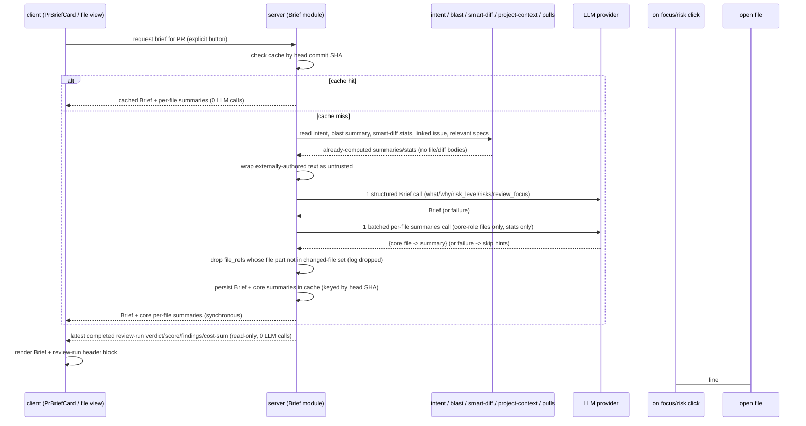

# Spec: Why+Risk Brief  |  Spec ID: SPEC-02  |  Status: draft
Planned in: docs/plans/why-risk-brief.md

## Проблема й навіщо

Коли рев'юер відкриває сторінку pull request, він бачить дифф, дерево змінених файлів і
деякі похідні (intent, blast radius, smart-diff), але **не має єдиної відповіді на три
питання, з яких починається будь-який огляд**: що цей PR робить, навіщо, і наскільки він
ризикований. Ці сигнали вже обчислюються різними модулями (`intent` — L03, blast radius —
L04, smart-diff — L03), плюс поруч лежать linked issue і релевантні specs із Context Folder
(SPEC-01), але вони розкидані й не зведені в одну картку, з якої видно **на що дивитися
першим**.

**Why+Risk Brief** — це PR-рівнева картка, що одним структурованим LLM-викликом зводить уже
обчислені (не сирі) сигнали в стислий бриф: `what`, `why`, `risk_level`, конкретні `risks[]`
із посиланнями на **реальні** файли, і `review_focus[]` — впорядкований список «на що глянути
першим». Посилання несуть локатор рядка (`file:line` або `file:startLine-endLine`), тож
click-through веде до конкретного рядка. Додатково, на файлах ролі `core` рев'юер бачить короткий
per-file hint «що робить цей файл» (нарешті заповнюючи `pseudocode_summary`, який сьогодні завжди
`null`). На тій самій overview-шапці поряд із Brief виводиться (тільки рендеринг) наявний
блок останнього завершеного review-run — verdict, PR score, лічильники findings/blockers і сума
вартості (cost) — це окреме, вже-обчислене джерело, а не частина `Brief`-контракту.

Ключова інженерна вимога: **тіла файлів і тіла диффів у вхід LLM не подаються** — лише
вже-обчислені summaries/stats. Це тримає токени, вартість і latency під контролем і робить
фічу дешевою поверх наявного пайплайна. Бриф **кешується per-PR** і перегенеровується лише за
явною дією користувача (кнопка), ніколи автоматично.

## Goals / Non-goals

- Goal: Один синхронний ендпоінт, що будує **Brief** для PR зі складу вже-обчислених входів
  (intent, blast radius summary, smart-diff stats-by-group, linked issue, релевантні specs) і
  повертає структуру `{ what, why, risk_level, risks[], review_focus[] }`.
- Goal: Кожен `risk` і кожен `review_focus` елемент посилається на **реальний** файл/endpoint,
  що присутній у наборі змінених файлів PR (blast radius / smart-diff); галюциновані шляхи
  детерміновано відкидаються після LLM-виклику. Посилання несе **локатор рядка** — один рядок
  (`file:line`), коли вказує на один рядок, або діапазон (`file:startLine-endLine`), коли
  вказує на блок коду; обирається найточніша форма, а не завжди діапазон.
- Goal: Бриф **кешується per-PR за head commit SHA**; повторне відкриття тієї самої версії PR
  віддає кеш **без жодного LLM-виклику**. Явна кнопка «Regenerate» примусово перегенеровує.
- Goal: Per-file hint «що робить цей файл» **лише на файлах ролі `core`** (за групуванням
  smart-diff) — заповнення `pseudocode_summary` **одним батчованим LLM-викликом** на підмножину
  core-файлів (не по одному виклику на файл, і не на wiring/boilerplate файли).
- Goal: `PrBriefCard` UI-компонент: `risk_level` показаний рівнем (колір **плюс** текстова
  мітка), і список `review_focus`, де кожен пункт клікабельний і веде до відповідного рядка файлу.
- Goal: На тій самій overview-шапці **вивести (тільки рендеринг)** наявні дані **останнього
  завершеного** review-run для цього PR — `verdict`, числовий `score`, лічильники findings/blockers
  (похідні від підрахунку наявних `findings` за severity) і **суму вартості (cost)** (без
  токен-телеметрії in→out). Це **окреме, вже-обчислене джерело** з review-run пайплайна (контракт
  `review-api.ts`), яке візуально сусідить із Brief-карткою; **жодного нового LLM-виклику й
  жодного нового бекенд-обчислення**.
- Goal: Fail-soft поведінка: падіння/таймаут/невалідна відповідь будь-якого з двох викликів не
  кладе сторінку і не отруює кеш.
- Non-goal: **Автоматична генерація** брифа при відкритті PR. Навіть перший бриф будується лише
  за явним натисканням кнопки.
- Non-goal: Подача **тіл файлів або тіл диффів** у вхід будь-якого з двох LLM-викликів. Входи —
  тільки вже-обчислені summaries/stats.
- Non-goal: Перевикористання/розширення старої композиції `PrBrief` з
  `vendor/shared/contracts/brief.ts` (`{ intent, blast, risks, history }`) та i18n-блоку
  `brief.json`. Це **застарілий scaffolding із стартового squash-коміту репо**, який жоден
  роут/сервіс не споживає; ця фіча вводить **новий** `Brief`-контракт. Чистка/синхронізація
  старого файла — це implementation-plan turf, не предмет цієї спеки.
- Non-goal: Поле `history` (PR history) у відповіді брифа. Не бере участі в цій фічі.
- Non-goal: Додавання `verdict`/`score`/`findings`/`cost` як **нових полів** контракту `Brief`.
  LLM-продукована частина лишається `{ what, why, risk_level, risks[], review_focus[] }`; шапка
  overview лише **композиційно рендерить** поряд наявний review-run блок і новий Brief — це два
  окремі джерела даних в одному візуальному регіоні.
- Non-goal: Обчислення/перерахунок verdict/score/findings/cost чи виклик LLM заради них — усі ці
  дані вже персистуються review-run пайплайном; фіча їх лише читає й показує.
- Non-goal: Керування per-line badges на дифі (`blocker`/`warning`/`suggestion`). Це наявний
  findings-engine; `risks[]`/`review_focus[]` лише **вказують** на файл+рядок, вони не малюють
  інлайн-бейджі рядків.
- Non-goal: Живий фетч linked issue із GitHub у момент генерації брифа — issue береться з уже
  наявних локальних даних БД.
- Non-goal: Стрімінг/SSE для брифа. Ендпоінт синхронний і повертає повний результат.
- Non-goal: Твердий бюджет-кап на токени входу (робиться і без нього завдяки stats-only входу).

## User stories

- US-1: Як рев'юер, я відкриваю сторінку PR і хочу побачити одну картку, що каже, **що** цей PR
  робить, **навіщо**, і його **рівень ризику**, щоб швидко зорієнтуватися перед оглядом.
- US-2: Як рев'юер, я хочу бачити конкретні ризики з **посиланнями на реальні файли**, щоб з
  картки одразу провалитися в місце, яке варто перевірити, а не гадати за шляхами.
- US-3: Як рев'юер, я хочу впорядкований `review_focus` («на що глянути першим»), де кожен пункт
  клікабельний, щоб пройти огляд у розумному порядку.
- US-4: Як рев'юер, коли я провалююся в конкретний файл, я хочу побачити короткий hint «що
  робить цей файл», щоб зрозуміти роль файла без читання всього диффа.
- US-5: Як рев'юер, я хочу, щоб повторне відкриття того самого PR віддавало готовий бриф миттєво
  (з кешу), не витрачаючи новий LLM-виклик і час.
- US-6: Як рев'юер, я хочу кнопку «Regenerate», щоб свідомо перебудувати бриф, коли вважаю
  наявний застарілим.
- US-7: Як рев'юер, якщо модель недоступна чи повернула сміття, я хочу бачити явний стан помилки
  з можливістю повторити, а не зламану сторінку чи мовчазно порожню картку.

## Acceptance criteria (EARS)

### Генерація й відповідь брифа

- AC-1: WHEN користувач явно запитує побудову брифа для PR, у якого немає кешованого брифа для
  поточного head commit SHA, THEN система **shall** зробити рівно один структурований LLM-виклик
  і повернути об'єкт із полями `what`, `why`, `risk_level`, `risks[]`, `review_focus[]`.
  _(verify: відповідь ендпоінта містить усі п'ять полів; провайдер отримав рівно один виклик для брифа)_
- AC-2: The system **shall** будувати вхід LLM-виклику виключно з уже-обчислених сигналів (intent,
  blast radius summary, smart-diff stats-by-group, linked issue, релевантні specs) і **shall not**
  включати у вхід тіла файлів або тіла диффів.
  _(verify: зібраний промпт містить summaries/stats і не містить повного тексту файлів чи диффів)_
- AC-3: The system **shall** виражати `risk_level` значенням з переліку `high | medium | low`
  (той самий перелік, що й `severity` окремого ризику).
  _(verify: `risk_level` у відповіді — одне з трьох дозволених значень)_
- AC-4: The system **shall** для кожного елемента `risks[]` нести `kind`, `title`, `explanation`,
  `severity` (`high|medium|low`) і `file_refs` (список посилань на файли), перевикористовуючи
  наявний `Risk`-контракт зі `@devdigest/shared`. Кожен елемент `file_refs` **shall** нести
  локатор рядка: `file:line` для одного рядка або `file:startLine-endLine` для блоку коду.
  _(verify: кожен ризик має п'ять полів, форма збігається з наявним `Risk`; кожен `file_ref` містить `:line` або `:startLine-endLine`)_
- AC-5: The system **shall** для кожного елемента `review_focus[]` нести людино-читабельну мітку,
  обов'язкове пояснення `reason` і посилання на файл із локатором рядка (`file:line` або
  `file:startLine-endLine`), до якого веде пункт.
  _(verify: кожен focus-елемент має мітку, непорожній `reason` і `file_ref` з локатором рядка)_

### Валідація посилань на реальні файли

- AC-6: WHEN бриф згенеровано, THEN система **shall** відкинути будь-яке файлове посилання в
  `risks[].file_refs` та в `review_focus[]`, чия **файлова частина локатора** (шлях без `:line`)
  відсутня в наборі змінених файлів PR (blast radius / smart-diff), перш ніж повернути відповідь.
  _(verify: посилання, чия файлова частина відсутня у наборі змінених файлів, не з'являється у відповіді, незалежно від `:line`)_
- AC-7: IF ризик після відкидання неіснуючих посилань лишається без жодного валідного `file_ref`,
  THEN система **shall** повністю відкинути цей ризик — він не з'являється у відповіді (ризик без
  реального вказівника в код не несе цінності).
  _(verify: ризик, усі `file_refs` якого відкинуто, відсутній у відповіді)_
- AC-8: WHEN система відкидає галюциноване файлове посилання, THEN вона **shall** зафіксувати цей
  факт у логах/трасі як подію фільтрації, а не мовчки.
  _(verify: відкидання неіснуючого шляху лишає слід у логах/трасі)_

### Кешування per-PR

- AC-9: WHILE існує кешований бриф для поточного head commit SHA PR, повторний запит брифа
  **shall** повертати кешований результат **без** нового LLM-виклику.
  _(verify: друге відкриття тієї самої версії PR не робить викликів провайдера; повертає той самий бриф)_
- AC-10: WHEN head commit SHA PR змінюється (нові коміти), THEN наступний явний запит брифа
  **shall** трактуватися як cache miss і будувати бриф заново.
  _(verify: після зміни head SHA новий запит породжує новий виклик і оновлений бриф)_
- AC-11: WHEN користувач натискає «Regenerate», THEN система **shall** примусово перебудувати
  бриф (і per-file summaries) незалежно від наявності кешу для поточного SHA і замінити кеш.
  _(verify: Regenerate робить нові виклики навіть коли кеш для SHA існує; кеш оновлюється)_
- AC-12: WHEN PR відкривається вперше і кешу немає, THEN система **shall** показати порожній
  стан із явним закликом до дії (кнопка «Generate») і **shall not** генерувати бриф автоматично.
  _(verify: перше відкриття без кешу не робить LLM-виклику доти, доки користувач не натисне кнопку)_

### Per-file hint («що робить цей файл»)

- AC-13: WHEN бриф будується (miss або Regenerate), THEN система **shall** зробити рівно один
  **батчований** LLM-виклик на **підмножину файлів ролі `core`** (за групуванням smart-diff), що
  повертає коротке резюме (`pseudocode_summary`) на core-файл, і **shall not** робити окремий
  виклик на кожен файл, ні виклик для файлів ролі `wiring`/`boilerplate`.
  _(verify: генерація робить не більше одного додаткового виклику для per-file summaries; його вхід — лише core-файли)_
- AC-14: The batched per-file виклик **shall** отримувати на вхід лише smart-diff stats/групи
  core-файлів (шлях, роль, кількість доданих/видалених рядків) і **shall not** отримувати тіла
  файлів або тіла диффів.
  _(verify: вхід батчованого виклику містить stats лише core-файлів, не містить тіл)_
- AC-15: WHEN користувач переглядає змінений файл ролі `core`, THEN UI **shall** показати hint
  «що робить цей файл» для того файла, якщо резюме доступне; для файлів `wiring`/`boilerplate`
  hint **shall not** показуватися.
  _(verify: у файловому в'ю блок-резюме рендериться для core-файлів із `pseudocode_summary` і не рендериться для wiring/boilerplate)_
- AC-16: Per-file summaries **shall** кешуватися разом із брифом за тим самим head commit SHA і
  перегенеровуватися разом із брифом при «Regenerate».
  _(verify: повторне відкриття тієї самої версії PR віддає summaries з кешу без викликів; Regenerate оновлює обидва)_
- AC-17: IF батчований per-file виклик падає, таймаутить або повертає невалідну відповідь, THEN
  система **shall** показати змінені файли **без** hint-блоку і **shall** завершити побудову
  брифа нормально (per-file збій не блокує Brief).
  _(verify: збій per-file виклику лишає бриф побудованим; файли показані без резюме)_

### Обробка помилок LLM

- AC-18: IF структурований Brief-виклик падає, таймаутить або повертає відповідь, що не
  проходить валідацію схеми, THEN система **shall** показати явний стан помилки з причиною і дією
  «Retry», **shall not** повернути частковий бриф і **shall not** записати частковий/невалідний
  результат у кеш.
  _(verify: при змодельованому збої відповідь — стан помилки з retry; кеш лишається без запису)_
- AC-19: The Brief-ендпоінт **shall** відповідати синхронно повним об'єктом брифа (на miss —
  після виклику; на hit — з кешу), без SSE/стрімінгу.
  _(verify: єдина синхронна відповідь містить повний бриф; окремого стріму подій немає)_

### UI — PrBriefCard

- AC-20: The `PrBriefCard` **shall** відображати `what`, `why`, `risk_level` та список
  `review_focus`, де `risk_level` передається **не лише кольором** — колір разом із текстовою
  міткою рівня.
  _(verify: картка показує рівень ризику текстом плюс кольором; сенс не втрачається без кольору)_
- AC-21: WHEN користувач активує пункт `review_focus`, THEN UI **shall** навести/перейти до
  **конкретного рядка** (або першого рядка діапазону) пов'язаного файлу PR, а не лише до файлу.
  _(verify: активація focus-пункта веде до рядка з локатора, а не тільки до файла)_
- AC-22: WHERE ризик має валідні `file_refs`, the `PrBriefCard` **shall** показувати кожен як
  клікабельне посилання, чий видимий текст містить локатор рядка (`file:line` /
  `file:startLine-endLine`) і чиє натискання веде до того рядка/діапазону у файлі.
  _(verify: посилання ризику показують `file:line`/діапазон і ведуть до відповідного рядка)_

### Overview-шапка: наявний verdict/score (тільки рендеринг)

- AC-23: WHILE для PR існує щонайменше один завершений review-run, the overview brief-область
  **shall** відображати `verdict` і числовий `score` **останнього** завершеного прогону
  (обраного тим самим шаблоном `latestReview`, що вже використовує smart-diff), беручи
  вже-персистовані дані review-run пайплайна (контракт `review-api.ts`), **без** нового
  LLM-виклику чи перерахунку.
  _(verify: за кількох прогонів шапка показує verdict/score саме останнього завершеного; кількість викликів провайдера не зростає)_
- AC-24: WHILE для PR існує щонайменше один завершений review-run, the overview **shall**
  відображати лічильники findings і blockers, похідні від підрахунку наявних `findings`
  **останнього** завершеного прогону за `severity`.
  _(verify: показані лічильники дорівнюють підрахунку findings останнього завершеного прогону за severity)_
- AC-25: WHERE на останньому завершеному review-run записана вартість (cost), the overview
  **shall** відображати **лише суму вартості** (напр. «$0.014»), беручи вже-записане на прогоні
  значення; телеметрія токенів in→out **shall not** показуватися.
  _(verify: показана лише сума cost останнього прогону; жодного показу токенів before/after)_
- AC-26: IF для PR ще немає жодного завершеного review-run, THEN система **shall** опустити
  verdict/score/findings/cost-блок (нічого або нейтральний стан «огляду ще не було») замість
  помилки, і **shall** усе одно дозволяти будувати/показувати Brief незалежно від наявності
  прогону.
  _(verify: PR без review-run не показує блок і не падає; кнопка генерації Brief лишається доступною)_

## Edge cases

- PR без змінених файлів (порожній дифф) → набір змінених файлів порожній; будь-який `file_ref`
  відкидається як неіснуючий; бриф або будується без ризиків із посиланнями, або показує порожній
  стан. → AC-6, AC-7.
- Модель повертає `file_ref` із валідним на вигляд, але неіснуючим у PR шляхом → відкидається +
  фіксується у трасі. → AC-6, AC-8.
- Ризик, у якого всі `file_refs` виявились неіснуючими → ризик повністю відкидається (не
  показується у відповіді). → AC-7.
- Повторне відкриття тієї самої версії PR → віддати кеш, нуль викликів. → AC-9, AC-16.
- Нові коміти в PR (head SHA змінився) між відкриттями → наступний запит = miss, перебудова. → AC-10.
- Перше в житті відкриття PR без кешу → порожній стан + CTA, без авто-генерації. → AC-12.
- Regenerate при наявному свіжому кеші → примусова перебудова обох (Brief + per-file). → AC-11, AC-16.
- Два одночасні натискання «Regenerate» на тому самому PR/head-SHA (гонка) → **accepted: збіг у
  одну побудову** — паралельні запити для того самого ключа кешу коалесуються в один build, а не
  породжують подвійні LLM-виклики чи взаємне затирання кешу (узгоджено з ціллю «нуль зайвих
  викликів»; механізм single-flight — implementation-plan turf, не фіксується у спеці).
- Brief-виклик успішний, per-file виклик впав → бриф є, файли без hint. → AC-17.
- Brief-виклик впав/таймаут/невалідна схема → стан помилки з retry, кеш не отруєно. → AC-18.
- Дуже великий PR (багато змінених файлів) → per-file summaries — один батчований виклик на
  **лише core-файли** незалежно від їх кількості; тіла не подаються, вхід stats-only. → AC-13, AC-14.
- PR без жодного файла ролі `core` (усі зміни — wiring/boilerplate) → батчований per-file виклик
  не робиться взагалі; жоден файл не показує hint; Brief будується як звичайно. → AC-13, AC-15.
- Файлове посилання з локатором рядка, чия файлова частина існує, але `:line` виходить за межі
  файла → валідація AC-6 звіряє лише файлову частину; такий локатор не відкидається за самим
  номером рядка (номер — вказівник, а не інваріант). → AC-6.
- Linked issue відсутній для PR → бриф будується без issue-сигналу; це не помилка. → AC-2.
- PR ще не має завершеного review-run → verdict/score/findings/cost-блок опущено (нейтральний
  стан), Brief лишається доступним. → AC-26.
- Останній review-run існує, але без записаної cost → показуються verdict/score/лічильники, суму
  cost опущено без помилки. → AC-25.
- Текст intent/issue/specs містить інструкції на кшталт «ignore previous instructions» →
  трактується як дані (untrusted-wrap), не як інструкції. → див. `## Untrusted inputs`.
- Дублікати `file_refs` у ризику → детерміновано (напр. dedupe за шляхом), стабільно на повторі. → AC-7.

## Non-functional

- Performance: cache hit — суто читання, **нуль LLM-викликів** (AC-9). Cache miss — обмежений до
  максимум **двох** викликів на побудову (1 структурований Brief + 1 батчований per-file), кожен
  один round-trip; тіла файлів/диффів у вхід не йдуть, тож обсяг токенів і latency лишаються
  малими й передбачуваними. Ендпоінт синхронний (AC-19); UI показує стан очікування під час miss.
- Security: вхід обох викликів містить текст, авторований людьми в репозиторії (PR body/intent,
  linked issue, specs) — це **untrusted** дані (OWASP A05 Injection / ASI01 Goal Hijacking для
  агентних LLM). Він має бути обгорнутий як untrusted (той самий `wrapUntrusted` бар'єр, що й для
  диффа/PR body у reviewer-core) і ніколи не інтерпретуватися як інструкції — див.
  `## Untrusted inputs`. Вивід (ризики, focus, per-file summaries) — AI-генерований контент
  (ASI09 Trust Exploitation): він валідується проти реального набору змінених файлів (AC-6) і
  мітиться як AI-генерований на UI; секрети й тіла у промпт не потрапляють. Rate-limit на
  generate/regenerate-дію Brief-ендпоінта (яка тригерить LLM) — узгоджений із наявним патерном
  LLM-тригерних роутів у коді (reviews і intent — `{ max: 10, timeWindow: '1 minute' }`), тобто
  **10/min**, а не новий довільний ліміт; дорогий LLM-шлях не зловживається.
- Accessibility: `risk_level` **і** `score`/`verdict` (кольорове кільце шкали) передаються
  кольором **плюс** текстовою міткою/числом — сенс не лише кольором; `review_focus`-пункти й
  файлові посилання з локаторами рядків keyboard-operable й досяжні з клавіатури; стан помилки з
  «Retry» доступний з клавіатури. Ціль — WCAG 2.1 AA, консистентно зі SPEC-01.
- i18n: усі нові користувацькі рядки йдуть через клієнтський i18n-шар (`next-intl`), без
  хардкоду англійської в JSX. Старий `brief.json` — застарілий; його синхронізація/чистка —
  implementation-plan turf.
- Cost: до двох LLM-викликів на побудову брифа; нуль на cache hit. Виведення наявного
  verdict/score/findings/cost на overview — **нуль** додаткових LLM-викликів і нуль нового
  бекенд-обчислення (суто читання review-run даних). Немає твердого токен-капа — контроль обсягу
  забезпечується stats-only входом (без тіл), а не лімітом.

## Cross-module interactions

Фіча спанить **server** (новий Brief-модуль, що читає з наявних модулів і робить LLM-виклики),
**client** (`PrBriefCard` + per-file hint у файловому в'ю) і опосередковано наявні модулі
`intent`, `blast`, `smart-diff`, `project-context`, `pulls` як **read-only** джерела входів.

- **server** збирає вже-обчислені сигнали (intent, blast radius summary, smart-diff
  stats-by-group, linked issue, релевантні specs), обгортає untrusted-текст, робить один
  структурований Brief-виклик і один батчований per-file виклик (лише core-файли), відкидає
  галюциновані `file_refs` (за файловою частиною локатора) проти набору змінених файлів, кешує
  результат за head commit SHA і віддає бриф синхронно. Дані review-run (verdict/score/findings/
  cost) вже персистовані пайплайном review — сервер їх лише читає, не обчислює.
- **client** рендерить `PrBriefCard` (what/why/risk_level/risks/review_focus) **разом із**
  read-only блоком review-run (verdict/score/findings/cost) у тій самій overview-шапці, кнопку
  «Generate/Regenerate», стани порожньо/очікування/помилка-з-retry, і per-file hint у файловому/
  дифф в'ю для core-файлів; читає бриф і review-run дані через ендпоінти, ніколи не викликає
  модель напряму.
- Наявні модулі (`intent`, `blast`, `smart-diff`, `project-context`, `pulls`) і **review-run
  пайплайн** (`review-api.ts`) — **read-only джерела**, їхні контракти не змінюються; ця фіча
  споживає їх, а не переписує. Verdict/score/findings/cost — окреме джерело, а не поля `Brief`.

Failure contract: галюциновані `file_refs` — fail-soft (відкинути + зафіксувати, AC-6/AC-8);
per-file збій — fail-soft (файли без hint, AC-17); Brief-збій — стан помилки з retry, кеш не
отруєно (AC-18). Сторінка PR ніколи не падає лише через збій генерації брифа.

## Contracts

Форми (поля/опційність), не імплементація. Наявні контракти названі, щоб планувальник будував
поверх них, а не дублював.

- **Brief** (server → client, відповідь Brief-ендпоінта) — **новий** контракт:
  `{ what: string; why: string; risk_level: "high" | "medium" | "low"; risks: Risk[];
  review_focus: ReviewFocusItem[] }`. Це **не** стара композиція `PrBrief`
  (`{ intent, blast, risks, history }`) з `vendor/shared/contracts/brief.ts` — той файл
  застарілий scaffolding; поле `history` тут відсутнє.
- **Risk** — **перевикористання наявного** `Risk` зі `@devdigest/shared`:
  `{ kind: string; title: string; explanation: string; severity: "high"|"medium"|"low";
  file_refs: string[] }`. Форма (`file_refs: string[]`) не змінюється; уточнюється лише
  **семантика вмісту**: кожен рядок — файловий локатор із номером рядка, `file:line` (один рядок)
  або `file:startLine-endLine` (блок коду), а не голий шлях. Файлова частина локатора після
  валідації гарантовано присутня в наборі змінених файлів PR (AC-6); найточніша форма (рядок vs
  діапазон) обирається за тим, на що вказує ризик.
- **ReviewFocusItem** (частина `Brief`) — форма: `{ label: string; file_ref: string;
  reason: string }`. `reason` **обов'язкове** (кожен пункт показує інлайн-пояснення, не сховане).
  `file_ref` — той самий локатор рядка (`file:line` / `file:startLine-endLine`), файлова частина
  зі набору змінених файлів; `label` — «на що глянути».
- **Per-file summary** — заповнення наявного `SmartDiffFile.pseudocode_summary` (сьогодні завжди
  `null`) коротким резюме, **лише для файлів ролі `core`**. Форма самого `SmartDiffFile` не
  змінюється; поле переходить зі стану «завжди `null`» у «може нести резюме для core-файлів»
  (для wiring/boilerplate лишається `null`).
- **Overview review-run блок** (наявне джерело, тільки рендеринг) — з **останнього завершеного**
  persist-запису review-run (контракт `review-api.ts`, обраного тим самим `latestReview`-шаблоном,
  що smart-diff): `verdict` (nullable), `score` (nullable ціле), findings/blockers-лічильники
  (похідні від підрахунку наявних `findings` за `severity`) і **сума вартості (cost)** прогону.
  Телеметрія токенів in→out не показується. Це **не** частина `Brief`-контракту й **не** нове поле
  — overview композиційно рендерить цей блок поряд із `Brief`. Форма review-run не змінюється;
  фіча її читає.
- **Входи Brief-виклику** (server-internal, не тіло відповіді): `Intent` (L03),
  blast radius `summary` (L04), smart-diff groups/stats (L03), linked issue (локальні дані БД),
  релевантні specs із Context Folder (SPEC-01). Усі — вже-обчислені; тіла файлів/диффів не
  входять.
- **Cache key** — (PR id + head commit SHA). Один запис кешу несе і `Brief`, і per-file
  summaries; інвалідація — зміна SHA (AC-10) або явний Regenerate (AC-11).

## Inputs (provenance)

- Intent PR-а — `[reused: L03]`: уже обчислюється модулем intent (включно з резолвом linked
  issue та feature-model слотом); ця фіча читає результат.
- Blast radius summary — `[reused: L04]`, `[deterministic: repo-intel]`: детерміновано з
  repo-intel (символи/downstream), тіла не читаються.
- Smart-diff stats-by-group — `[reused: L03]`, `[deterministic: repo-intel]`: детермінована
  рекомпозиція, нуль LLM-викликів, групування файлів за роллю з per-file stats.
- Linked issue — `[deterministic: repo-intel]`: уже наявні локальні дані БД (заімпортовані
  раніше), без живого GitHub-фетчу під час генерації.
- Релевантні specs із Context Folder — `[reused: L05]` (SPEC-01): вже-виявлені markdown-документи
  проєктного контексту.
- Структурований Brief-виклик — `[new: 1 LLM call]`: єдиний виклик, що зводить входи в
  `Brief`-структуру.
- Батчований per-file summaries виклик — `[new: 1 LLM call]`: один виклик на підмножину
  **core-файлів**, що заповнює `pseudocode_summary`.
- Overview verdict/score/findings/cost-сума — `[reused: existing review pipeline]`,
  `[deterministic: repo-intel]`: вже-персистовані дані **останнього завершеного** review-run
  запису (`review-api.ts`); лічильники findings/blockers — детермінований підрахунок наявних
  findings за severity; показується лише сума cost (без токен-телеметрії). **Нуль** нових
  LLM-викликів і нуль нового бекенд-обчислення — суто читання й рендеринг.
- Untrusted-обгортка входів — `[reused: L02–L04]`: той самий `wrapUntrusted` бар'єр, що вже
  фенсить дифф і PR body у reviewer-core.

Разом на побудову брифа (cache miss): **до 2 нових LLM-викликів**. Cache hit: **0**.

## Untrusted inputs

**Так — ця фіча читає текст, авторований поза цим кодом, і подає його в модель.** Untrusted
входи, що мусять трактуватися як **дані, ніколи як інструкції**:

- **PR body / intent** — intent похідний від тексту опису PR, який пише автор PR.
- **Linked issue** — тіло issue, авторований людьми (нехай і з локальної БД).
- **Релевантні specs із Context Folder** — markdown, авторований будь-ким із доступом на запис у
  репозиторій (той самий untrusted-профіль, що в SPEC-01).

Вимоги:

- Кожен такий фрагмент обгортається наявним untrusted-фенсом (`wrapUntrusted`) перед подачею в
  будь-який із двох викликів; інструкції всередині цього тексту не виконуються.
- Детерміновані сигнали (blast radius, smart-diff stats) — repo-intel, не untrusted, але тіла
  файлів/диффів усе одно не подаються (окрема вимога, AC-2/AC-14).
- Вивід моделі — AI-генерований контент: `file_refs` валідуються проти реального набору змінених
  файлів (AC-6), а per-file summaries та тексти ризиків/focus мітяться як AI-генеровані на UI
  (ASI09). Секрети й тіла у промпт не потрапляють.

## Changelog

- 2026-07-13: created (draft)
- 2026-07-13: design review (2 UI мокапи overview PR-сторінки) — (1) додано у скоуп read-only
  виведення наявного review-run блоку (verdict/score/findings/cost) на overview-шапку як окреме
  джерело поряд із Brief, без нових полів `Brief` і без нових LLM-викликів (нові AC-23..AC-26,
  Goals, Contracts, Inputs, Edge cases); (2) звужено per-file hint до файлів ролі `core` замість
  усіх змінених (AC-13/AC-14/AC-15); (3) уточнено семантику файлових посилань — локатор рядка
  `file:line` / `file:startLine-endLine` (найточніша форма), у `Risk.file_refs` і
  `ReviewFocusItem.file_ref`, з валідацією за файловою частиною (AC-4/AC-5/AC-6/AC-21/AC-22,
  Contracts); (4) `ReviewFocusItem.reason` зроблено обов'язковим; (5) зафіксовано, що per-line
  diff badges — поза скоупом (наявний findings-engine).
- 2026-07-13: production-readiness review — (1) AC-7 зроблено однозначним: ризик без жодного
  валідного `file_ref` **повністю відкидається** (прибрано недетерміноване «відкинути або лишити
  порожнім»); (2) виправлено вигаданий rate-limit — замість неіснуючого 120/min зазначено реальний
  прецедент LLM-тригерних роутів (reviews/intent — `{ max: 10, timeWindow: '1 minute' }`), тобто
  10/min; (3) усунено неоднозначність «який review-run» за кількох прогонів — усюди зазначено
  **останній завершений** review-run (шаблон `latestReview`, як у smart-diff): AC-23..AC-26,
  Contracts, mermaid, Inputs; (4) прибрано плутану токен-телеметрію in→out — на overview
  показується **лише сума cost**: AC-25, intro, Goals, Contracts, Edge cases, Inputs; (5) додано
  Edge case для гонки двох одночасних Regenerate (accepted: коалесенс у одну побудову). Політика
  retention/eviction кешу свідомо лишена implementation-plan turf, не спека.
- 2026-07-13: Planned in updated — implementation plan written at docs/plans/why-risk-brief.md
  (Status лишається draft, human-gated).
