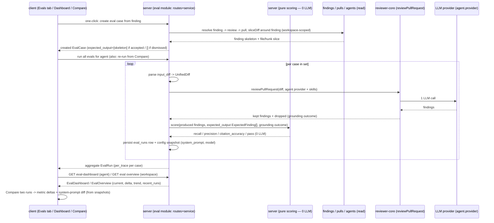

# Spec: Eval Pipeline (регресійна сітка безпеки для рев'ю-агентів)  |  Spec ID: SPEC-03  |  Status: draft
Planned in: not yet planned

## Проблема й навіщо

Коли користувач змінює рев'ю-агента — править його system prompt, міняє модель або перелінковує
skill — він **не має способу дізнатися, чи ця зміна покращила агента, чи тихо його зламала**. Єдине
доступне «тестування» — відкрити кілька PR вручну й на око порівняти findings. Це повільно,
недетерміновано й не масштабується: неможливо сказати «нова версія промпта ловить на 12% менше
реальних багів, ніж стара».

Це та сама проблема, що «Experiment 3» з лабораторної (strict vs lite `architecture-reviewer`), але
перенесена в продуктову площину: замість того щоб гнати експеримент у скрипті, користувач отримує
**фіксований регресійний набір eval-кейсів на агента** й може за одну дію прогнати агента по всьому
набору та побачити в числах recall / precision / citation_accuracy.

Ключова ідея датасету: **eval-кейси народжуються з реальних accept/dismiss рішень користувача** з
попередніх уроків. `expected_output` кейса — це **масив очікуваних findings** (finding-скелетів), що
описує, які findings агент має видати на цьому вході. Accept/dismiss слугує лише **провенансом** того,
який масив збирає one-click: прийнятий (accepted) finding → кейс, чий `expected_output` = `[<скелет
цього finding>]` («агент **має** видати ось цей finding»); відхилений (dismissed) finding → кейс, чий
`expected_output` = `[]` («на цьому місці **не** очікуємо жодного finding»). Тобто регресійна сітка
збирається з уже винесених людиною суджень про якість, а не з синтетичних прикладів. `must_find` /
`must_not_flag` лишаються **лише концепцією провенансу**, а не збереженим полем.

Друга ключова інженерна вимога: **скоринг не робить жодного LLM-виклику**. Прогін агента по кейсу
робить один реальний виклик рев'ю-движка (`reviewPullRequest` з інжектованим провайдером агента), але
перетворення «набір produced findings + набір expectations → recall/precision/citation_accuracy/pass»
— це **чистий код**, детермінований і дешевий. Це робить метрики відтворюваними й дозволяє покривати
скоринг гермермітичними юніт-тестами без мережі.

## Goals / Non-goals

- Goal: Один агент має **фіксований регресійний набір ≥8 eval-кейсів**, засіяний через `db:seed`
  (ідемпотентно), плюс можливість додавати ad-hoc кейси з UI.
- Goal: **One-click створення кейса** з реального finding: `input_diff` = **file/hunk-зріз того
  finding** (не весь дифф PR), а `expected_output` = `[<скелет finding>]` для accepted або `[]` для
  dismissed. Зріз робиться наявним `sliceDiff`-хелпером рушія (reviewer-core `reduce.ts`), щоб «нічого
  не очікуємо» було строго визначеним — у зрізі єдиний реалістичний finding — це той, що на цьому місці.
- Goal: **Прогін агента по всьому набору** за одну дію: для кожного кейса розпарсити `input_diff` у
  `UnifiedDiff`, викликати `reviewPullRequest` з провайдером агента, порахувати метрики чистим кодом,
  персистнути рядок прогону; ендпоінт rate-limited (LLM-дорогий шлях). Кожен прогін персистить
  **снапшот конфігу агента на момент прогону** (`system_prompt`, `model`), щоб живити prompt-diff.
- Goal: **Детермінований скоринг без жодного LLM-виклику** за точними формулами
  (recall / precision / citation_accuracy / pass), покритий гермермітичним юніт-тестом
  «фікстури → точні метрики».
- Goal: Метрики агрегуються **мікро-усередненням** (пул лічильників) у **вже наявну `EvalDashboard`-
  форму** (current, delta vs попередній прогін, trend, recent_runs, alert) для одного агента, і у
  **workspace-рівневий огляд** усіх агентів через новий additive-контракт.
- Goal: **Історія прогонів** на кейс/агент і **порівняння двох прогонів** сайд-бай-сайд («старий
  промпт vs новий») з дельтами метрик і diff system-промптів двох прогонів.
- Goal: **Re-run дія з Compare-модалки** («Promote v7» у мокапі) — повторний прогін набору проти
  **поточного (оновленого)** system prompt агента, що породжує **новий прогін** для порівняння зі
  старим (прогін 6 = старий промпт, прогін 7 = новий). Модельовано як повторний виклик того самого
  batch-run шляху; це **не** зміна «активної версії» й **не** routing/dispatch.
- Goal: Нова серверна `eval`-фіча (routes + service + repository + **scoring**), нові клієнтські
  поверхні (Evals-таб на сторінці агента, Eval Dashboard-сторінка, кнопка «Turn into eval case» на
  картці finding), і **новий гейт `pnpm verify:l06`**, зелений на гермермітичному покритті.
- Goal: **Additive** розширення `@devdigest/shared`: конкретна схема `expected_output` як **масив
  finding-скелетів** (`ExpectedFinding[]`) на місці поточного `z.unknown()`, і нові
  `EvalOverview` / `EvalAgentSummary` для workspace-огляду — без зміни наявних контрактів
  `EvalCaseInput` / `EvalRun` / `EvalRunRecord` / `EvalDashboard` / `EvalTrendPoint`.
- Non-goal: **Wiring роутингу/диспетчу** агентів (яку версію промпта запускати на реальних PR) — це
  окремий пізніший експеримент. «Promote v7» у L06 — **лише re-run** проти поточного промпта, без
  концепції «активної версії».
- Non-goal: **Скриптування самого weaken/strengthen експерименту**. L06 постачає робочий пайплайн +
  зелений `verify:l06` + how-to; послаблення/посилення промпта й порівняння прогонів користувач
  робить сам.
- Non-goal: **LLM-виклики у скорингу**. Скоринг — суто детермінований код над produced findings і
  expectations; жоден етап скорингу не звертається до провайдера.
- Non-goal: **Повторний прогін grounding у скорингу**. `citation_accuracy` береться прямо з результату
  `reviewPullRequest` (kept/dropped), grounding не переобраховується.
- Non-goal: **Skill-owned eval-кейси** (`owner_kind='skill'`). Таблиця їх підтримує, але L06
  скоупиться на `owner_kind='agent'`; skill-evals — пізніший урок.
- Non-goal: Зміна форми наявних таблиць `eval_cases` / `eval_runs` через міграцію задля цієї фічі —
  усе нове (config-снапшот прогону, expectations) кладеться в наявні `jsonb`-колонки.

## User stories

- US-1: Як користувач, я хочу з реального finding одним кліком зробити eval-кейс (accepted → кейс, що
  очікує цей finding-скелет; dismissed → кейс, що очікує порожній `[]`), щоб будувати регресійну сітку
  зі своїх власних рішень, а не писати кейси вручну.
- US-2: Як користувач, я хочу бачити всі кейси в наборі агента з їхнім per-case статусом (проходить /
  ні), щоб розуміти покриття.
- US-3: Як користувач, я хочу одним натисканням прогнати агента по всьому набору й побачити
  recall / precision / citation_accuracy, щоб оцінити зміну в числах.
- US-4: Як користувач, я хочу, щоб після зміни system prompt два прогони видимо відрізнялися за
  recall/precision, щоб бачити ефект правки.
- US-5: Як користувач, я хочу відкрити історію прогонів і порівняти два прогони сайд-бай-сайд («старий
  промпт vs новий») з дельтами метрик і diff-ом промптів, щоб приймати рішення обґрунтовано.
- US-6: Як користувач, я хочу дашборд усіх рев'ю-агентів із їхніми RECALL / PRECISION / CITE й
  спарклайнами, щоб з одного місця бачити стан регресії по всіх агентах.
- US-7: Як користувач, я хочу, щоб скоринг був миттєвим і безкоштовним (без LLM), щоб метрики були
  відтворюваними й дешевими для перепрогону.

## Acceptance criteria (EARS)

### Створення кейсів (one-click + generic)

- AC-1: WHEN користувач ініціює one-click створення eval-кейса з наявного finding, THEN система
  **shall** зарезолвити ланцюг finding → review → pull, взяти **file/hunk-зріз того finding** з диффа
  PR (наявний `sliceDiff`) як `input_diff`, і створити кейс з `owner_kind='agent'`, `owner_id` = агент
  review.
  _(verify: створений кейс несе owner_kind='agent' і input_diff = зріз навколо finding, а не весь дифф PR)_
- AC-2: WHEN one-click кейс створюється з finding, що має `acceptedAt`, THEN `expected_output`
  **shall** дорівнювати `[<скелет цього finding>]` (одна `ExpectedFinding` з `severity`, `category`,
  `title`, `file`, `start_line` та опційним `end_line`); WHEN finding має `dismissedAt`, THEN
  `expected_output` **shall** дорівнювати `[]` (порожній масив — «нічого не очікуємо на цьому місці»).
  _(verify: accepted finding → expected_output = [skeleton]; dismissed finding → expected_output = [])_
- AC-3: IF one-click створення викликано з finding, що не має ані `acceptedAt`, ані `dismissedAt`
  (немає рішення користувача), THEN система **shall** відхилити запит з явною помилкою і **shall not**
  створити кейс, бо неможливо визначити, чи очікувати finding-скелет, чи порожній масив.
  _(verify: finding без accept/dismiss не породжує кейс; повертається помилка)_
- AC-4: The generic create-ендпоінт **shall** приймати тіло у формі `EvalCaseInput` зі
  `@devdigest/shared`, де `expected_output` відповідає новій схемі `ExpectedFinding[]` (масив
  finding-скелетів), і повертати створений кейс.
  _(verify: тіло валідне за EvalCaseInput; expected_output парситься як ExpectedFinding[])_
- AC-5: The list-ендпоінт кейсів агента **shall** повертати всі eval-кейси, чий `owner_kind='agent'`
  і `owner_id` = цей агент, у межах workspace викликача.
  _(verify: список містить лише кейси цього агента цього workspace)_

### Скоринг (детермінований, нуль LLM-викликів)

- AC-6: The scoring stage **shall** обчислювати всі метрики кейса виключно з набору produced findings
  і набору expectations, **shall not** робити жодного LLM-виклику і **shall not** переобраховувати
  grounding.
  _(verify: шлях скорингу не інстанціює й не викликає провайдера; grounding не запускається повторно)_
- AC-7: The scoring stage **shall** вважати produced finding таким, що матчить очікуваний
  (`ExpectedFinding`), тоді й лише тоді, коли `file` збігається І діапазони рядків перетинаються за
  правилом `aStart <= bEnd && bStart <= aEnd`, де для будь-якого боку без `end_line` кінець
  дорівнює `start_line`.
  _(verify: збіг file + перетин діапазонів = матч; end_line за замовчуванням = start_line; різний file або відсутність перетину = не матч)_
- AC-8: The scoring stage **shall** обчислювати `recall` = (кількість покритих очікуваних findings) /
  (загальна кількість очікуваних findings у `expected_output`); IF `expected_output` порожній (`[]`),
  THEN `recall` **shall** дорівнювати 1.
  _(verify: recall = matched_expected / total_expected; порожній expected_output → recall=1)_
- AC-9: The scoring stage **shall** обчислювати `precision` = (кількість produced findings, що
  матчать хоч один очікуваний) / (загальна кількість produced findings); будь-який produced finding,
  що не матчить жоден очікуваний, — це false positive (зокрема **будь-який** produced finding при
  порожньому `expected_output`); IF produced findings немає, THEN `precision` **shall** дорівнювати 1.
  _(verify: precision = matched_produced/total_produced; produced при порожньому expected = FP; порожній produced → precision=1)_
- AC-10: The scoring stage **shall** брати `citation_accuracy` = kept / (kept + dropped) прямо з
  результату `reviewPullRequest` (findings, що вижили grounding, проти відкинутих); IF
  kept + dropped = 0, THEN `citation_accuracy` **shall** дорівнювати 1.
  _(verify: citation_accuracy дорівнює grounding kept/(kept+dropped) з outcome; порожньо → 1)_
- AC-11: The scoring stage **shall** позначати кейс `pass=true` тоді й лише тоді, коли **всі**
  очікувані findings покриті І в цьому кейсі **нуль** FP; інакше `pass=false`. Це відтворює мокапи:
  «expected 1 finding, got 1» → pass; «expected 1, got 0» → fail (recall-промах); «expected 0, got 0
  · empty []» → pass.
  _(verify: усі очікувані покриті + 0 FP → pass; expected 1 got 0 → fail; expected 0 got 0 → pass)_
- AC-12: The run-level metrics **shall** агрегуватися **мікро-усередненням** (пул лічильників по всіх
  кейсах): `recall` = сума покритих очікуваних / сума всіх очікуваних; `precision` = сума матчених
  produced / сума всіх produced; `citation_accuracy` = сума kept / сума (kept+dropped);
  `traces_passed` = кількість кейсів із `pass=true`; `traces_total` = кількість кейсів.
  _(verify: агреговані метрики дорівнюють пуловим лічильникам, а не середньому per-case значень)_

### Прогін (реальний LLM у рантаймі)

- AC-13: WHEN користувач запускає прогін набору агента, THEN система **shall** для **кожного** кейса
  розпарсити `input_diff` у `UnifiedDiff`, викликати `reviewPullRequest` з провайдером агента
  (`agent.provider`) і його злінкованими skills, скорити результат і персистнути рядок прогону
  (`eval_runs`) з recall / precision / citation_accuracy / pass / duration_ms / cost_usd.
  _(verify: прогін набору з N кейсів створює N рядків eval_runs з заповненими метриками)_
- AC-14: WHEN персиститься рядок прогону, THEN система **shall** записати снапшот конфігу агента на
  момент прогону (щонайменше `system_prompt` і `model`) у наявну `jsonb`-колонку прогону
  (`actual_output`/`input_meta`), без міграції схеми.
  _(verify: персистований прогін несе system_prompt+model агента на момент прогону)_
- AC-15: The batch-run ендпоінт **shall** повертати агреговану `EvalRun`-форму (recall / precision /
  citation_accuracy / traces_passed / traces_total / duration_ms / cost_usd / per_trace), де кожен
  `per_trace` елемент відповідає одному кейсу з його `pass`, `expected` і `actual`.
  _(verify: відповідь відповідає EvalRun; per_trace має по елементу на кейс)_
- AC-16: The single-case run ендпоінт **shall** прогнати рівно один кейс і повернути `EvalRunResult`
  (`run_id`, `case_id`, `result`).
  _(verify: одиничний прогін торкається лише одного кейса; відповідь відповідає EvalRunResult)_
- AC-17: WHEN два прогони того самого набору виконуються з system prompt агента, який змінює поведінку
  findings, THEN метрики прогонів **shall** відрізнятися (recall та/або precision рухаються).
  _(verify: гермермітично — два стаб-LLM, що дають різні findings, дають різні recall/precision)_
- AC-18: The batch-run ендпоінт (LLM-дорогий шлях) **shall** бути rate-limited за тим самим патерном,
  що вже застосований до наявного рев'ю/LLM-run роуту; конкретне число наслідує наявний прецедент, а
  не вводить довільний ліміт.
  _(verify: роут несе rate-limit, узгоджений з наявним рев'ю/LLM-run роутом)_
- AC-19: IF `reviewPullRequest` падає, таймаутить або повертає невалідний результат для одного кейса,
  THEN система **shall** зафіксувати цей кейс як провалений/помилковий у прогоні (не мовчки) і
  **shall** продовжити решту кейсів набору, а не валити весь прогін.
  _(verify: збій одного кейса лишає інші кейси прогнаними; провальний кейс видимий у результаті)_

### Історія, порівняння та re-run

- AC-20: The run-history ендпоінт кейса **shall** повертати персистовані прогони (`EvalRunRecord[]`)
  у хронологічному порядку.
  _(verify: історія кейса повертає його рядки прогонів у часі)_
- AC-21: The agent eval-dashboard ендпоінт **shall** повертати `EvalDashboard` для агента: `current`
  (метрики останнього прогону), `delta` (проти попереднього прогону), `trend`
  (`EvalTrendPoint[]` хронологічно), `recent_runs` і `alert` (nullable).
  _(verify: дашборд агента заповнює current/delta/trend/recent_runs за наявними прогонами)_
- AC-22: WHEN користувач порівнює два прогони, THEN UI **shall** показати дельти метрик обох прогонів
  (recall / precision / citation_accuracy) поруч і diff їхніх персистованих system-промптів; IF
  один із прогонів не несе снапшота промпта (напр. прогін до введення снапшота), THEN prompt-diff
  **shall** бути опущений без помилки, а метрик-дельти показані все одно.
  _(verify: Compare показує метрики+дельти двох прогонів і prompt-diff за снапшотами; без снапшота prompt-diff опущено, дельти лишаються)_
- AC-23: WHEN користувач ініціює re-run дію з Compare-модалки («Promote v7»), THEN система **shall**
  повторно прогнати набір агента проти його **поточного** system prompt через той самий batch-run
  шлях, породжуючи **новий** прогін, і **shall not** змінювати жодну «активну версію» чи routing.
  _(verify: re-run з Compare створює новий прогін проти поточного промпта; жодного стану «активної версії» не змінено)_

### Workspace-огляд

- AC-24: The workspace eval-огляд ендпоінт **shall** повертати `EvalOverview`: по одному
  `EvalAgentSummary` на рев'ю-агента з його поточними RECALL / PRECISION / CITATION_ACCURACY і trend
  (для спарклайна), плюс зведену таблицю останніх прогонів по всіх агентах.
  _(verify: огляд перелічує всіх рев'ю-агентів workspace з поточними метриками + trend + recent_runs)_
- AC-25: IF агент ще не має жодного прогону, THEN огляд **shall** показати його з нейтральним/порожнім
  станом метрик замість помилки.
  _(verify: агент без прогонів з'являється в огляді з порожнім станом, не валить відповідь)_

### Регресійний набір (seed) і верифікація

- AC-26: The seed (`db:seed`) **shall** ідемпотентно засівати регресійний набір із **щонайменше 8**
  eval-кейсів, прив'язаних до рев'ю-агента, що покриває **обидві** форми `expected_output` — кейси з
  непорожнім масивом finding-скелетів (accepted-провенанс) і кейси з порожнім `[]` (dismissed-провенанс).
  _(verify: після seed набір агента містить ≥8 кейсів; присутні і непорожній expected_output, і порожній []; повторний seed не дублює)_
- AC-27: The command `pnpm verify:l06` **shall** проганяти гермермітичне покриття eval (як мінімум:
  чистий scoring-тест «фікстури → точні метрики» і service-тест одного кейса зі стаб-LLM) плюс
  typecheck, і **shall** завершуватися зеленим (exit 0); DB-backed route-тести
  (`eval/*.it.test.ts`) виконуються окремо й **shall not** входити в `verify:l06`.
  _(verify: `pnpm verify:l06` виходить 0 на гермермітичних тестах + typecheck; інтеграційні .it.test виключені)_

### Eval-case editor (UI)

- AC-28: The eval-case editor modal («Eval case · <name>», підзаголовок «<Agent> · simulate a PR and
  assert the expected output») **shall** мати обов'язкове поле **Name** і секцію **Input** з трьома
  вкладками — **Diff** (сирий unified diff → `input_diff`), **Files** (→ `input_files`), **PR meta**
  (→ `input_meta`), що мапляться на наявні колонки `eval_cases`.
  _(verify: редактор показує Name + три вкладки Input, кожна пише у відповідне поле кейса)_
- AC-29: The **Expected output** редактор **shall** бути JSON-редактором вмісту `ExpectedFinding[]`
  з живим індикатором валідності («valid JSON») і кнопкою **«+ Finding skeleton»**, що вставляє
  порожній шаблон finding.
  _(verify: редактор показує статус валідності JSON у реальному часі; «+ Finding skeleton» вставляє шаблон; вміст — масив ExpectedFinding)_
- AC-30: The editor footer **shall** нести перемикач **«Run on save»**, кнопки **Cancel**, **Save** і
  **Run case**; WHEN користувач тисне **Run case**, THEN система **shall** прогнати саме цей кейс через
  `POST /eval-cases/:id/run` і показати статус-рядок «Last run passed/failed · expected N finding, got
  M · <duration> · <cost>».
  _(verify: Run case робить single-case run; після прогону статус-рядок показує pass/fail + expected N/got M + duration + cost)_

## Edge cases

- Finding без `acceptedAt` і без `dismissedAt` → one-click відхиляється явно (немає визначеного типу
  expectation). → AC-3.
- Кейс із порожнім `expected_output` (`[]`, dismissed-провенанс) і агент нічого не продукує →
  `recall=1` (нема чого шукати), `precision=1` (нема produced), `pass=true`. → AC-8, AC-9, AC-11.
- Агент нічого не продукує на кейсі з непорожнім `expected_output` → `recall=0`, `precision=1`
  (нема FP), `pass=false` («expected 1, got 0»). → AC-8, AC-9, AC-11.
- Агент продукує finding на кейсі з порожнім `expected_output` (`[]`) → цей produced finding —
  false positive; `precision<1`; кейс не проходить. → AC-9, AC-11.
- `reviewPullRequest` відкинув усі findings grounding-ом (порожній kept, є dropped) →
  `citation_accuracy` = 0/(0+dropped)=0; recall низький; це валідна поведінка, не помилка. → AC-10.
- `reviewPullRequest` не відкинув нічого і нічого не продукував (kept+dropped=0) →
  `citation_accuracy=1`. → AC-10.
- Один кейс падає посеред batch-прогону (LLM таймаут/невалідна відповідь) → цей кейс позначено
  fail/error, решта кейсів прогнані; прогін не валиться повністю. → AC-19.
- Дуже великий `input_diff` (за межами map-reduce стабу reviewer-core) → прогін усе одно робиться
  наявним рушієм; якість може падати, але скоринг детермінований над тим, що продукт видав. → AC-13.
- Порожній `input_diff` (діфф не завантажився) → produced findings порожні; кейс скориться як «нічого
  не знайдено» (recall залежить від `expected_output`). → AC-9, AC-13.
- Агент без жодного eval-кейса → batch-прогін дає порожній результат (traces_total=0), не помилку;
  дашборд/огляд показує порожній стан. → AC-15, AC-25.
- Порівняння прогонів, де один зі снапшотів промпта відсутній (старий прогін до введення снапшота) →
  метрики-дельти показуються, prompt-diff опущено. → AC-22.
- Re-run з Compare-модалки, коли поточний промпт агента ідентичний старому → новий прогін усе одно
  створюється; prompt-diff порожній, метрик-дельти можуть бути ~0 (шум LLM). → AC-23.
- Дублікати expectations або produced findings на тому самому локаторі → скоринг детермінований
  (стабільний матчинг), стабільний на повторі. → AC-7.
- Текст у `input_diff` містить інструкції на кшталт «ignore previous instructions» → трактується як
  дані наявним `wrapUntrusted`-бар'єром reviewer-core, не як інструкції. → див. `## Untrusted inputs`.

## Non-functional

- Performance: **скоринг — суто читання/арифметика, нуль LLM-викликів** (AC-6), тож метрики миттєві й
  відтворювані. Дорогий шлях — рантайм-прогін: batch-прогін набору з N кейсів = **N викликів
  `reviewPullRequest`** (по одному на кейс), тому ендпоінт rate-limited (AC-18) і показує стан
  очікування в UI. `duration_ms` і `cost_usd` персистуються на прогін для видимості вартості.
- Security: (1) **OWASP A05 Injection / ASI01 Goal Hijacking** — `input_diff` кейса — це реальний
  дифф, авторований автором PR (untrusted). Прогін проганяє його через `reviewPullRequest`, який уже
  фенсить дифф `wrapUntrusted()` + `INJECTION_GUARD`; цей бар'єр **не обходиться** eval-шляхом (див.
  `## Untrusted inputs`). (2) **OWASP A01 Broken Access Control / IDOR** — усі eval-ендпоінти
  (створення one-click, list, run, history, dashboard, overview) **мусять** бути workspace-scoped
  через наявний `getContext(...)` tenancy-патерн; one-click створення мусить перевіряти, що
  finding→review→pull належить workspace викликача, інакше користувач A міг би зробити кейс із PR
  користувача B. (3) **OWASP A06** — batch-run як дорогий LLM-шлях rate-limited (AC-18).
- Accessibility: метрики (recall/precision/citation як картки, бари, спарклайни) передаються **числом
  плюс міткою**, а не лише кольором/довжиною бару; per-case pass/fail-статус має текстовий/іконковий
  еквівалент, не лише колір; Compare-модалка, prompt-diff і таблиці прогонів keyboard-operable. Ціль —
  WCAG 2.1 AA, консистентно зі SPEC-01/SPEC-02.
- i18n: усі нові рядки йдуть через наявні i18n-блоки `eval.json` (`dashboard`, `caseEditor`,
  `evalsTab`, `page`) і `nav.eval`; жодного хардкоду англійської в JSX (наявний `next-intl`-шар).
- Cost: рантайм-прогін = N LLM-викликів (N = кількість кейсів у наборі); **скоринг = 0**; seed = 0
  (детермінований). `cost_usd` записується на прогін; агрегат показується на дашборді.

## Cross-module interactions

Фіча спанить **server** (нова `eval`-фіча: routes + service + repository + scoring), **client** (Evals-таб
на сторінці агента, Eval Dashboard-сторінка, кнопка «Turn into eval case» на картці finding), і
споживає **reviewer-core** (`reviewPullRequest` + його grounding-outcome) та наявні серверні дані
(findings + accept/dismiss рішення, PR-діффи, агенти та їхні злінковані skills) як джерела.

- **server** приймає one-click запит, резолвить finding→review→pull, будує кейс; на прогоні парсить
  `input_diff` у `UnifiedDiff`, викликає `reviewPullRequest` з провайдером агента, **скорить чистим
  кодом** (нуль LLM), персистить рядки `eval_runs` (з config-снапшотом прогону), агрегує в
  `EvalDashboard` / `EvalOverview`. Скоринг ізольований від I/O — детермінована функція над
  (produced findings, `expected_output` як `ExpectedFinding[]`, grounding-outcome).
- **reviewer-core** — read-only рушій прогону: eval-шлях викликає `reviewPullRequest`, отримує findings
  (kept після grounding) + `dropped`; grounding **не** переобраховується в скорингу. Untrusted-бар'єр
  движка діє.
- **client** рендерить Evals-таб (метрик-картки + список кейсів із per-case статусом + run/edit/delete
  + «Run all evals»/«New eval case»), Eval Dashboard-сторінку (список агентів із RECALL/PRECISION/CITE
  + спарклайн, таблиця останніх прогонів, drill-in з великими метрик-картками + trend-графік + Compare-
  модалка з дельтами, prompt-diff і re-run-дією), і **Eval-case editor-модалку**. Читає дані через
  eval-ендпоінти; ніколи не викликає модель напряму.
- **Eval-case editor-модалка** («Eval case · <name>», підзаголовок «<Agent> · simulate a PR and assert
  the expected output») — редагує один кейс: обов'язкове **Name**; секція **Input** з трьома вкладками
  **Diff** / **Files** / **PR meta** (мапляться на `input_diff` / `input_files` / `input_meta`);
  **Expected output** як JSON-редактор `ExpectedFinding[]` з живим індикатором «valid JSON» і кнопкою
  «+ Finding skeleton»; футер із перемикачем «Run on save», кнопками **Cancel** / **Save** / **Run
  case** (одиничний прогін через `POST /eval-cases/:id/run`); після прогону — статус-рядок «Last run
  passed/failed · expected N finding, got M · <duration> · <cost>» (AC-28..AC-30).

Failure contract: збій одного кейса в batch — fail-soft (кейс fail/error, решта прогнані, AC-19);
відсутній prompt-снапшот — fail-soft (prompt-diff опущено, AC-22); агент без прогонів — нейтральний
стан, не помилка (AC-25).

## Contracts

Форми (поля/опційність), не імплементація. Наявні контракти названі, щоб планувальник будував поверх
них, а не дублював. Усі додавання — **additive** у наявному файлі eval-контрактів `@devdigest/shared`.

- **ExpectedFinding** (нове, additive) — один finding-скелет; `expected_output` кейса — це масив
  `ExpectedFinding[]` (на місці поточного `z.unknown()`): `{ severity: Severity; category:
  FindingCategory; title: string; file: string; start_line: number; end_line?: number }`, де
  `Severity` (`CRITICAL|WARNING|SUGGESTION`) і `FindingCategory` (`bug|security|perf|style|test`) — наявні enums
  зі `@devdigest/shared`. `end_line` опційне; за відсутності дорівнює `start_line` для матчингу
  (AC-7). Порожній масив `[]` означає «не очікуємо жодного finding на цьому вході» (dismissed-провенанс).
  Дискримінатор `must_find`/`must_not_flag` **не зберігається** — це лише концепція провенансу one-click.
- **EvalOverview** (нове, additive) — workspace-рівнева відповідь `GET /eval/dashboard`:
  `{ agents: EvalAgentSummary[]; recent_runs: EvalRunRecord[] }`.
- **EvalAgentSummary** (нове, additive) — `{ agent_id: string; name: string; recall: number;
  precision: number; citation_accuracy: number; traces_passed: number; traces_total: number;
  trend: EvalTrendPoint[] }`. Для агента без прогонів метрики несуть нейтральний/порожній стан (AC-25).
- **EvalCaseInput** (наявний, без змін) — `owner_kind`, `owner_id`, `name`, `input_diff`,
  `input_files?`, `input_meta?`, `expected_output`, `notes?`. Уточнюється лише **семантика**:
  `expected_output` тепер валідується як `ExpectedFinding[]` (замість голого `z.unknown()`).
- **EvalCase** (наявний, без змін) — повертається create/list-ендпоінтами.
- **EvalRun** (наявний, без змін) — агрегована відповідь batch-run: `recall`, `precision`,
  `citation_accuracy`, `traces_passed`, `traces_total`, `duration_ms`, `cost_usd`, `per_trace`.
- **EvalPerTrace** (наявний, без змін) — `{ name, pass, expected, actual }` на кейс.
- **EvalRunResult** (наявний, без змін) — `{ run_id, case_id, result: EvalRun }` для single-case run.
- **EvalRunRecord** (наявний, без змін) — персистований рядок прогону, повертається history: `id`,
  `case_id`, `case_name?`, `ran_at`, `actual_output`, `pass`, `recall`, `precision`,
  `citation_accuracy`, `duration_ms`, `cost_usd`.
- **EvalDashboard** / **EvalTrendPoint** (наявні, без змін) — форма дашборда одного агента.
- **Run config snapshot** (без нового top-level контракту) — кожен прогін несе снапшот конфігу агента
  на момент прогону: щонайменше `system_prompt` і `model`, покладені в наявну `jsonb`-колонку прогону
  (`actual_output`/`input_meta`) без міграції. Це джерело prompt-diff у Compare-модалці (AC-22). Точна
  колонка й форма обгортки — implementation-plan turf.

## Inputs (provenance)

- Eval-кейси з accept/dismiss рішень — `[reused: L03]`: findings і їхні `acceptedAt`/`dismissedAt`
  уже персистовані review/findings-модулями; фіча читає їх, щоб вивести тип expectation.
- `input_diff` кейса — `[deterministic: repo-intel]`: реальний дифф PR, уже наявний локально; для
  one-click кейса це **file/hunk-зріз** навколо finding (наявний `sliceDiff`), інакше повний дифф;
  парситься у `UnifiedDiff` детермінованим diff-парсером.
- Рантайм-прогін — `[reused: L01]` (`reviewPullRequest` рушій) + `[new: N LLM calls]`: по одному
  виклику на кейс (N = розмір набору) з провайдером агента.
- `citation_accuracy` (kept/dropped) — `[reused: L01]`: береться з grounding-outcome
  `reviewPullRequest`, grounding не переобраховується.
- Скоринг (recall/precision/pass) — `[deterministic: pure code, no LLM]`: чиста функція над produced
  findings + expectations.
- Config-снапшот прогону (system_prompt, model) — `[deterministic: repo-intel]`: читається з наявного
  агента на момент прогону й персиститься; нуль LLM.
- Регресійний набір (≥8) — `[deterministic: seed]`: засівається `db:seed` ідемпотентно, нуль LLM.
- Untrusted-обгортка діффа на прогоні — `[reused: L01]`: наявний `wrapUntrusted` бар'єр reviewer-core.

Разом: рантайм-прогін набору — **N нових LLM-викликів** (N = кількість кейсів). Скоринг, snapshot і
seed — **0**.

## Untrusted inputs

**Так — ця фіча проганяє через модель текст, авторований поза цим кодом.** Untrusted вхід, що мусить
трактуватися як **дані, ніколи як інструкції**:

- **`input_diff` кейса** — це реальний дифф PR, авторований автором PR (той самий untrusted-профіль,
  що й будь-який дифф у рев'ю-пайплайні).
- **`name` / `notes` кейса**, похідні від тексту finding (title/rationale) — можуть містити текст,
  авторований людьми в репозиторії.

Вимоги:

- На прогоні дифф подається в `reviewPullRequest`, який **уже** обгортає його `wrapUntrusted()` +
  `INJECTION_GUARD`; eval-шлях **не обходить** цей бар'єр (reviewer-core лишається єдиною точкою
  виклику LLM). Інструкції всередині діффа не виконуються.
- Скоринг **не** подає нічого в модель (нуль LLM-викликів, AC-6), тож produced findings і
  `expected_output` (finding-скелети) ніколи не інтерпретуються як інструкції — вони лише
  порівнюються детермінованим кодом.

## Changelog

- 2026-07-15: created (draft)
- 2026-07-15: representation change + editor mockup — (1) `expected_output` переописано як масив
  finding-скелетів `ExpectedFinding[]` (severity/category/title/file/start_line/[end_line?]) замість
  `{ expectations: [{ type: must_find|must_not_flag }] }`; `must_find`/`must_not_flag` лишено лише як
  провенанс one-click (accepted → `[skeleton]`, dismissed → `[]`); контракти
  `EvalExpectedOutput`/`EvalExpectation` прибрано на користь `ExpectedFinding` (AC-1..AC-4, AC-7..AC-9,
  AC-11, AC-12, Contracts, Inputs, mermaid, Untrusted); (2) one-click `input_diff` звужено до
  file/hunk-зрізу finding (наявний `sliceDiff`), щоб «нічого не очікуємо» було визначеним (AC-1,
  Goals, Inputs); (3) додано UI-поверхню Eval-case editor-модалки (Name; Input tabs Diff/Files/PR
  meta; JSON-редактор Expected output з «valid JSON» і «+ Finding skeleton»; футер Run on
  save/Cancel/Save/Run case; статус-рядок «Last run …») — нові AC-28..AC-30 і client-опис у
  Cross-module interactions; (4) seed AC-26 переформульовано під дві форми `expected_output`.
